# Changelog

All notable changes to QuantLite are documented here.

---

## v1.0: The Dream API

QuantLite v1.0 introduces the **Dream API**, a five-function pipeline that chains the entire quant workflow:

```python
import quantlite as ql

data = ql.fetch(["AAPL", "BTC-USD", "GLD", "TLT"], period="5y")
regimes = ql.detect_regimes(data, n_regimes=3)
weights = ql.construct_portfolio(data, regime_aware=True, regimes=regimes)
result = ql.backtest(data, weights)
ql.tearsheet(result, regimes=regimes, save="portfolio.txt")
```

### Regime-Aware Portfolio Construction

Weights automatically tilt defensive during crisis regimes, increasing allocations to bonds and gold while reducing equity exposure:


### Regime Risk Analysis

VaR, CVaR, volatility, skewness, and kurtosis computed separately for each market regime:


### Regime-Filtered Backtesting

Different weight sets applied per regime, with full performance attribution:


### v1.0 Module Reference

| Module | Description |
|--------|-------------|
| `quantlite.pipeline` | Dream API: `fetch`, `detect_regimes`, `construct_portfolio`, `backtest`, `tearsheet` |
| `quantlite.regime_integration` | Regime-conditional risk, defensive portfolio tilting, filtered backtesting, tearsheets |
| `quantlite.regimes` | HMM regime detection, Bayesian changepoint detection, conditional metrics |
| `quantlite.portfolio` | Markowitz, CVaR, risk parity, HRP, Black-Litterman, Kelly optimisation |
| `quantlite.backtesting` | Multi-asset engine with circuit breakers, slippage, regime-aware signals |
| `quantlite.risk` | VaR, CVaR, Sortino, Calmar, omega ratio, tail ratio, drawdown analysis |
| `quantlite.data` | Unified fetching: Yahoo Finance, CCXT, FRED, local files |
| `quantlite.distributions` | Student-t, stable, GPD, GEV fitting and simulation |
| `quantlite.simulation` | Fat-tail Monte Carlo: EVT-based, copula-based engines |
| `quantlite.viz` | Stephen Few-inspired charts: regimes, portfolios, risk dashboards |
| `quantlite.factors` | Classical factors, custom factors, tail risk factors |
| `quantlite.ergodicity` | Time-average vs ensemble-average growth, Kelly sizing |
| `quantlite.antifragile` | Barbell metrics, convexity scores, stress testing |
| `quantlite.scenarios` | Historical, hypothetical, and Monte Carlo scenario analysis |
| `quantlite.forensics` | Overfitting detection, data snooping tests, walk-forward analysis |
| `quantlite.contagion` | CoVaR, Delta CoVaR, MES, Granger causality |
| `quantlite.network` | Correlation networks, centrality, cascade simulation |
| `quantlite.diversification` | Effective Number of Bets, entropy, tail diversification |
| `quantlite.crypto` | On-chain risk, stablecoin depeg, exchange risk scoring |

---

## v0.9: Fat-Tail Monte Carlo

Three simulation families that go beyond naive Monte Carlo. Standard MC assumes returns are Gaussian and independent. QuantLite's fat-tail MC uses EVT for realistic tails, copulas for joint dependence, and regime switching for structural breaks.

### EVT Tail Simulation

Generate scenarios with GPD-fitted tails that respect the true shape of financial returns.

```python
import numpy as np
from quantlite.simulation import evt_tail_simulation, scenario_fan

rng = np.random.default_rng(42)
returns = np.concatenate([
    rng.normal(0.0003, 0.01, 900),
    rng.standard_t(3, 100) * 0.03,
])

# EVT-based scenario generation
simulated = evt_tail_simulation(returns, n_scenarios=20000, seed=42)
print(f"Historical 1st pctl: {np.percentile(returns, 1):.4f}")
print(f"Simulated 1st pctl:  {np.percentile(simulated, 1):.4f}")

# Fan chart across multiple horizons
fan = scenario_fan(returns, horizons=[1, 5, 21, 63, 252])
for h in fan["horizons"]:
    p5, p95 = fan["fans"][h]["5"], fan["fans"][h]["95"]
    print(f"  {h:>3}d: [{p5:+.2%}, {p95:+.2%}]")
```


### Copula Monte Carlo

Multivariate simulation that preserves fat-tailed marginals and captures tail dependence.

```python
import numpy as np
from quantlite.simulation import t_copula_mc, joint_tail_probability

rng = np.random.default_rng(42)
fund_a = np.concatenate([rng.normal(0.0005, 0.012, 900), rng.standard_t(3, 100) * 0.03])
fund_b = np.concatenate([rng.normal(0.0003, 0.015, 900), rng.standard_t(4, 100) * 0.025])
corr = np.array([[1.0, 0.6], [0.6, 1.0]])

# t-copula captures tail dependence that Gaussian copula misses
simulated = t_copula_mc([fund_a, fund_b], corr, df=4, n_scenarios=50000)

result = joint_tail_probability(simulated, thresholds=[-0.03, -0.03])
print(f"Joint crash probability: {result['joint_probability']:.4f}")
print(f"Marginal probabilities:  {result['marginal_probabilities']}")
```


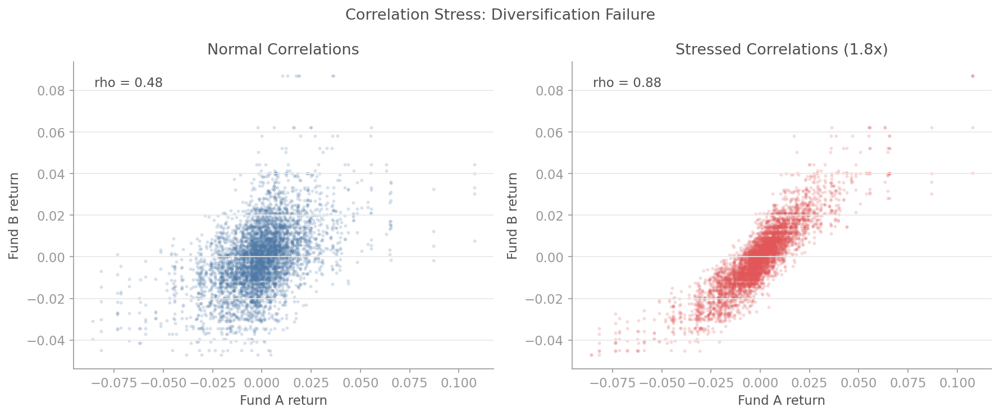

### Regime-Switching Simulation

Paths that switch between calm, volatile, and crisis regimes via a Markov chain.

```python
import numpy as np
from quantlite.simulation import (
    regime_switching_simulation,
    reverse_stress_test,
    simulation_summary,
)

regimes = [
    {"mu": 0.0004, "sigma": 0.008},   # Calm
    {"mu": 0.0001, "sigma": 0.020},   # Volatile
    {"mu": -0.002, "sigma": 0.035},   # Crisis
]
transition = np.array([
    [0.95, 0.04, 0.01],
    [0.10, 0.80, 0.10],
    [0.05, 0.15, 0.80],
])

sim = regime_switching_simulation(regimes, transition, n_steps=252, n_scenarios=5000)
stats = simulation_summary(sim["returns"])
print(f"VaR 95%: {stats['var']['95%']:.2%}")
print(f"CVaR 95%: {stats['cvar']['95%']:.2%}")
print(f"P(loss > 20%): {stats['probability_of_ruin']['20%']:.2%}")
```

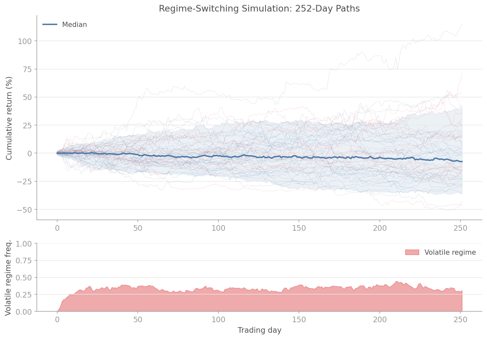

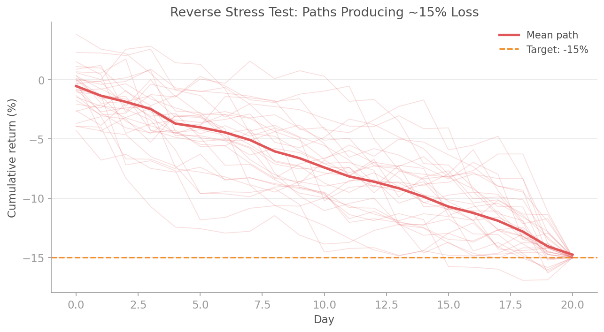

See [docs/simulation_evt.md](docs/simulation_evt.md), [docs/simulation_copula.md](docs/simulation_copula.md), and [docs/simulation_regime.md](docs/simulation_regime.md) for the full API reference.

---

## v0.8: Factor Models

Three modules for comprehensive factor analysis: classical academic models, custom factor tools, and tail-risk-aware factor decomposition.

### Classical Factor Models

Decompose returns into systematic factor exposures and genuine alpha.

```python
from quantlite.factors import fama_french_three, factor_summary

# Fama-French three-factor regression
result = fama_french_three(fund_returns, market, smb, hml)
print(f"Alpha: {result['alpha']:.5f} (t={result['t_stats']['alpha']:.2f})")
print(f"Market beta: {result['betas']['market']:.3f}")
print(f"R-squared: {result['r_squared']:.3f}")
```

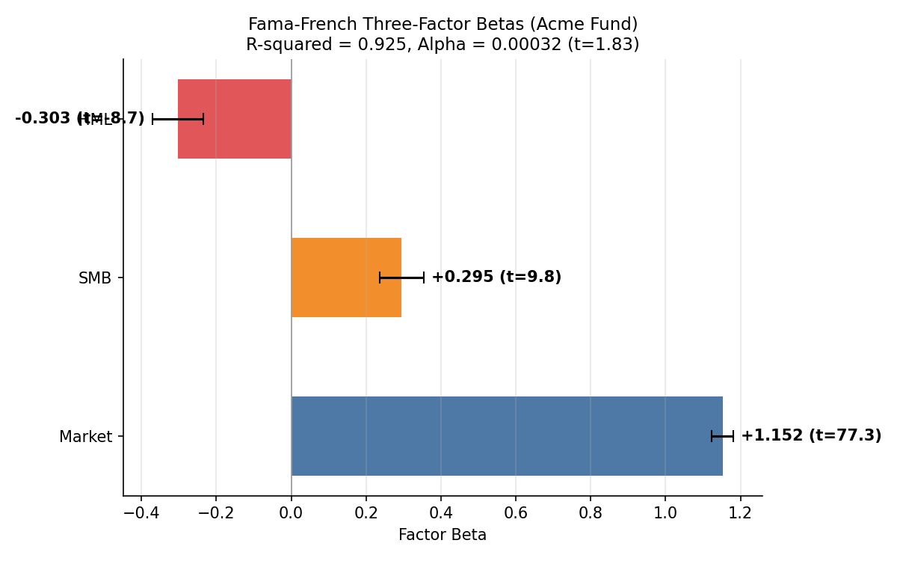

### Custom Factor Tools

Build, test, and analyse proprietary factors.

```python
from quantlite.factors import CustomFactor, factor_portfolio, factor_decay

# Test factor decay
decay = factor_decay(returns, momentum_signal, max_lag=20)
print(f"Half-life: {decay['half_life']:.1f} periods")

# Build long-short portfolios
result = factor_portfolio(stock_returns, factor_values, n_quantiles=5)
print(f"Long-short spread: {result['spread'] * 252:.2%} annualised")
```

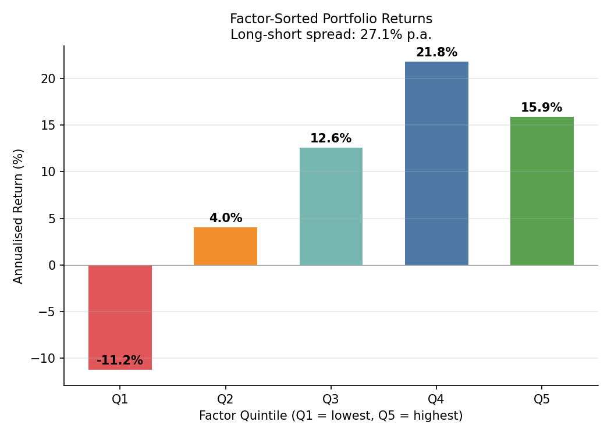

### Tail Risk Factor Analysis

Understand how factor exposures behave in the tails and across regimes.

```python
from quantlite.factors import tail_factor_beta, factor_crowding_score

# Tail betas: how exposures amplify in crises
result = tail_factor_beta(returns, [market, value], ["Market", "Value"])
for name in ["Market", "Value"]:
    print(f"{name}: full={result['full_betas'][name]:.2f}, "
          f"tail={result['tail_betas'][name]:.2f}")

# Factor crowding detection
crowd = factor_crowding_score([value_rets, momentum_rets])
print(f"Crowding score: {crowd['current_score']:.3f}")
```


See [docs/factors_classical.md](docs/factors_classical.md), [docs/factors_custom.md](docs/factors_custom.md), and [docs/factors_tail_risk.md](docs/factors_tail_risk.md) for the full API reference.

---

## v0.6: Systemic Risk and Diversification

Three new modules for understanding how risk propagates through portfolios and markets: contagion analysis, financial network modelling, and diversification diagnostics.

### Contagion and Systemic Risk

When one asset crashes, how much does it drag down the rest? CoVaR and Marginal Expected Shortfall measure the contagion channels that standard correlation misses.

```python
from quantlite.contagion import covar, systemic_risk_contributions

result = covar(market_returns, bank_returns, alpha=0.05)
print(f"Unconditional VaR: {result['var_b']:.4f}")
print(f"CoVaR (market stress): {result['covar']:.4f}")

contributions = systemic_risk_contributions(returns_df, alpha=0.05)
for asset, mes in contributions.items():
    print(f"{asset:15s} MES: {mes:+.4f}")
```

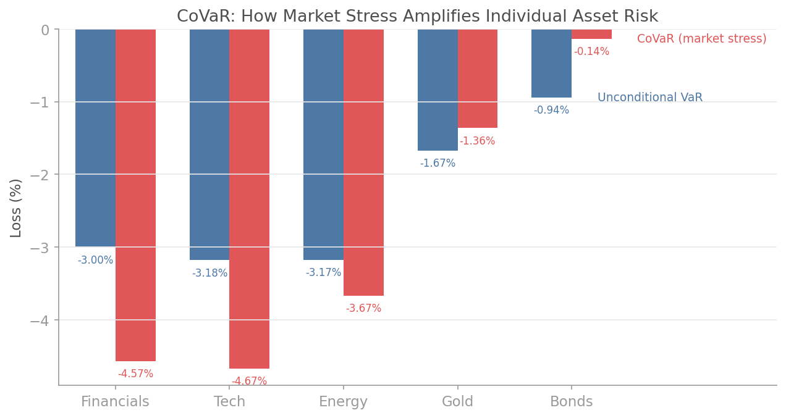

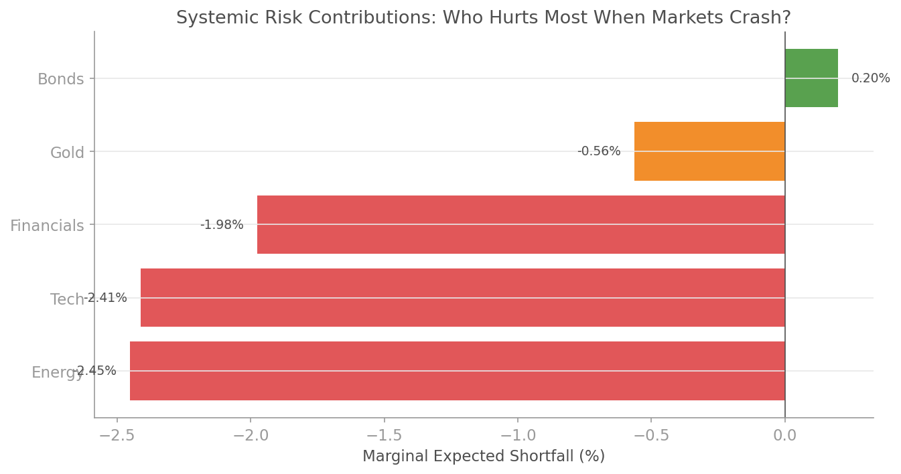

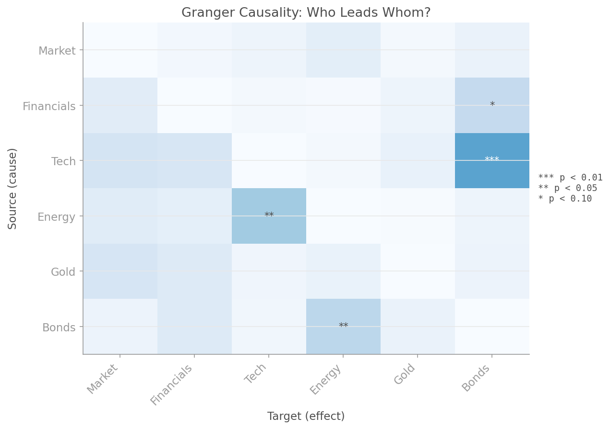

[Documentation: docs/contagion.md](docs/contagion.md)

### Financial Network Analysis

Model markets as networks. Find the most systemically important assets, simulate shock cascades, and detect communities of co-moving assets.

```python
from quantlite.network import network_summary, cascade_simulation

summary = network_summary(returns_df, threshold=0.4)
for i, name in enumerate(summary["nodes"]):
    print(f"{name:10s} centrality: {summary['centrality'][i]:.4f}")

cascade = cascade_simulation(
    summary["network"]["adjacency_matrix"],
    shock_node=0,
    shock_magnitude=-0.50,
)
```

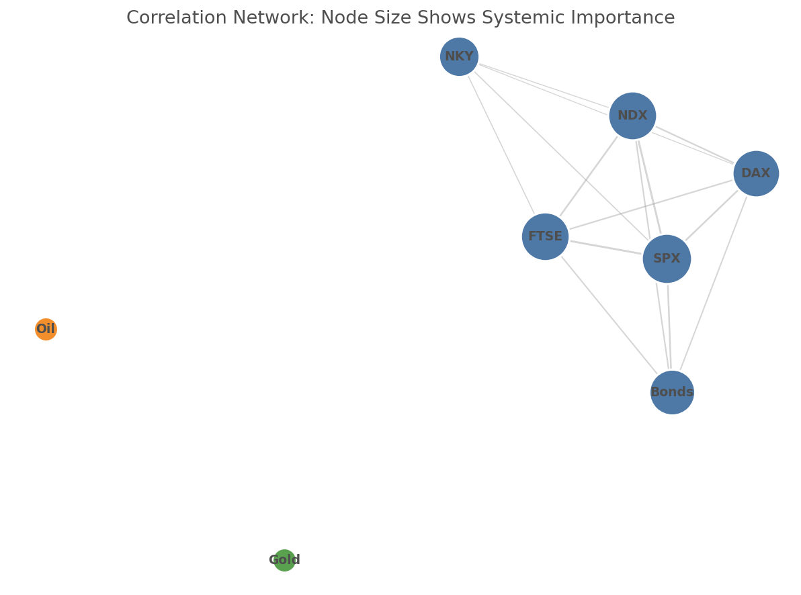

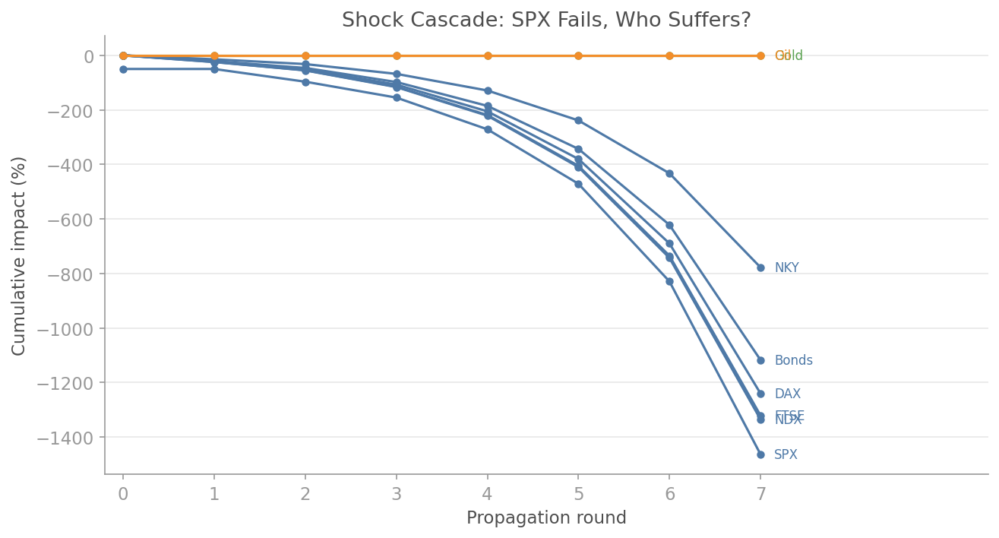

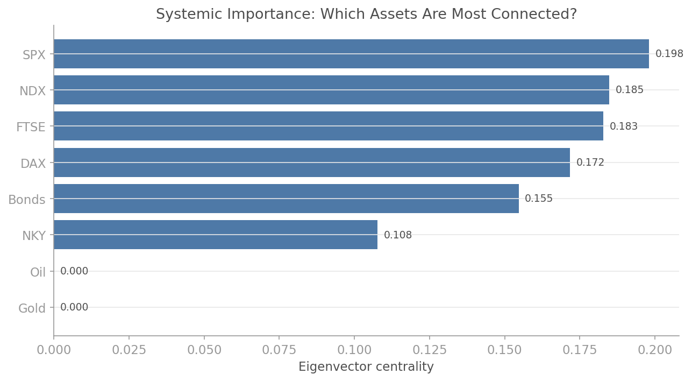

[Documentation: docs/network.md](docs/network.md)

### Diversification Analysis

You think you are diversified. These six metrics tell you whether that is actually true, and whether your diversification survives crises.

```python
from quantlite.diversification import (
    effective_number_of_bets,
    tail_diversification,
)

enb = effective_number_of_bets(weights, cov)
print(f"Assets: 10, Effective bets: {enb:.1f}")

td = tail_diversification(returns_df, weights, alpha=0.05)
print(f"Normal diversification: {td['normal_diversification']:.3f}")
print(f"Tail diversification:   {td['tail_diversification']:.3f}")
```


[Documentation: docs/diversification.md](docs/diversification.md)

---

## v0.5: Honest Backtesting

Three new modules that answer the question every quant should ask but rarely does: "Is this backtest result real, or did I just get lucky?"

### Strategy Forensics

Most reported Sharpe ratios are inflated by multiple testing. The `quantlite.forensics` module implements Lopez de Prado's Deflated Sharpe Ratio framework to separate signal from noise.

```python
from quantlite.forensics import deflated_sharpe_ratio

# You tried 50 strategies and the best had Sharpe 1.8
dsr = deflated_sharpe_ratio(observed_sharpe=1.8, n_trials=50, n_obs=252)
print(f"Probability Sharpe is genuine: {dsr:.2%}")
```

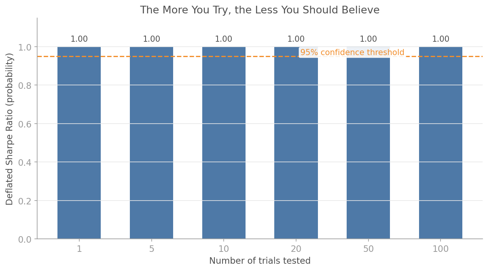

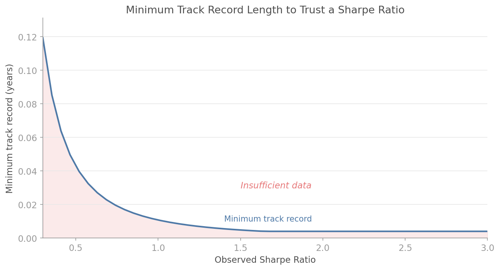


[Documentation: docs/forensics.md](docs/forensics.md)

### Overfitting Detection

The more strategies you test, the more likely your best one is a fluke. Detect and quantify backtest overfitting with CSCV, walk-forward validation, and the TrialTracker.

```python
from quantlite.overfit import TrialTracker

with TrialTracker("momentum_search") as tracker:
    for lookback in [10, 20, 40, 60, 120]:
        tracker.log(params={"lookback": lookback}, sharpe=1.2, returns=returns)
    print(f"Overfitting probability: {tracker.overfitting_probability():.2%}")
```

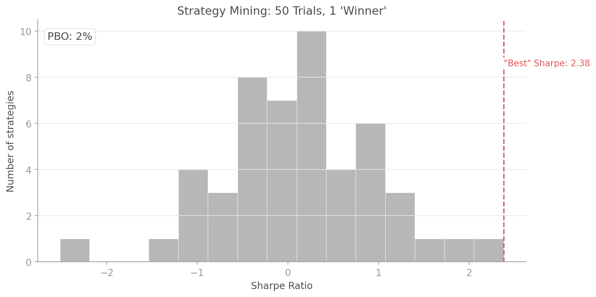

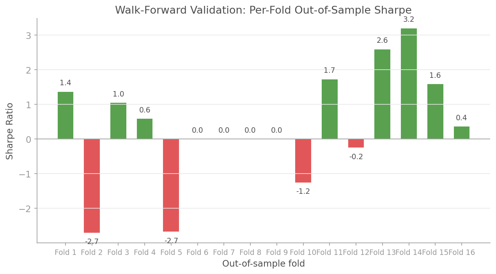

[Documentation: docs/overfitting.md](docs/overfitting.md)

### Resampled Backtesting

A single backtest is a single draw from a distribution. Bootstrap methods build honest confidence intervals around any performance metric.

```python
from quantlite.resample import bootstrap_sharpe_distribution

result = bootstrap_sharpe_distribution(returns, n_samples=2000, seed=42)
print(f"Sharpe: {result['point_estimate']:.2f}")
print(f"95% CI: [{result['ci_lower']:.2f}, {result['ci_upper']:.2f}]")
```


[Documentation: docs/resampling.md](docs/resampling.md)

---

## v0.4: The Taleb Stack

Three new modules bringing Nassim Taleb's key ideas into quantitative practice: ergodicity economics, antifragility measurement, and scenario stress testing.

### Ergodicity Economics

The ensemble average lies. The time average tells the truth. Measure the gap and find the optimal Kelly leverage.

```python
from quantlite.ergodicity import time_average, ensemble_average, ergodicity_gap

returns = [0.50, -0.40, 0.50, -0.40, 0.50, -0.40]
print(f"Ensemble average: {ensemble_average(returns):+.4f}")   # +0.0500 (looks great)
print(f"Time average:     {time_average(returns):+.4f}")        # -0.0513 (you go broke)
print(f"Ergodicity gap:   {ergodicity_gap(returns):+.4f}")      # +0.1013 (the lie)
```


[Documentation: docs/ergodicity.md](docs/ergodicity.md)

### Antifragility Measurement

Quantify whether your portfolio gains from disorder or breaks under it.

```python
from quantlite.antifragile import antifragility_score

fragile_score = antifragility_score(short_vol_returns)     # Negative: fragile
robust_score = antifragility_score(index_returns)           # Near zero: robust
antifragile_score_ = antifragility_score(long_vol_returns)  # Positive: antifragile
```


[Documentation: docs/antifragility.md](docs/antifragility.md)

### Scenario Stress Testing

Build crisis scenarios with a fluent API and stress-test your portfolio against historical and hypothetical crises.

```python
from quantlite.scenarios import stress_test, SCENARIO_LIBRARY

weights = {"SPX": 0.30, "BTC": 0.15, "ETH": 0.10, "BONDS_10Y": 0.30, "GLD": 0.15}
result = stress_test(weights, SCENARIO_LIBRARY["2008 GFC"])
print(f"Portfolio impact: {result['portfolio_impact']:.2%}")
print(f"Survives: {result['survival']}")
```


[Documentation: docs/scenarios.md](docs/scenarios.md)

---

## v0.3: Core Modules

Initial release of risk metrics, EVT, fat-tailed distributions, copulas, correlation analysis, HRP, regime detection, portfolio optimisation, rebalancing, backtesting engine, data connectors, data generation, instruments, and visualisation modules.

---

## v0.2: Foundation

Project scaffolding, basic risk metrics, and initial test suite.
