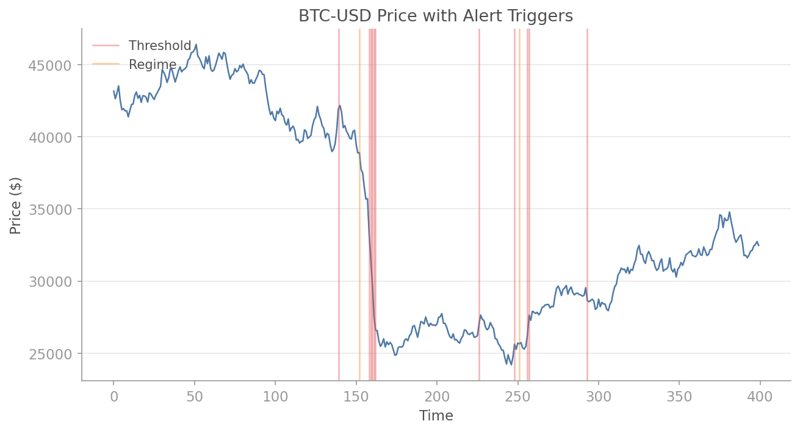
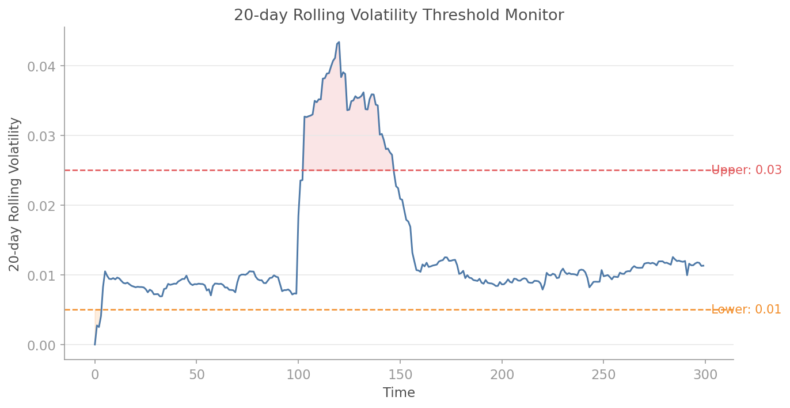
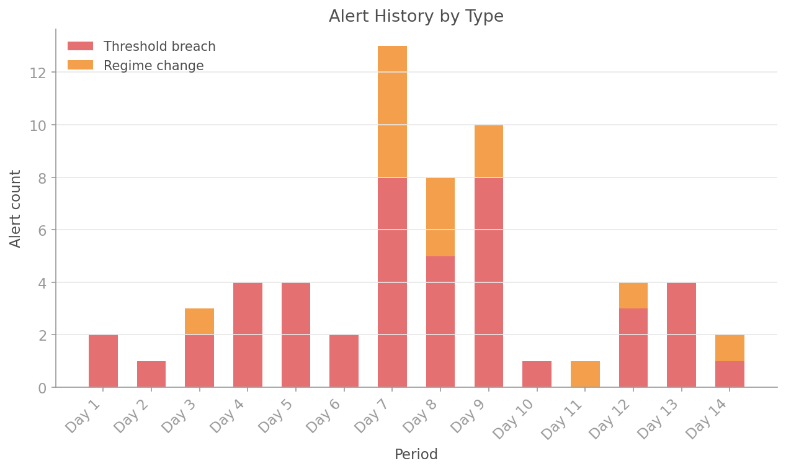

# Alerts

QuantLite's alert system provides rule-based and threshold-based monitoring for market conditions, regime changes, and portfolio metrics. Alerts support callbacks, cooldowns, and a full history log.

## Overview

The alert system comprises:

- **`AlertManager`** — manages rules, evaluates conditions, and maintains alert history
- **`AlertRule`** — a configured monitoring rule (regime change or threshold)
- **`Alert`** — a fired alert record with timestamp, message, and metadata

Alerts are designed to integrate with the [streaming](streaming.md) and [online regime detection](online_regimes.md) modules for real-time monitoring pipelines.

## Quick Start

```python
import quantlite as ql

def notify(alert: ql.Alert) -> None:
    print(f"ALERT: {alert.message}")

manager = ql.AlertManager()

# Alert on regime changes
manager.add_rule("BTC-USD", condition="regime_change", callback=notify)

# Alert when VaR exceeds 5%
manager.add_threshold("portfolio_var", threshold=0.05,
                      direction="above", callback=notify)

# Check against new data
fired = manager.check("BTC-USD", regime=2, previous_regime=0)
# → ALERT: Regime change on BTC-USD: 0 -> 2

fired = manager.check("portfolio_var", value=0.07)
# → ALERT: portfolio_var is above threshold 0.05: 0.07
```

## API Reference

### `AlertStatus`

Enum of alert states:

- `TRIGGERED` — alert has fired
- `ACKNOWLEDGED` — alert has been seen
- `RESOLVED` — condition no longer holds

### `ThresholdDirection`

Enum for threshold comparison:

- `ABOVE` — fires when value exceeds threshold
- `BELOW` — fires when value drops below threshold
- `CROSS` — fires when value crosses the threshold in either direction

### `Alert`

A fired alert record.

| Attribute   | Type          | Description                                |
|-------------|---------------|--------------------------------------------|
| `rule_name` | `str`         | Name of the rule that triggered            |
| `metric`    | `str`         | The metric or symbol being monitored       |
| `message`   | `str`         | Human-readable alert message               |
| `value`     | `float\|None` | The value that triggered the alert         |
| `timestamp` | `float`       | Unix timestamp when the alert fired        |
| `status`    | `AlertStatus` | Current alert status                       |
| `metadata`  | `dict`        | Additional context about the alert         |

### `AlertRule`

A configured alert rule.

| Attribute    | Type                    | Default    | Description                              |
|--------------|-------------------------|------------|------------------------------------------|
| `name`       | `str`                   | (required) | Unique rule name                         |
| `metric`     | `str`                   | (required) | Metric or symbol to monitor              |
| `condition`  | `str`                   | (required) | Condition type                           |
| `callback`   | `Callable\|None`        | `None`     | Function called when the alert fires     |
| `threshold`  | `float\|None`           | `None`     | Threshold value                          |
| `direction`  | `ThresholdDirection`    | `ABOVE`    | Direction for threshold comparison       |
| `cooldown_s` | `float`                 | `60.0`     | Min seconds between repeated firings     |
| `enabled`    | `bool`                  | `True`     | Whether the rule is active               |

### `AlertManager`

Manages alert rules, checks conditions, and maintains history.

**Constructor:**

```python
manager = ql.AlertManager(max_history=1000)
```

**Methods:**

#### `add_rule(metric, condition, callback, name, cooldown_s) -> AlertRule`

Add a rule-based alert. Currently supported conditions:

- `"regime_change"` — fires when `regime != previous_regime`

```python
rule = manager.add_rule(
    "ETH-USD",
    condition="regime_change",
    callback=my_handler,
    name="eth_regime",
    cooldown_s=300,  # At most one alert every 5 minutes
)
```

#### `add_threshold(metric, threshold, direction, callback, name, cooldown_s) -> AlertRule`

Add a threshold-based alert:

```python
rule = manager.add_threshold(
    "portfolio_drawdown",
    threshold=0.10,
    direction="above",
    callback=lambda a: send_email(a.message),
    cooldown_s=3600,  # At most once per hour
)
```

#### `check(metric, value, regime, previous_regime, **metadata) -> list[Alert]`

Evaluate all rules for the given metric and return any fired alerts:

```python
fired = manager.check(
    "portfolio_drawdown",
    value=0.12,
    source="daily_risk_report",
)
```

#### `check_many(updates) -> list[Alert]`

Check multiple metric updates at once:

```python
fired = manager.check_many([
    {"metric": "BTC-USD", "regime": 2, "previous_regime": 1},
    {"metric": "portfolio_var", "value": 0.06},
    {"metric": "portfolio_drawdown", "value": 0.08},
])
```

#### `on_alert(callback)`

Register a global callback for all alerts (in addition to rule-specific callbacks):

```python
manager.on_alert(lambda a: log_to_database(a))
```

#### `remove_rule(name)`, `enable_rule(name)`, `disable_rule(name)`

Manage rules by name.

#### `rules` (property), `history` (property), `clear_history()`

Access configured rules and alert history.

## Examples

### Portfolio Risk Monitoring

Monitor multiple risk metrics for a portfolio managed by Acme Fund:

```python
import quantlite as ql

manager = ql.AlertManager()

# Drawdown alert
manager.add_threshold(
    "acme_drawdown",
    threshold=0.10,
    direction="above",
    name="acme_dd_warning",
    cooldown_s=3600,
)

# Extreme drawdown — escalation
manager.add_threshold(
    "acme_drawdown",
    threshold=0.20,
    direction="above",
    name="acme_dd_critical",
    cooldown_s=300,
)

# VaR breach
manager.add_threshold(
    "acme_var_99",
    threshold=0.05,
    direction="above",
    name="acme_var_breach",
    cooldown_s=1800,
)

# Simulate daily risk reporting
daily_metrics = [
    {"metric": "acme_drawdown", "value": 0.08},   # Fine
    {"metric": "acme_drawdown", "value": 0.12},   # Warning!
    {"metric": "acme_var_99", "value": 0.04},      # Fine
    {"metric": "acme_var_99", "value": 0.065},     # Breach!
]

for m in daily_metrics:
    alerts = manager.check(**m)
    for a in alerts:
        print(f"[{a.status.value}] {a.message}")
```

### Regime Change Alerts with Streaming

The alert system integrates naturally with online regime detection and price streaming:

```python
import asyncio
import math
from collections import deque

import quantlite as ql

async def monitored_trading():
    # Set up regime detection
    import numpy as np
    detector = ql.OnlineRegimeDetector(n_regimes=3, rng_seed=42)
    detector.fit(np.random.normal(0, 0.02, 1000))

    # Set up alerts
    manager = ql.AlertManager()

    alert_log: list[str] = []

    def on_regime_change(alert: ql.Alert) -> None:
        msg = (f"[{alert.timestamp:.0f}] {alert.message} | "
               f"metadata: {alert.metadata}")
        alert_log.append(msg)
        print(msg)

    manager.add_rule(
        "BTC-USD",
        condition="regime_change",
        callback=on_regime_change,
        cooldown_s=30,
    )

    # Stream and monitor
    prices: deque[float] = deque(maxlen=2)
    stream = ql.stream(["BTC-USD"], exchange="binance", throttle_ms=1000)

    async with stream:
        async for tick in stream:
            prices.append(tick.price)
            if len(prices) < 2:
                continue

            log_ret = math.log(prices[-1] / prices[-2])
            result = detector.update(log_ret)

            if result.regime_changed:
                prev = result.regime  # Simplified; real code tracks previous
                manager.check(
                    "BTC-USD",
                    regime=result.regime,
                    previous_regime=prev,
                    price=tick.price,
                    confidence=result.confidence,
                )

asyncio.run(monitored_trading())
```

### Cooldown Behaviour

Cooldowns prevent alert fatigue. A rule will not fire again until its cooldown period has elapsed:

```python
import time
import quantlite as ql

manager = ql.AlertManager()
manager.add_threshold(
    "volatility",
    threshold=0.30,
    direction="above",
    cooldown_s=10,  # Short cooldown for demonstration
)

# First check: fires
alerts = manager.check("volatility", value=0.35)
print(f"First check: {len(alerts)} alert(s)")  # 1

# Immediate second check: suppressed by cooldown
alerts = manager.check("volatility", value=0.40)
print(f"Second check: {len(alerts)} alert(s)")  # 0

# After cooldown expires
time.sleep(11)
alerts = manager.check("volatility", value=0.38)
print(f"After cooldown: {len(alerts)} alert(s)")  # 1
```

### Cross-Threshold Alerts

The `"cross"` direction fires only when the value crosses the threshold, not simply when it is above or below:

```python
import quantlite as ql

manager = ql.AlertManager()
manager.add_threshold(
    "correlation",
    threshold=0.80,
    direction="cross",
    cooldown_s=0,  # No cooldown for demonstration
)

# Build up: value starts below, crosses above
manager.check("correlation", value=0.75)   # Sets baseline, no alert
alerts = manager.check("correlation", value=0.85)  # Crosses up → alert!
print(f"Cross up: {len(alerts)} alert(s)")  # 1

alerts = manager.check("correlation", value=0.90)  # Still above, no cross
print(f"Still above: {len(alerts)} alert(s)")  # 0

alerts = manager.check("correlation", value=0.70)  # Crosses down → alert!
print(f"Cross down: {len(alerts)} alert(s)")  # 1
```

### Alert History and Inspection

```python
import quantlite as ql

manager = ql.AlertManager()
manager.add_threshold("spread", threshold=0.01, direction="above", cooldown_s=0)

for val in [0.005, 0.012, 0.008, 0.015, 0.020]:
    manager.check("spread", value=val)

print(f"Total alerts fired: {len(manager.history)}")
for alert in manager.history:
    print(f"  {alert.rule_name}: {alert.message} (value={alert.value})")

# Clear history
manager.clear_history()
print(f"After clear: {len(manager.history)}")
```

## Rule Types

### Regime Change Rules

Fire when `regime != previous_regime`. Pass both `regime` and `previous_regime` to `check()`. The alert metadata includes both the previous and new regime indices.

### Threshold Rules

Fire when the `value` meets the threshold condition:

- **`above`**: `value > threshold`
- **`below`**: `value < threshold`
- **`cross`**: `value` crosses the threshold compared to the previous check (requires two consecutive checks to establish direction)

## Cooldowns

Every rule has a `cooldown_s` parameter (default: 60 seconds). After firing, the rule is suppressed for the cooldown duration. This prevents alert storms during volatile periods.

Recommended cooldowns:

| Context                        | Cooldown         |
|-------------------------------|------------------|
| Real-time tick monitoring      | 30-60 seconds    |
| Daily risk reporting           | 3600 seconds     |
| Regime change (intraday)       | 300 seconds      |
| Critical threshold breach      | 60 seconds       |

## Visualisation

### Alert Timeline

Price series with alert trigger points marked as downward triangles, colour-coded by type. Regime-change alerts (amber) and threshold-breach alerts (red) are visually distinct.



### Threshold Monitor

A monitored metric (here, 20-day rolling volatility) plotted against upper and lower thresholds. Shaded zones highlight periods where the metric breaches the alert boundary.



### Alert History

Stacked bar chart showing the frequency and type breakdown of alerts over a 14-day period. The spike in days 7-9 corresponds to a market stress episode.


