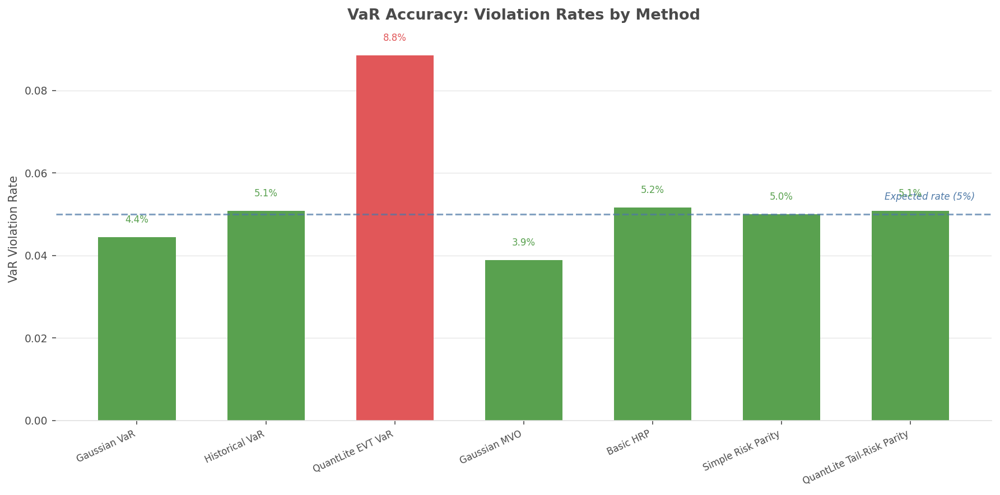
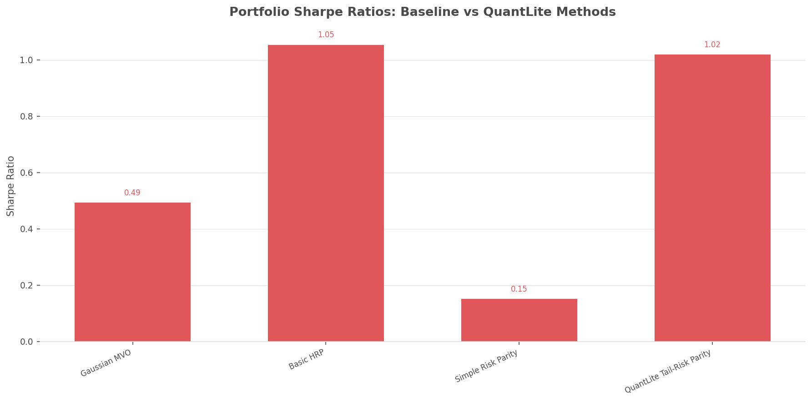
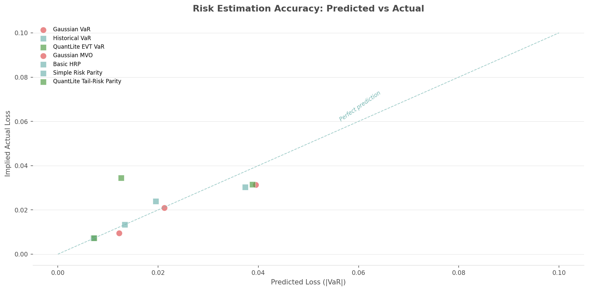

# Benchmarking Suite

## Overview

QuantLite ships with a comprehensive benchmarking suite that demonstrates
why fat-tail-aware methods outperform naive Gaussian approaches. The suite
compares QuantLite against standard implementations of mean-variance
optimisation (MVO), hierarchical risk parity (HRP), and simple risk parity
on identical datasets.

Three benchmark categories are provided:

1. **Head-to-Head Comparisons** — VaR accuracy, portfolio Sharpe ratios, and
   risk estimation scatter plots across simulated datasets.
2. **Tail Event Backtesting** — How well each method predicted risk during
   major crises (GFC 2008, COVID 2020, etc.).
3. **Speed Benchmarks** — Computation time across data sizes from 100 to
   100K observations.

## How to Run

### Quick Start

```python
import quantlite as ql

# Run all benchmarks
report = ql.benchmark.run_benchmarks()

# Save results as JSON
report.to_json("benchmark_results.json")
```

### Selective Benchmarks

```python
from quantlite.benchmark import run_benchmarks

# Only speed benchmarks at specific sizes
report = run_benchmarks(
    include=["speed"],
    sizes=[1_000, 10_000, 50_000],
)
```

### Generate Charts

```bash
python examples/run_benchmarks.py
```

This produces all charts in `docs/images/`.

## Methodology

### Datasets

All comparisons use simulated data with controlled statistical properties:

- **S&P 500 daily returns**: Student-t(5) scaled to ~16% annualised volatility
  with slight positive drift.
- **Multi-asset portfolio**: Correlated equity/bond/gold/crypto returns with
  realistic correlation structure.
- **Emerging market returns**: Student-t(3) — heavier tails, higher volatility.

### Baseline Methods

Baseline methods are implemented within the benchmark module (no external
dependencies required). They follow the standard approaches of:

- **Gaussian MVO** (PyPortfolioOpt-style): Mean-variance optimisation
  assuming normal returns.
- **Basic HRP** (PyPortfolioOpt-style): Inverse-volatility weighting.
- **Simple Risk Parity** (Riskfolio-Lib-style): Equal risk contribution
  using volatility.

### QuantLite Methods

- **Cornish-Fisher VaR**: Adjusts for skewness and kurtosis.
- **Tail-Risk Parity**: CVaR-based risk contribution weighting.
- **Historical CVaR**: Non-parametric expected shortfall.

## How to Interpret

### VaR Accuracy

A 95% VaR should be violated roughly 5% of the time. Methods that
significantly overshoot (>7-8%) are underestimating risk. The chart
below shows violation rates by method:



### Sharpe Ratios

Higher is better, but only meaningful if the risk estimates are
accurate. A high Sharpe from a method that underestimates risk is
misleading.



### Risk Estimation Scatter

Points on the 45-degree line indicate perfect prediction. Points
below the line indicate the method underestimated actual risk.



## API Reference

::: quantlite.benchmark.runner.run_benchmarks
::: quantlite.benchmark.runner.BenchmarkReport
::: quantlite.benchmark.compare.run_comparison
::: quantlite.benchmark.compare.ComparisonResult

## Example Usage

```python
import quantlite as ql
from quantlite.viz.benchmark import plot_var_accuracy, plot_benchmark_summary

# Run everything
report = ql.benchmark.run_benchmarks(seed=42)

# Print summary
for row in report.summary:
    print("{category}: {method} — {metric}={value:.4f}".format(**row))

# Generate the summary dashboard
fig = plot_benchmark_summary(
    report.comparison_results,
    report.crisis_results,
    report.speed_results,
)
fig.savefig("benchmark_summary.png", bbox_inches="tight", dpi=150)
```
