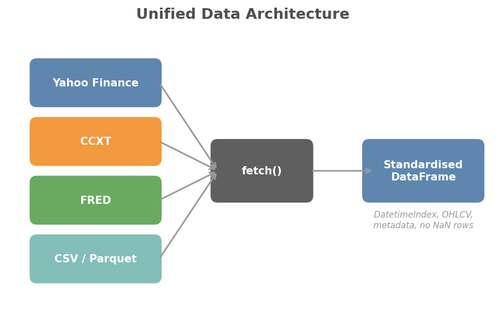

# Data Connectors

QuantLite provides a unified `fetch()` function that pulls OHLCV data from multiple sources through a single, consistent interface. Whether you need equities from Yahoo Finance, crypto candles from Binance, macro series from FRED, or data from local files, the API is the same.

## Overview



## Quick Start

```python
from quantlite.data import fetch

# Equities (Yahoo Finance, the default)
df = fetch("AAPL", period="5y")

# Crypto (CCXT, auto-detected from the "/" in the symbol)
df = fetch("BTC/USDT", source="ccxt", exchange="binance")

# Macro (FRED)
df = fetch("DGS10", source="fred")

# Local CSV or Parquet
df = fetch("my_data.csv", source="local")
```

Every call returns a pandas DataFrame with:

- A timezone-aware `DatetimeIndex`
- Lowercase columns: `open`, `high`, `low`, `close`, `volume`
- No fully-NaN rows, sorted by date
- A `.attrs["metadata"]` dict containing source, symbol, frequency, and fetch time

## Installation

The base package has no data-connector dependencies. Install only what you need:

```bash
# Yahoo Finance
pip install quantlite[yahoo]

# Cryptocurrency exchanges
pip install quantlite[crypto]

# FRED macroeconomic data
pip install quantlite[fred]

# Everything
pip install quantlite[all]
```

## Sources in Detail

### Yahoo Finance (`yahoo`)

The default source for equity tickers, ETFs, indices, and mutual funds.

```python
# Five years of daily Apple data
df = fetch("AAPL", period="5y")

# Hourly data for the last month
df = fetch("AAPL", period="1mo", interval="1h")

# Custom date range
df = fetch("AAPL", start="2020-01-01", end="2023-12-31")

# Multiple tickers at once
data = fetch(["AAPL", "MSFT", "GOOG"], period="5y")
# Returns {"AAPL": DataFrame, "MSFT": DataFrame, "GOOG": DataFrame}
```

**Parameters:** All keyword arguments are forwarded to `yfinance.Ticker.history()`. Common ones include `period`, `interval`, `start`, `end`, and `auto_adjust`.

**Dependency:** `yfinance>=0.2`

### CCXT (`ccxt`)

Pulls OHLCV candles from any of the 100+ cryptocurrency exchanges supported by CCXT.

```python
# Daily Bitcoin candles from Binance
df = fetch("BTC/USDT", source="ccxt", exchange="binance")

# Hourly Ethereum candles from Coinbase
df = fetch("ETH/USD", source="ccxt", exchange="coinbase", timeframe="1h", limit=500)
```

**Parameters:**
- `exchange` (str): Exchange identifier, default `"binance"`.
- `timeframe` (str): Candle interval, default `"1d"`.
- `limit` (int): Number of candles to fetch, default `1000`.

**Dependency:** `ccxt>=4.0`

### FRED (`fred`)

Fetches macroeconomic time series from the Federal Reserve Economic Data API.

```python
import os
os.environ["FRED_API_KEY"] = "your_key_here"

# 10-year Treasury yield
df = fetch("DGS10", source="fred")

# Federal funds rate
df = fetch("FEDFUNDS", source="fred")

# Pass key directly
df = fetch("DGS10", source="fred", api_key="your_key_here")
```

FRED series return a DataFrame with a single `close` column containing the series values.

**Parameters:**
- `api_key` (str): Your FRED API key. Falls back to the `FRED_API_KEY` environment variable.
- `start` (str): Start date.
- `end` (str): End date.

**Dependency:** `fredapi>=0.5`

**API key:** Register at [https://fred.stlouisfed.org/docs/api/api_key.html](https://fred.stlouisfed.org/docs/api/api_key.html)

### Local Files (`local`)

Loads OHLCV data from CSV or Parquet files on disk.

```python
# CSV
df = fetch("data/prices.csv", source="local")

# Parquet
df = fetch("data/prices.parquet", source="local")

# Specify the date column explicitly
df = fetch("data/prices.csv", source="local", date_column="trade_date")
```

The loader expects columns that map to `open`, `high`, `low`, `close`, `volume` (case-insensitive). The first column or index is used as the date index unless `date_column` is specified.

**Supported formats:** `.csv`, `.parquet`, `.pq`

## Multi-Source Fetching

Fetch from multiple sources in a single call using a dictionary:

```python
data = fetch({
    "AAPL": "yahoo",
    "BTC/USDT": {"source": "ccxt", "exchange": "binance"},
    "DGS10": {"source": "fred", "api_key": "your_key"},
})
# Returns {"AAPL": DataFrame, "BTC/USDT": DataFrame, "DGS10": DataFrame}
```

## Source Auto-Detection

When you omit `source=`, QuantLite guesses based on the symbol:

| Pattern | Inferred Source |
|---------|----------------|
| Contains `/` (not a file path) | `ccxt` |
| Ends with `.csv`, `.parquet`, `.pq` | `local` |
| Everything else | `yahoo` |

## Caching

By default, fetched data is cached to `~/.quantlite/cache/` to avoid redundant API calls.

- **Daily data:** 24-hour TTL
- **Intraday data:** 1-hour TTL
- **Cache key:** SHA-256 hash of (source, symbol, parameters)

### Controlling the Cache

```python
# Bypass the cache for a single call
df = fetch("AAPL", cache=False)

# Clear all cached data
from quantlite.data import clear_cache
clear_cache()
```

### Custom Cache Directory

```python
from quantlite.data.cache import cache_get, cache_put
from pathlib import Path

my_cache = Path("/tmp/my_cache")
# The cache_get/cache_put functions accept a cache_dir parameter
```

## Plugin Architecture

Register your own data sources using the `@register_source` decorator:

```python
from quantlite.data import DataSource, register_source, fetch
import pandas as pd


@register_source("my_api")
class MyAPISource(DataSource):
    """Custom data source for My API."""

    def fetch(self, symbol: str, **kwargs) -> pd.DataFrame:
        # Your implementation here
        import requests
        resp = requests.get(f"https://api.example.com/ohlcv/{symbol}")
        data = resp.json()
        df = pd.DataFrame(data)
        df.index = pd.to_datetime(df["date"], utc=True)
        df.columns = [c.lower() for c in df.columns]
        return df

    def supported_symbols(self) -> list[str] | None:
        return None  # or a specific list


# Now use it like any built-in source
df = fetch("MY_TICKER", source="my_api")
```

### Listing Registered Sources

```python
from quantlite.data import list_sources

print(list_sources())
# ['ccxt', 'fred', 'local', 'my_api', 'yahoo']
```

## Error Handling

QuantLite raises clear, specific exceptions:

| Exception | When |
|-----------|------|
| `ImportError` | Optional dependency not installed |
| `ValueError` | Symbol returns no data, or invalid parameter |
| `KeyError` | Unknown source name |
| `FileNotFoundError` | Local file does not exist |

```python
try:
    df = fetch("AAPL", source="yahoo")
except ImportError:
    print("Install yfinance: pip install quantlite[yahoo]")
except ValueError as e:
    print(f"Bad symbol or no data: {e}")
```

## Source Comparison

| Feature | Yahoo | CCXT | FRED | Local |
|---------|-------|------|------|-------|
| **Asset classes** | Equities, ETFs, indices, FX | Crypto pairs | Macro, rates, employment | Any |
| **Cost** | Free | Free | Free (API key required) | Free |
| **Rate limits** | Unofficial, ~2000/hr | Exchange-dependent | 120 requests/min | None |
| **Historical depth** | ~40 years | Exchange-dependent | Decades | Your data |
| **Real-time** | 15-min delayed | Near real-time | Daily/monthly releases | N/A |
| **Dependency** | `yfinance` | `ccxt` | `fredapi` | None |

## Visualisation Suggestions

Once you have fetched data, combine it with QuantLite's visualisation module:

```python
from quantlite.data import fetch
from quantlite.viz.theme import apply_few_theme
from quantlite.visualisation import plot_time_series

apply_few_theme()
df = fetch("AAPL", period="2y")
plot_time_series(df["close"], title="AAPL Close Price")
```
