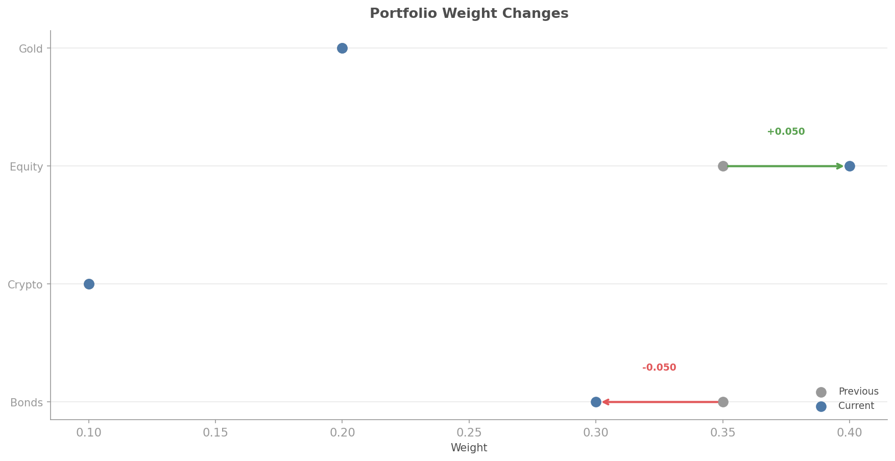

# Decision Audit Trail

## Overview

Every portfolio weight should come with a justification. The `quantlite.explain.audit` module provides a structured audit trail that logs the full provenance of every allocation decision: what data went in, which method was used, what constraints were applied, what regime the market was in, and why each weight is what it is.

This matters for three reasons:

1. **Regulatory compliance**: auditors and risk committees need to understand why positions were taken
2. **Debugging**: when a portfolio behaves unexpectedly, the audit trail lets you trace back to the decision
3. **Institutional memory**: when the person who built the model leaves, the trail preserves the reasoning

The trail is exportable as JSON (for programmatic consumption), markdown (for reports), or HTML (for dashboards).



## API Reference

### `AuditTrail(name)`

The main class. Create one per portfolio, then call `log()` for each decision.

```python
from quantlite.explain.audit import AuditTrail

trail = AuditTrail("Growth Portfolio")
```

---

### `AuditTrail.log(method, weights, returns_df, constraints, regime_state, rationale, metadata)`

Log a portfolio decision. Automatically generates rationale if not provided.

```python
entry = trail.log(
    method="Risk Parity",
    weights={"Equity": 0.4, "Bonds": 0.35, "Gold": 0.25},
    returns_df=returns,
    constraints={"max_weight": 0.5, "min_weight": 0.05},
    regime_state={"current": "Calm", "confidence": 0.85},
)
```

**Parameters:**

| Name | Type | Description |
|------|------|-------------|
| `method` | `str` | Allocation method name |
| `weights` | `dict[str, float]` | Resulting portfolio weights |
| `returns_df` | `pd.DataFrame` | Input return data (for summary) |
| `constraints` | `dict` | Constraints applied |
| `regime_state` | `dict` | Current regime information |
| `rationale` | `dict[str, str]` | Per-asset rationale (auto-generated if omitted) |
| `metadata` | `dict` | Additional context |

**Returns:** `AuditEntry` dataclass.

---

### `AuditTrail.to_json(indent)`

Export as JSON string.

```python
json_str = trail.to_json()
# Save to file
with open("audit.json", "w") as f:
    f.write(json_str)
```

---

### `AuditTrail.to_markdown()`

Export as markdown.

```python
md = trail.to_markdown()
print(md)
```

---

### `AuditTrail.to_html()`

Export as styled HTML.

```python
html = trail.to_html()
with open("audit.html", "w") as f:
    f.write(html)
```

---

### `compare_weights(previous, current, method, regime_change)`

Compare two weight sets and explain the changes.

```python
from quantlite.explain.audit import compare_weights

changes = compare_weights(
    previous={"Equity": 0.5, "Bonds": 0.3, "Gold": 0.2},
    current={"Equity": 0.4, "Bonds": 0.35, "Gold": 0.25},
    regime_change="shift from Calm to Transitional",
)

for asset, explanation in changes.items():
    print(f"{asset}: {explanation}")
# Equity: decreased from 0.5000 to 0.4000 (-0.1000) driven by shift from Calm to Transitional.
# Bonds: increased from 0.3000 to 0.3500 (+0.0500) driven by shift from Calm to Transitional.
# Gold: increased from 0.2000 to 0.2500 (+0.0500) driven by shift from Calm to Transitional.
```

## Examples

### Complete Audit Pipeline

```python
import pandas as pd
import numpy as np
from quantlite.explain.audit import AuditTrail, compare_weights

returns = pd.DataFrame(
    np.random.randn(500, 3) * 0.01,
    columns=["Equity", "Bonds", "Gold"],
)

trail = AuditTrail("Conservative Portfolio")

# First allocation
weights_v1 = {"Equity": 0.3, "Bonds": 0.5, "Gold": 0.2}
trail.log(
    method="Risk Parity",
    weights=weights_v1,
    returns_df=returns,
    constraints={"max_weight": 0.6},
)

# Regime change triggers rebalance
weights_v2 = {"Equity": 0.2, "Bonds": 0.6, "Gold": 0.2}
trail.log(
    method="Risk Parity (Crisis Overlay)",
    weights=weights_v2,
    returns_df=returns,
    constraints={"max_weight": 0.6},
    regime_state={"current": "Crisis", "confidence": 0.92},
)

# Compare the two decisions
changes = compare_weights(
    weights_v1, weights_v2,
    regime_change="shift to Crisis regime",
)

# Export
print(trail.to_markdown())
```

### `AuditEntry` Dataclass

| Field | Type | Description |
|-------|------|-------------|
| `timestamp` | `str` | ISO 8601 timestamp |
| `method` | `str` | Allocation method |
| `input_summary` | `dict` | Summary of input data |
| `constraints` | `dict` | Applied constraints |
| `regime_state` | `dict` | Regime information |
| `weights` | `dict[str, float]` | Resulting weights |
| `rationale` | `dict[str, str]` | Per-asset explanation |
| `metadata` | `dict` | Additional context |
