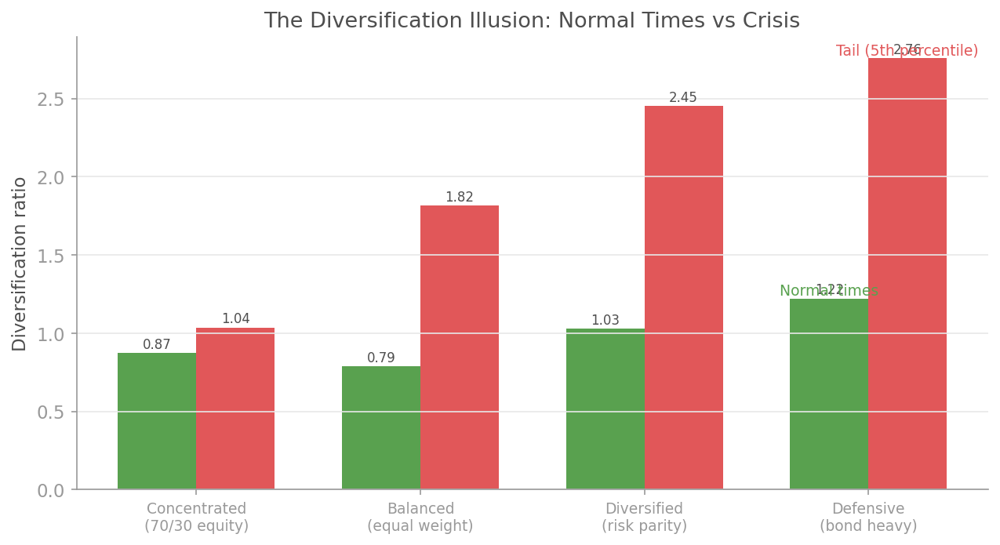
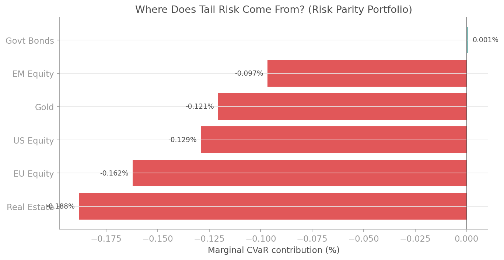

# Diversification Analysis

## Overview

You think you are diversified. You are probably wrong.

A portfolio of 10 assets is not 10 independent bets. If those assets are correlated (and they always are), your effective diversification is far lower than the number of positions suggests. Worse, the diversification you do have tends to evaporate precisely during crises, when correlations spike and everything falls together.

The `quantlite.diversification` module provides six tools to measure, decompose, and stress-test portfolio diversification:

1. **Effective Number of Bets** reveals how many truly independent risk sources your portfolio contains
2. **Entropy Diversification** measures weight concentration using information theory
3. **Tail Diversification** compares diversification in normal times versus during crises
4. **Marginal Tail Risk Contribution** decomposes CVaR into per-asset contributions
5. **Diversification Ratio** computes the classic ratio of weighted volatility to portfolio volatility
6. **Herfindahl Index** provides a simple, intuitive measure of weight concentration

Together, these tools answer the question: "Is my portfolio genuinely diversified, or does it just look diversified?"

## API Reference

### `effective_number_of_bets`

```python
effective_number_of_bets(
    weights: array-like,
    covariance_matrix: array-like,
) -> float
```

Compute the eigenvalue-based Effective Number of Bets (ENB). This uses the Shannon entropy of PCA-explained variance to estimate how many truly independent risk factors drive the portfolio. A portfolio of 10 assets might have only 3 effective bets if they are correlated.

**Parameters:**

| Parameter | Type | Description |
|-----------|------|-------------|
| `weights` | array-like | Portfolio weights |
| `covariance_matrix` | array-like | Covariance matrix of asset returns |

**Returns:** Effective number of bets (float).

**Interpretation:**

| ENB vs N Assets | Meaning |
|----------------|---------|
| ENB close to N | Genuinely diversified across independent risk factors |
| ENB = N/2 | Moderate redundancy; some risk factors are shared |
| ENB = 1 to 2 | Nearly all risk comes from one or two factors (e.g., "equity beta") |

**Example:**

```python
import numpy as np
from quantlite.diversification import effective_number_of_bets

# Equal-weighted portfolio of 6 assets
weights = np.ones(6) / 6
cov = returns_df.cov().values

enb = effective_number_of_bets(weights, cov)
print(f"Assets: {len(weights)}, Effective bets: {enb:.1f}")
# If ENB is 2.5 with 6 assets, you have far less diversification
# than the position count suggests.
```


### `entropy_diversification`

```python
entropy_diversification(
    weights: array-like,
) -> float
```

Compute the Shannon entropy of the weight distribution, normalised to [0, 1]. This measures weight concentration independent of return dynamics. Uniform weights yield maximum diversification (1.0); a single concentrated position yields minimum (0.0).

**Parameters:**

| Parameter | Type | Description |
|-----------|------|-------------|
| `weights` | array-like | Portfolio weights (must be non-negative) |

**Returns:** Normalised entropy in [0, 1].

**Interpretation:**

| Value | Meaning |
|-------|---------|
| 0.9 to 1.0 | Near-uniform allocation |
| 0.7 to 0.9 | Moderate concentration |
| 0.5 to 0.7 | Significant concentration |
| Below 0.5 | Heavily concentrated |

**Example:**

```python
from quantlite.diversification import entropy_diversification

equal_weight = np.ones(10) / 10
concentrated = np.array([0.80, 0.10, 0.05, 0.03, 0.02])

print(f"Equal weight: {entropy_diversification(equal_weight):.3f}")    # ~1.0
print(f"Concentrated: {entropy_diversification(concentrated):.3f}")    # ~0.5
```

### `tail_diversification`

```python
tail_diversification(
    returns_df: pandas.DataFrame,
    weights: array-like,
    alpha: float = 0.05,
) -> dict
```

Compare diversification in normal times versus the tail. This is the critical test: diversification that disappears during crises is an illusion. The tail concentration ratio reveals how much diversification you lose when markets crash.

**Parameters:**

| Parameter | Type | Description |
|-----------|------|-------------|
| `returns_df` | DataFrame | Asset returns, one column per asset |
| `weights` | array-like | Portfolio weights |
| `alpha` | float | Tail percentile (default 0.05) |

**Returns:** Dictionary with:

| Key | Description |
|-----|-------------|
| `normal_diversification` | Diversification ratio in normal times |
| `tail_diversification` | Diversification ratio in the worst alpha-percentile |
| `tail_concentration_ratio` | Ratio of tail to normal diversification |

**Interpretation:**

| Tail Concentration Ratio | Meaning |
|--------------------------|---------|
| Close to 1.0 | Diversification holds in crises (rare and valuable) |
| 0.7 to 0.9 | Some diversification loss during stress |
| 0.5 to 0.7 | Significant diversification failure |
| Below 0.5 | Diversification illusion: it vanishes when you need it most |

**Example:**

```python
from quantlite.diversification import tail_diversification

weights = np.array([0.25, 0.25, 0.10, 0.20, 0.10, 0.10])
result = tail_diversification(returns_df, weights, alpha=0.05)

print(f"Normal: {result['normal_diversification']:.3f}")
print(f"Tail:   {result['tail_diversification']:.3f}")
print(f"Ratio:  {result['tail_concentration_ratio']:.3f}")
# If the ratio is 0.6, you lose 40% of your diversification
# during the worst 5% of days.
```



### `marginal_tail_risk_contribution`

```python
marginal_tail_risk_contribution(
    returns_df: pandas.DataFrame,
    weights: array-like,
    alpha: float = 0.05,
) -> dict
```

Decompose portfolio CVaR into per-asset contributions. This answers: "When the portfolio is in its tail, which assets are responsible for the losses?"

**Parameters:**

| Parameter | Type | Description |
|-----------|------|-------------|
| `returns_df` | DataFrame | Asset returns, one column per asset |
| `weights` | array-like | Portfolio weights |
| `alpha` | float | Tail percentile (default 0.05) |

**Returns:** Dictionary mapping asset names to their marginal CVaR contribution.

**Interpretation:**

| Contribution | Meaning |
|-------------|---------|
| Large negative | Major driver of portfolio tail losses |
| Small negative | Minor contributor to tail risk |
| Near zero | Negligible tail risk contribution |
| Positive | Asset offsets tail losses (hedge) |

**Example:**

```python
from quantlite.diversification import marginal_tail_risk_contribution

weights = np.array([0.10, 0.12, 0.08, 0.35, 0.20, 0.15])
contributions = marginal_tail_risk_contribution(returns_df, weights, alpha=0.05)

for asset, contrib in contributions.items():
    print(f"{asset:15s} {contrib:+.5f}")
# Assets with the largest negative contributions are your
# biggest sources of tail risk.
```



### `diversification_ratio`

```python
diversification_ratio(
    weights: array-like,
    volatilities: array-like,
    covariance_matrix: array-like,
) -> float
```

Compute the classic diversification ratio: weighted average volatility divided by portfolio volatility. A ratio greater than 1 means diversification is reducing risk. The higher the ratio, the more benefit you get from combining these assets.

**Parameters:**

| Parameter | Type | Description |
|-----------|------|-------------|
| `weights` | array-like | Portfolio weights |
| `volatilities` | array-like | Individual asset volatilities (standard deviations) |
| `covariance_matrix` | array-like | Covariance matrix of asset returns |

**Returns:** Diversification ratio (float). Always >= 1 for long-only portfolios.

**Interpretation:**

| Ratio | Meaning |
|-------|---------|
| 1.0 | No diversification benefit (perfectly correlated or single asset) |
| 1.2 to 1.5 | Modest diversification |
| 1.5 to 2.0 | Good diversification |
| Above 2.0 | Excellent diversification (assets are weakly correlated) |

**Example:**

```python
from quantlite.diversification import diversification_ratio

weights = np.ones(6) / 6
vols = returns_df.std().values
cov = returns_df.cov().values

dr = diversification_ratio(weights, vols, cov)
print(f"Diversification ratio: {dr:.2f}")
```

### `herfindahl_index`

```python
herfindahl_index(
    weights: array-like,
) -> float
```

Compute the Herfindahl-Hirschman Index: the sum of squared weights. This is the simplest measure of portfolio concentration. It equals 1/n for equal-weighted portfolios and 1.0 for a single-asset portfolio.

**Parameters:**

| Parameter | Type | Description |
|-----------|------|-------------|
| `weights` | array-like | Portfolio weights |

**Returns:** Herfindahl index (float).

**Interpretation:**

| HHI Value | Meaning |
|-----------|---------|
| 1/n (e.g., 0.10 for 10 assets) | Perfectly equal-weighted |
| Up to 2/n | Moderate concentration |
| Above 0.25 | Highly concentrated |
| 1.0 | Single-asset portfolio |

**Example:**

```python
from quantlite.diversification import herfindahl_index

equal = np.ones(10) / 10
concentrated = np.array([0.70, 0.15, 0.05, 0.05, 0.03, 0.02])

print(f"Equal weight HHI:  {herfindahl_index(equal):.3f}")        # 0.100
print(f"Concentrated HHI:  {herfindahl_index(concentrated):.3f}")  # 0.527
```

## Practical Guidance

### Which Metric for Which Question?

| Question | Use |
|----------|-----|
| "How many independent bets do I have?" | `effective_number_of_bets` |
| "Are my weights well spread?" | `entropy_diversification` or `herfindahl_index` |
| "Does my diversification survive crises?" | `tail_diversification` |
| "Which assets drive my tail risk?" | `marginal_tail_risk_contribution` |
| "How much does diversification reduce my risk?" | `diversification_ratio` |

### The Diversification Stack

For a thorough diversification assessment, run all six metrics and compare:

```python
from quantlite.diversification import (
    effective_number_of_bets,
    entropy_diversification,
    tail_diversification,
    marginal_tail_risk_contribution,
    diversification_ratio,
    herfindahl_index,
)

weights = np.array([0.25, 0.20, 0.15, 0.20, 0.10, 0.10])
cov = returns_df.cov().values
vols = returns_df.std().values

print(f"Effective bets:     {effective_number_of_bets(weights, cov):.1f}")
print(f"Entropy:            {entropy_diversification(weights):.3f}")
print(f"Diversification:    {diversification_ratio(weights, vols, cov):.2f}")
print(f"HHI:                {herfindahl_index(weights):.3f}")

td = tail_diversification(returns_df, weights)
print(f"Tail concentration: {td['tail_concentration_ratio']:.3f}")
```

### Data Requirements

- **Minimum observations:** 500 for stable tail estimates, 250 for non-tail metrics
- **Weights:** Must sum to approximately 1.0 for meaningful interpretation
- **Covariance matrix:** Should be estimated from the same period as the returns used for tail analysis
- **Negative weights:** `entropy_diversification` ignores negative weights; other metrics handle them correctly

### Limitations

- Effective Number of Bets depends on the covariance matrix, not on the weights; two portfolios with different weights but the same covariance matrix will have the same ENB
- Entropy diversification only measures weight concentration; it ignores correlations entirely
- Tail diversification estimates can be noisy with fewer than 500 observations
- The diversification ratio assumes long-only portfolios; short positions can produce ratios below 1
