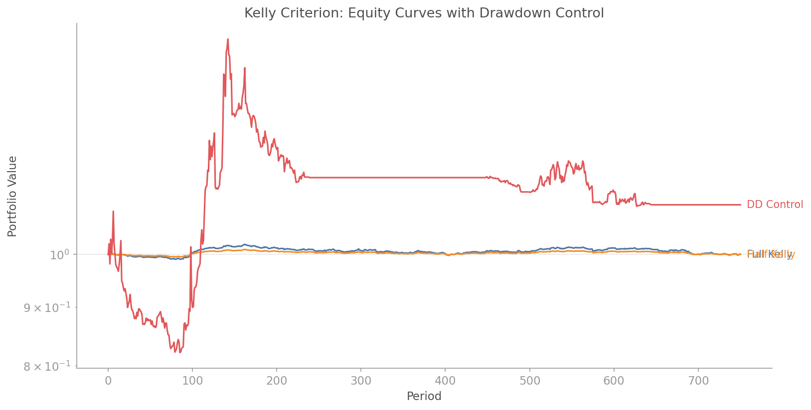
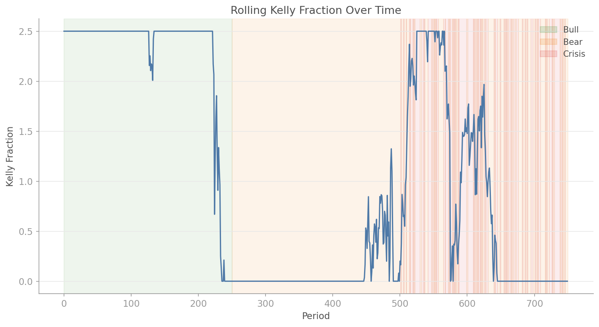

# Dynamic Kelly Criterion

## Overview

The Kelly criterion tells you the optimal fraction of your capital to bet: the fraction that maximises the long-run geometric growth rate. Full Kelly is mathematically optimal but practically terrifying, with drawdowns that would make most investors capitulate. Half Kelly delivers roughly 75% of the growth with dramatically less variance. Quarter Kelly is even more conservative.

The `quantlite.portfolio.dynamic_kelly` module adds two critical extensions:

1. **Rolling Kelly** — re-estimates the optimal fraction on a rolling window, adapting to changing market conditions.
2. **Drawdown circuit breaker** — automatically reduces position size when the portfolio drawdown exceeds a threshold, preventing the geometric drag of deep losses.

All optimisation uses `scipy.optimize.minimize_scalar` (not grid search), which is both faster and more precise.



## API Reference

### `optimal_kelly_fraction(returns, max_fraction=5.0)`

Compute the optimal Kelly fraction by maximising the expected geometric growth rate via `scipy.optimize.minimize_scalar`.

```python
from quantlite.portfolio.dynamic_kelly import optimal_kelly_fraction

f = optimal_kelly_fraction(returns, max_fraction=3.0)
print(f"Optimal Kelly: {f:.3f}")
```

**Parameters:**

| Name | Type | Description |
|------|------|-------------|
| `returns` | array-like | Simple returns |
| `max_fraction` | `float` | Upper bound on Kelly fraction |

**Returns:** `float` — optimal Kelly fraction.

---

### `fractional_kelly(returns, fraction_of_kelly=0.5, max_fraction=5.0)`

Compute a fractional Kelly allocation and simulate the equity curve.

```python
from quantlite.portfolio.dynamic_kelly import fractional_kelly

half = fractional_kelly(returns, fraction_of_kelly=0.5)
print(f"Fraction: {half.fraction:.3f}")
print(f"Max drawdown: {half.max_drawdown:.2%}")
print(f"Final wealth: {half.final_wealth:.2f}")
```

**Returns:** `KellyResult` with `fraction`, `equity_curve`, `max_drawdown`, `final_wealth`, `cagr`, `method`.

---

### `rolling_kelly(returns, window=126, fraction_of_kelly=0.5, max_fraction=5.0)`

Rolling Kelly fraction over a sliding window.

```python
from quantlite.portfolio.dynamic_kelly import rolling_kelly

fracs, equity = rolling_kelly(returns, window=126)
```

**Returns:** Tuple of `(kelly_fractions, equity_curve)` arrays.

---

### `kelly_with_drawdown_control(returns, fraction_of_kelly=0.5, max_drawdown_threshold=-0.15, drawdown_reduction=0.5, window=126, max_fraction=5.0)`

Kelly sizing with a maximum drawdown circuit breaker.

```python
from quantlite.portfolio.dynamic_kelly import kelly_with_drawdown_control

result = kelly_with_drawdown_control(
    returns,
    fraction_of_kelly=0.5,
    max_drawdown_threshold=-0.10,
    drawdown_reduction=0.25,
)
print(f"Max DD: {result.max_drawdown:.2%}")
```

**Parameters:**

| Name | Type | Description |
|------|------|-------------|
| `max_drawdown_threshold` | `float` | DD level that triggers the breaker (negative) |
| `drawdown_reduction` | `float` | Multiplicative reduction when breaker fires |

---

## Examples

### Comparing Kelly Variants

```python
import numpy as np
from quantlite.portfolio.dynamic_kelly import fractional_kelly, kelly_with_drawdown_control

rng = np.random.RandomState(42)
returns = rng.normal(0.0005, 0.02, 1000)

full = fractional_kelly(returns, fraction_of_kelly=1.0)
half = fractional_kelly(returns, fraction_of_kelly=0.5)
controlled = kelly_with_drawdown_control(
    returns, max_drawdown_threshold=-0.10, drawdown_reduction=0.25
)

print(f"Full Kelly:  CAGR={full.cagr:.2%}, MaxDD={full.max_drawdown:.2%}")
print(f"Half Kelly:  CAGR={half.cagr:.2%}, MaxDD={half.max_drawdown:.2%}")
print(f"DD Control:  CAGR={controlled.cagr:.2%}, MaxDD={controlled.max_drawdown:.2%}")
```




## References

- Kelly, J. L. (1956). "A New Interpretation of Information Rate." *Bell System Technical Journal.*
- Thorp, E. O. (2006). "The Kelly Criterion in Blackjack, Sports Betting, and the Stock Market." *Handbook of Asset and Liability Management.*
- MacLean, L. C., Thorp, E. O., and Ziemba, W. T. (2011). *The Kelly Capital Growth Investment Criterion.* World Scientific.
