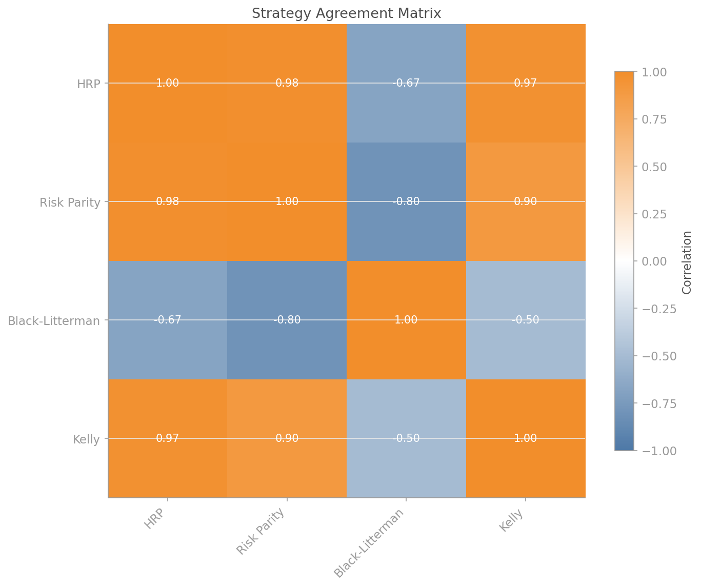
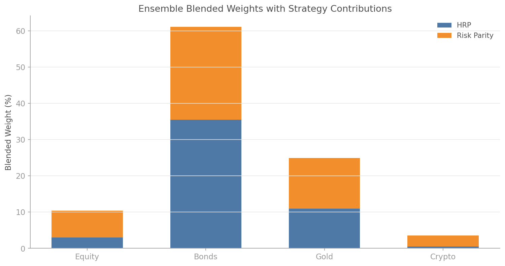

# Ensemble Allocators

## Overview

No single allocation strategy dominates in all market conditions. HRP excels when correlations are unstable. Risk parity works well in balanced regimes. Kelly maximises geometric growth when your edge is real. Black-Litterman shines when you have genuine views.

Ensemble allocation blends multiple strategies into a single portfolio, diversifying across methodologies rather than just across assets. The `quantlite.portfolio.ensemble` module provides:

- **Equal-weight blending** — simple average across strategies
- **Inverse-error weighting** — strategies with lower tracking error get more weight
- **Regime-confidence weighting** — strategies weighted by how well they match the current regime
- **Consensus portfolio** — the minimum weight each asset receives across all strategies (where everyone agrees)



## API Reference

### `ensemble_allocate(returns_df, strategies=None, weighting="equal", ...)`

Blend multiple allocation strategies into a single portfolio.

```python
from quantlite.portfolio.ensemble import ensemble_allocate

result = ensemble_allocate(returns_df, weighting="equal")
print(result.blended_weights)
print(result.strategy_weights)
```

If `strategies` is not provided, HRP and risk parity are computed automatically from `returns_df`.

**Parameters:**

| Name | Type | Description |
|------|------|-------------|
| `returns_df` | `pd.DataFrame` | Asset returns |
| `strategies` | `dict` or `None` | Pre-computed strategy allocations |
| `weighting` | `str` | `"equal"`, `"inverse_error"`, or `"regime_confidence"` |
| `strategy_errors` | `dict` | Per-strategy error (for inverse-error weighting) |
| `regime_confidences` | `dict` | Per-strategy confidence (for regime weighting) |

**Returns:** `EnsembleResult` with `blended_weights`, `strategy_weights`, `strategy_allocations`, `agreement_matrix`.

---

### `consensus_portfolio(strategies, threshold=0.05)`

Find where all strategies agree: the minimum weight for each asset across all strategies.

```python
from quantlite.portfolio.ensemble import consensus_portfolio

strats = {
    "HRP": {"Equity": 0.35, "Bonds": 0.40, "Gold": 0.25},
    "RP":  {"Equity": 0.30, "Bonds": 0.45, "Gold": 0.25},
    "BL":  {"Equity": 0.50, "Bonds": 0.30, "Gold": 0.20},
}
consensus = consensus_portfolio(strats)
# Gold=0.20, Bonds=0.30, Equity=0.30 → renormalised
```

---

### `inverse_error_weights(strategy_errors)`

Compute blend weights inversely proportional to error.

```python
from quantlite.portfolio.ensemble import inverse_error_weights

weights = inverse_error_weights({"HRP": 0.03, "RP": 0.05, "BL": 0.08})
# HRP gets highest weight (lowest error)
```

---

## Examples

### Custom Multi-Strategy Ensemble

```python
import pandas as pd
import numpy as np
from quantlite.portfolio.ensemble import ensemble_allocate

rng = np.random.RandomState(42)
returns_df = pd.DataFrame({
    "Equity": rng.normal(0.0003, 0.015, 500),
    "Bonds": rng.normal(0.0002, 0.006, 500),
    "Gold": rng.normal(0.0001, 0.010, 500),
})

strategies = {
    "HRP": {"Equity": 0.35, "Bonds": 0.40, "Gold": 0.25},
    "Risk Parity": {"Equity": 0.28, "Bonds": 0.45, "Gold": 0.27},
    "Kelly": {"Equity": 0.55, "Bonds": 0.25, "Gold": 0.20},
    "BL": {"Equity": 0.45, "Bonds": 0.30, "Gold": 0.25},
}

result = ensemble_allocate(
    returns_df,
    strategies=strategies,
    weighting="inverse_error",
    strategy_errors={"HRP": 0.03, "Risk Parity": 0.04, "Kelly": 0.08, "BL": 0.05},
)

print("Blended:", result.blended_weights)
print("Strategy weights:", result.strategy_weights)
print("Agreement:\n", result.agreement_matrix)
```



## References

- Lopez de Prado, M. (2016). "Building Diversified Portfolios that Outperform Out of Sample." *Journal of Portfolio Management.*
- DeMiguel, V., Garlappi, L., and Uppal, R. (2009). "Optimal Versus Naive Diversification: How Inefficient is the 1/N Portfolio Strategy?" *Review of Financial Studies.*
