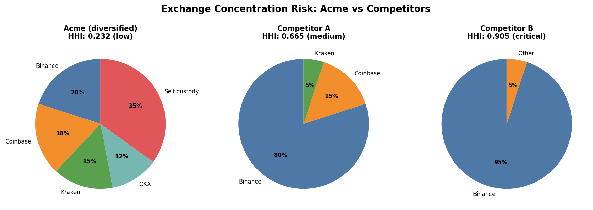
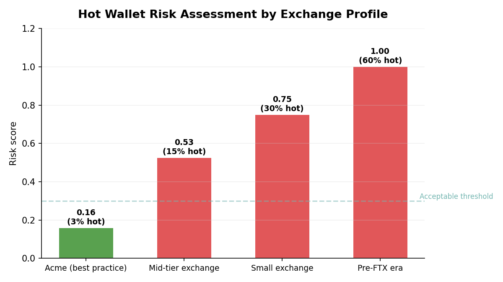
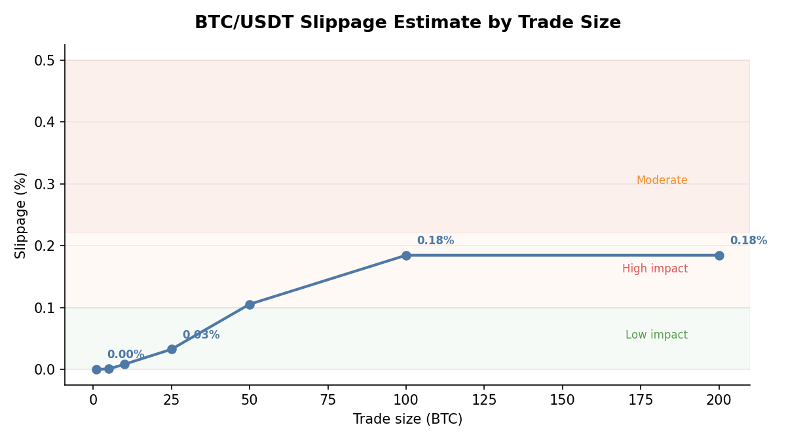

# Exchange Risk Analysis

## Overview

FTX proved that exchange counterparty risk is existential.

When an exchange fails, it takes customer assets with it. The collapse of FTX in November 2022, Mt. Gox in 2014, and numerous smaller exchanges since then demonstrate that counterparty risk in crypto is not a theoretical exercise. For a crypto exchange CFO, understanding and managing exchange-level risk is a fiduciary obligation.

The `quantlite.crypto.exchange` module provides five tools for assessing exchange counterparty and operational risk:

1. **Concentration Score** measures how concentrated holdings are across exchanges using HHI
2. **Wallet Risk Assessment** evaluates hot/cold wallet allocation safety
3. **Proof of Reserves Check** compares claimed reserves against on-chain verification
4. **Liquidity Risk** estimates position unwind time given order book depth
5. **Slippage Estimate** calculates price impact for a given trade size

## API Reference

### `concentration_score`

```python
concentration_score(
    balances_by_exchange: dict,
) -> dict
```

Compute Herfindahl-Hirschman Index (HHI) based concentration across exchanges. An HHI near 1.0 means all funds sit on a single exchange, representing maximum counterparty risk.

**Parameters:**

| Parameter | Type | Description |
|-----------|------|-------------|
| `balances_by_exchange` | dict | Mapping of exchange name to balance value |

**Returns:** Dictionary with keys:

| Key | Description |
|-----|-------------|
| `hhi` | Herfindahl-Hirschman Index, float in (0, 1] |
| `normalised_hhi` | HHI normalised to [0, 1] for the number of exchanges |
| `risk_rating` | Qualitative rating: low, medium, high, or critical |
| `shares` | Dict of exchange to percentage share |
| `dominant_exchange` | Exchange with the largest share |
| `n_exchanges` | Number of exchanges with non-zero balance |

**Interpretation:**

| Normalised HHI | Risk Rating | Meaning |
|-----------------|-------------|---------|
| < 0.25 | Low | Well-diversified across exchanges |
| 0.25 to 0.50 | Medium | Moderate concentration; consider rebalancing |
| 0.50 to 0.75 | High | Significant single-exchange dependency |
| > 0.75 | Critical | Near-total reliance on one exchange |

**Example:**

```python
from quantlite.crypto.exchange import concentration_score

# Acme Fund diversified custody
balances = {
    "Binance": 200e6,
    "Coinbase": 180e6,
    "Kraken": 150e6,
    "OKX": 120e6,
    "Self-custody": 350e6,
}
result = concentration_score(balances)
print(f"HHI: {result['hhi']:.3f}")
print(f"Dominant: {result['dominant_exchange']} ({result['shares'][result['dominant_exchange']]:.1%})")
```



### `wallet_risk_assessment`

```python
wallet_risk_assessment(
    hot_pct: float,
    cold_pct: float,
    total_value: float,
) -> dict
```

Score hot/cold wallet ratio risk. Industry best practice keeps hot wallet exposure below 5% of total holdings.

**Parameters:**

| Parameter | Type | Description |
|-----------|------|-------------|
| `hot_pct` | float | Percentage of total value in hot wallets (0 to 100) |
| `cold_pct` | float | Percentage of total value in cold wallets (0 to 100) |
| `total_value` | float | Total value across all wallets |

**Returns:** Dictionary with keys:

| Key | Description |
|-----|-------------|
| `risk_score` | Float in [0, 1], higher means riskier |
| `risk_rating` | Qualitative rating |
| `hot_value` | Absolute value in hot wallets |
| `cold_value` | Absolute value in cold wallets |
| `recommendations` | List of risk mitigation suggestions |

**Interpretation:**

| Hot Wallet % | Risk Score | Guidance |
|-------------|------------|----------|
| < 2% | ~0.05 | Excellent; institutional best practice |
| 2% to 5% | ~0.15 | Good; within industry norms |
| 5% to 10% | ~0.30 | Acceptable but monitor closely |
| 10% to 20% | ~0.50 | High risk; remediation needed |
| > 20% | > 0.75 | Critical; immediate action required |

**Example:**

```python
from quantlite.crypto.exchange import wallet_risk_assessment

# Acme Fund wallet allocation
result = wallet_risk_assessment(hot_pct=3, cold_pct=97, total_value=1_000_000_000)
print(f"Risk score: {result['risk_score']:.2f} ({result['risk_rating']})")
print(f"Hot wallet value: ${result['hot_value'] / 1e6:.0f}M")
for rec in result["recommendations"]:
    print(f"  - {rec}")
```



### `proof_of_reserves_check`

```python
proof_of_reserves_check(
    claimed_reserves: dict,
    on_chain_verified: dict,
) -> dict
```

Compare claimed reserves against on-chain verified amounts. Essential for evaluating exchange solvency claims.

**Parameters:**

| Parameter | Type | Description |
|-----------|------|-------------|
| `claimed_reserves` | dict | Mapping of asset name to claimed reserve amount |
| `on_chain_verified` | dict | Mapping of asset name to on-chain verified amount |

**Returns:** Dictionary with keys:

| Key | Description |
|-----|-------------|
| `overall_ratio` | Total verified divided by total claimed |
| `per_asset` | Per-asset verification details |
| `fully_verified` | True if all assets are at least 100% verified |
| `risk_rating` | Qualitative rating |
| `warnings` | List of specific concerns |

**Interpretation:**

| Overall Ratio | Risk Rating | Meaning |
|---------------|-------------|---------|
| >= 1.0 (all assets) | Low | Fully collateralised and verified |
| >= 0.95 | Medium | Minor discrepancies; investigate |
| 0.80 to 0.95 | High | Material shortfall; demand explanation |
| < 0.80 | Critical | Potential insolvency; reduce exposure immediately |

**Example:**

```python
from quantlite.crypto.exchange import proof_of_reserves_check

claimed = {"BTC": 10_000, "ETH": 150_000, "USDT": 500_000_000}
verified = {"BTC": 9_800, "ETH": 150_000, "USDT": 485_000_000}

result = proof_of_reserves_check(claimed, verified)
print(f"Overall ratio: {result['overall_ratio']:.2%}")
print(f"Fully verified: {result['fully_verified']}")
for warning in result["warnings"]:
    print(f"  Warning: {warning}")
```

### `liquidity_risk`

```python
liquidity_risk(
    order_book_depth: float,
    position_size: float,
) -> dict
```

Estimate unwind time and risk given order book depth.

**Parameters:**

| Parameter | Type | Description |
|-----------|------|-------------|
| `order_book_depth` | float | Average available depth per period (e.g. daily volume at acceptable slippage) |
| `position_size` | float | Total position size to unwind |

**Returns:** Dictionary with keys:

| Key | Description |
|-----|-------------|
| `periods_to_unwind` | Estimated periods at 100% participation |
| `position_to_depth_ratio` | Position size relative to available depth |
| `risk_rating` | Qualitative rating |
| `daily_participation_rate` | Suggested conservative daily rate (10% of depth) |
| `recommended_unwind_periods` | Periods at conservative participation |

**Interpretation:**

| Position/Depth Ratio | Risk Rating | Meaning |
|---------------------|-------------|---------|
| < 0.5 | Low | Can unwind within one period comfortably |
| 0.5 to 2.0 | Medium | Multi-period unwind needed |
| 2.0 to 10.0 | High | Significant market impact likely |
| > 10.0 | Critical | Position is effectively illiquid |

**Example:**

```python
from quantlite.crypto.exchange import liquidity_risk

result = liquidity_risk(order_book_depth=5_000_000, position_size=25_000_000)
print(f"Periods to unwind: {result['periods_to_unwind']:.1f}")
print(f"Recommended periods: {result['recommended_unwind_periods']:.0f}")
```

### `slippage_estimate`

```python
slippage_estimate(
    order_book: list,
    trade_size: float,
) -> dict
```

Walk through an order book to estimate volume-weighted average price and slippage.

**Parameters:**

| Parameter | Type | Description |
|-----------|------|-------------|
| `order_book` | list of tuples | List of (price, quantity) tuples, sorted by price |
| `trade_size` | float | Total quantity to trade |

**Returns:** Dictionary with keys:

| Key | Description |
|-----|-------------|
| `vwap` | Volume-weighted average execution price |
| `best_price` | Best available price (first level) |
| `worst_price` | Worst price touched |
| `slippage_pct` | Percentage slippage from best price |
| `levels_consumed` | Number of order book levels consumed |
| `unfilled` | Quantity that could not be filled |
| `risk_rating` | Qualitative rating |

**Interpretation:**

| Slippage % | Risk Rating | Meaning |
|-----------|-------------|---------|
| < 0.1% | Low | Negligible market impact |
| 0.1% to 0.5% | Medium | Acceptable for most trades |
| 0.5% to 2.0% | High | Consider splitting the order |
| > 2.0% | Critical | Severe impact; use algorithmic execution |

**Example:**

```python
from quantlite.crypto.exchange import slippage_estimate

# BTC/USDT ask side
order_book = [
    (65_000, 2.0),
    (65_010, 1.5),
    (65_050, 3.0),
    (65_100, 5.0),
]
result = slippage_estimate(order_book, trade_size=5.0)
print(f"VWAP: ${result['vwap']:,.2f}")
print(f"Slippage: {result['slippage_pct']:.3f}%")
```



