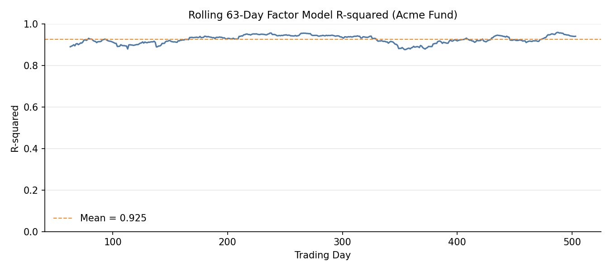

# Classical Factor Models

## Overview

Factor models are the backbone of quantitative portfolio analysis. They decompose asset returns into systematic exposures (betas) and idiosyncratic risk (alpha), answering the fundamental question: is this manager generating genuine skill, or just taking on known risk premia?

The `quantlite.factors.classical` module implements the three most widely used academic factor models, plus a generic multi-factor framework:

1. **Fama-French Three-Factor** separates market, size, and value exposures
2. **Fama-French Five-Factor** adds profitability and investment factors
3. **Carhart Four-Factor** extends the three-factor model with momentum
4. **Factor Attribution** decomposes total return into factor contributions
5. **Factor Summary** provides a one-call comprehensive regression table

## API Reference

### `fama_french_three`

```python
fama_french_three(
    returns: array-like,
    market_returns: array-like,
    smb: array-like,
    hml: array-like,
) -> dict
```

Regresses asset returns against the three Fama-French factors: market excess returns, SMB (Small Minus Big), and HML (High Minus Low).

**Parameters:**

| Parameter | Type | Description |
|-----------|------|-------------|
| `returns` | array-like | Asset excess return series |
| `market_returns` | array-like | Market excess return series |
| `smb` | array-like | Size factor (Small Minus Big) |
| `hml` | array-like | Value factor (High Minus Low) |

**Returns:** Dictionary with keys:

| Key | Description |
|-----|-------------|
| `alpha` | Jensen's alpha (intercept) |
| `betas` | Dict with `market`, `smb`, `hml` factor loadings |
| `r_squared` | Coefficient of determination |
| `adj_r_squared` | Adjusted R-squared |
| `t_stats` | Dict with t-statistics for alpha and each beta |
| `p_values` | Dict with p-values for alpha and each beta |
| `residuals` | Array of regression residuals |

**Example:**

```python
from quantlite.factors import fama_french_three

result = fama_french_three(fund_returns, market, smb, hml)
print(f"Alpha: {result['alpha']:.5f}")
print(f"Market beta: {result['betas']['market']:.3f}")
print(f"Size tilt: {result['betas']['smb']:.3f}")
print(f"Value tilt: {result['betas']['hml']:.3f}")
print(f"R-squared: {result['r_squared']:.3f}")
```


### `fama_french_five`

```python
fama_french_five(
    returns: array-like,
    market_returns: array-like,
    smb: array-like,
    hml: array-like,
    rmw: array-like,
    cma: array-like,
) -> dict
```

Extends the three-factor model with profitability (RMW: Robust Minus Weak) and investment (CMA: Conservative Minus Aggressive) factors.

**Parameters:**

| Parameter | Type | Description |
|-----------|------|-------------|
| `returns` | array-like | Asset excess return series |
| `market_returns` | array-like | Market excess return series |
| `smb` | array-like | Size factor |
| `hml` | array-like | Value factor |
| `rmw` | array-like | Profitability factor (Robust Minus Weak) |
| `cma` | array-like | Investment factor (Conservative Minus Aggressive) |

**Returns:** Same structure as `fama_french_three`, with `rmw` and `cma` added to `betas`, `t_stats`, and `p_values`.

**Example:**

```python
from quantlite.factors import fama_french_five

result = fama_french_five(fund_returns, market, smb, hml, rmw, cma)
for name, beta in result["betas"].items():
    sig = "***" if result["p_values"][name] < 0.01 else ""
    print(f"  {name}: {beta:+.3f} {sig}")
```

### `carhart_four`

```python
carhart_four(
    returns: array-like,
    market_returns: array-like,
    smb: array-like,
    hml: array-like,
    mom: array-like,
) -> dict
```

Adds a momentum factor (MOM: Winners Minus Losers) to the Fama-French three-factor model.

**Parameters:**

| Parameter | Type | Description |
|-----------|------|-------------|
| `returns` | array-like | Asset excess return series |
| `market_returns` | array-like | Market excess return series |
| `smb` | array-like | Size factor |
| `hml` | array-like | Value factor |
| `mom` | array-like | Momentum factor (Winners Minus Losers) |

**Returns:** Same structure as `fama_french_three`, with `mom` added.

### `factor_attribution`

```python
factor_attribution(
    returns: array-like,
    factor_returns: list of array-like,
    factor_names: list of str,
) -> dict
```

Decomposes total returns into factor contributions and unexplained (alpha) return.

**Parameters:**

| Parameter | Type | Description |
|-----------|------|-------------|
| `returns` | array-like | Asset return series |
| `factor_returns` | list of array-like | Factor return series |
| `factor_names` | list of str | Names for each factor |

**Returns:**

| Key | Description |
|-----|-------------|
| `alpha` | Regression intercept |
| `factor_contributions` | Dict mapping factor name to mean return contribution |
| `unexplained` | Mean return not explained by factors |
| `r_squared` | Model R-squared |
| `total_return` | Mean total return |

**Example:**

```python
from quantlite.factors import factor_attribution

attr = factor_attribution(
    fund_returns,
    [market, smb, hml],
    ["Market", "SMB", "HML"],
)
for name, contrib in attr["factor_contributions"].items():
    print(f"  {name}: {contrib:.6f}")
print(f"  Unexplained: {attr['unexplained']:.6f}")
```


### `factor_summary`

```python
factor_summary(
    returns: array-like,
    factor_returns: list of array-like,
    factor_names: list of str,
) -> dict
```

One-call summary table with all regression statistics.

**Parameters:**

| Parameter | Type | Description |
|-----------|------|-------------|
| `returns` | array-like | Asset return series |
| `factor_returns` | list of array-like | Factor return series |
| `factor_names` | list of str | Names for each factor |

**Returns:**

| Key | Description |
|-----|-------------|
| `alpha` | Regression alpha |
| `alpha_t` | t-statistic for alpha |
| `alpha_p` | p-value for alpha |
| `betas` | Dict of factor betas |
| `t_stats` | Dict of factor t-statistics |
| `p_values` | Dict of factor p-values |
| `r_squared` | R-squared |
| `adj_r_squared` | Adjusted R-squared |
| `n_obs` | Number of observations |



## Interpretation Guide

### Alpha

| Alpha | Interpretation |
|-------|----------------|
| Positive, significant (p < 0.05) | Genuine outperformance after controlling for factor exposures |
| Positive, insignificant | Returns may be explained by unmeasured factors or luck |
| Near zero | Performance fully explained by factor exposures |
| Negative, significant | Underperformance after adjusting for risk taken |

### Factor Betas

| Beta Range | Interpretation |
|------------|----------------|
| > 1.0 (market) | Aggressive; amplifies market moves |
| 0.5 to 1.0 (market) | Moderate market exposure |
| > 0 (SMB) | Small-cap tilt |
| > 0 (HML) | Value tilt |
| > 0 (MOM) | Momentum strategy |
| < 0 | Contrarian or hedged exposure to that factor |

### R-squared

| R-squared | Interpretation |
|-----------|----------------|
| > 0.90 | Essentially a factor portfolio; little idiosyncratic risk |
| 0.70 to 0.90 | Well-explained by factors; some active management |
| 0.40 to 0.70 | Moderate factor exposure; significant stock selection |
| < 0.40 | Highly idiosyncratic; factors explain little |
