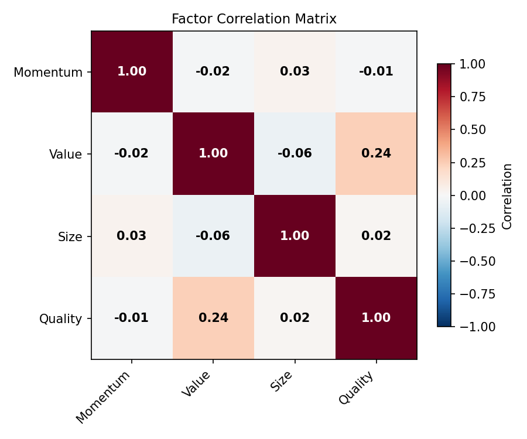
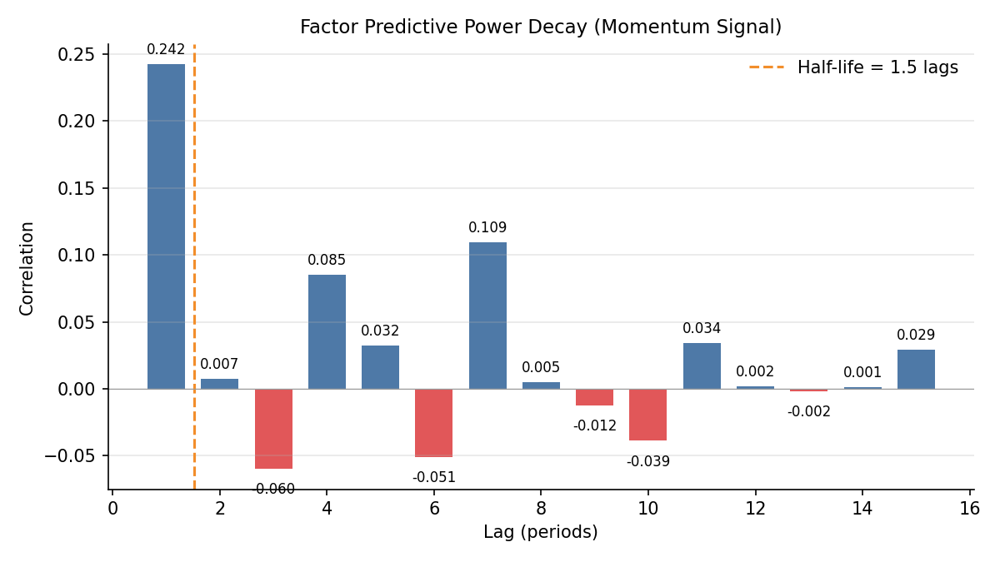

# Custom Factor Tools

## Overview

Academic factor models cover the standard premia, but real-world alpha research demands custom factors. You need to wrap proprietary signals, test whether they add value beyond known factors, check for multicollinearity, build long-short portfolios, and measure how quickly predictive power decays.

The `quantlite.factors.custom` module provides five tools for this workflow:

1. **CustomFactor** wraps any time series as a named factor
2. **test_factor_significance** runs t-tests and F-tests for marginal contribution
3. **factor_correlation_matrix** detects multicollinearity between factors
4. **factor_portfolio** builds quantile-sorted long-short portfolios
5. **factor_decay** measures how quickly a signal's power fades with lag

## API Reference

### `CustomFactor`

```python
CustomFactor(name: str, series: array-like or pd.Series)
```

Wraps any time series as a named factor object with convenience methods.

**Parameters:**

| Parameter | Type | Description |
|-----------|------|-------------|
| `name` | str | Human-readable factor name |
| `series` | array-like or pd.Series | Factor values |

**Methods:**

| Method | Returns | Description |
|--------|---------|-------------|
| `mean()` | float | Mean of the series |
| `std()` | float | Standard deviation (ddof=1) |
| `correlation(other)` | float | Pearson correlation with another factor or array |
| `len(factor)` | int | Number of observations |

**Example:**

```python
from quantlite.factors import CustomFactor

sentiment = CustomFactor("Sentiment", sentiment_scores)
print(f"Mean: {sentiment.mean():.4f}, Std: {sentiment.std():.4f}")
print(f"Correlation with momentum: {sentiment.correlation(momentum_factor):.3f}")
```

### `test_factor_significance`

```python
test_factor_significance(
    returns: array-like,
    factor: CustomFactor or array-like,
    control_factors: list of CustomFactor or array-like = None,
) -> dict
```

Tests whether a factor adds explanatory power beyond control factors, using both t-tests and F-tests.

**Parameters:**

| Parameter | Type | Description |
|-----------|------|-------------|
| `returns` | array-like | Asset return series |
| `factor` | CustomFactor or array-like | The factor to test |
| `control_factors` | list, optional | Control factors to include |

**Returns:**

| Key | Description |
|-----|-------------|
| `t_stat` | t-statistic for the test factor |
| `t_pvalue` | Two-sided p-value for the t-test |
| `f_stat` | F-statistic for marginal contribution |
| `f_pvalue` | p-value for the F-test |
| `beta` | Regression coefficient on the test factor |
| `r_squared_full` | R-squared with all factors |
| `r_squared_restricted` | R-squared without the test factor |
| `marginal_r_squared` | Incremental R-squared from the test factor |

**Example:**

```python
from quantlite.factors import test_factor_significance, CustomFactor

sentiment = CustomFactor("Sentiment", sentiment_scores)
result = test_factor_significance(
    fund_returns, sentiment, control_factors=[market, value]
)
print(f"Marginal R-squared: {result['marginal_r_squared']:.4f}")
print(f"t-stat: {result['t_stat']:.2f} (p={result['t_pvalue']:.4f})")
```

### `factor_correlation_matrix`

```python
factor_correlation_matrix(
    factors: list of CustomFactor or array-like,
) -> dict
```

Computes pairwise correlations between factors to detect multicollinearity.

**Parameters:**

| Parameter | Type | Description |
|-----------|------|-------------|
| `factors` | list | Factor series (CustomFactor or array-like) |

**Returns:**

| Key | Description |
|-----|-------------|
| `matrix` | 2D numpy array of correlations |
| `names` | Factor names |
| `max_offdiag` | Maximum absolute off-diagonal correlation |
| `pairs` | List of (name_a, name_b, correlation) tuples with abs(corr) > 0.5 |



### `factor_portfolio`

```python
factor_portfolio(
    returns_df: pd.DataFrame,
    factor_values: array-like,
    n_quantiles: int = 5,
) -> dict
```

Sorts assets into quantiles by factor value and computes per-quantile returns plus the long-short spread.

**Parameters:**

| Parameter | Type | Description |
|-----------|------|-------------|
| `returns_df` | pd.DataFrame | Asset returns (columns = assets, rows = periods) |
| `factor_values` | array-like | Factor values per asset (length = number of columns) |
| `n_quantiles` | int | Number of quantiles (default 5) |

**Returns:**

| Key | Description |
|-----|-------------|
| `quantile_returns` | Dict mapping quantile number to mean return |
| `spread` | Top minus bottom quantile return |
| `n_quantiles` | Number of quantiles used |
| `monotonic` | Whether returns increase/decrease monotonically across quantiles |

**Example:**

```python
from quantlite.factors import factor_portfolio

result = factor_portfolio(stock_returns, book_to_market, n_quantiles=5)
for q, r in result["quantile_returns"].items():
    print(f"  Q{q}: {r * 252:.2%} annualised")
print(f"Spread: {result['spread'] * 252:.2%}")
```


### `factor_decay`

```python
factor_decay(
    returns: array-like,
    factor: CustomFactor or array-like,
    max_lag: int = 20,
) -> dict
```

Measures how quickly a factor's predictive power decays with lag.

**Parameters:**

| Parameter | Type | Description |
|-----------|------|-------------|
| `returns` | array-like | Asset return series |
| `factor` | CustomFactor or array-like | Factor series |
| `max_lag` | int | Maximum lags to test (default 20) |

**Returns:**

| Key | Description |
|-----|-------------|
| `decay_curve` | List of (lag, correlation) tuples |
| `half_life` | Estimated half-life in periods (float or None) |
| `r_squared_curve` | List of (lag, r_squared) tuples |



## Interpretation Guide

### Factor Significance

| p-value | Interpretation |
|---------|----------------|
| < 0.01 | Strong evidence the factor adds predictive power |
| 0.01 to 0.05 | Moderate evidence; worth including |
| 0.05 to 0.10 | Weak evidence; borderline |
| > 0.10 | No evidence of marginal contribution |

### Multicollinearity

| Max Off-Diagonal Correlation | Interpretation |
|-----------------------------|----------------|
| < 0.3 | Low multicollinearity; factors are distinct |
| 0.3 to 0.6 | Moderate; monitor but likely acceptable |
| 0.6 to 0.8 | High; consider dropping or combining factors |
| > 0.8 | Severe; regression coefficients unreliable |

### Factor Decay Half-Life

| Half-Life | Interpretation |
|-----------|----------------|
| 1 to 3 periods | Very fast decay; needs high-frequency rebalancing |
| 3 to 10 periods | Moderate persistence; weekly to monthly signal |
| 10 to 20 periods | Slow decay; monthly to quarterly signal |
| > 20 periods | Structural factor; very persistent |

### Quintile Spread

| Spread | Interpretation |
|--------|----------------|
| Monotonic, significant | Strong factor; clean separation of returns |
| Non-monotonic | Factor may only work at extremes |
| Near zero | Factor has no cross-sectional predictive power |
| Negative (Q1 > Q5) | Factor works in reverse of expected direction |
