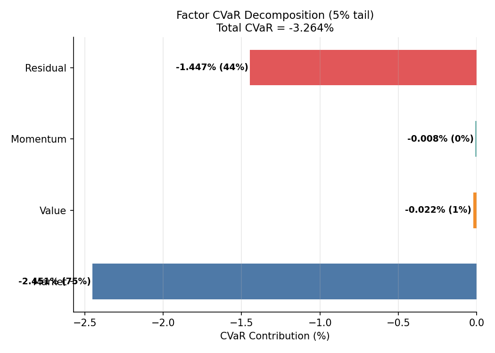
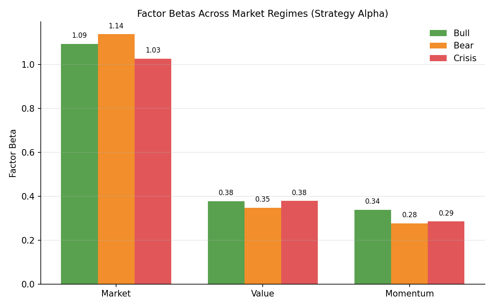
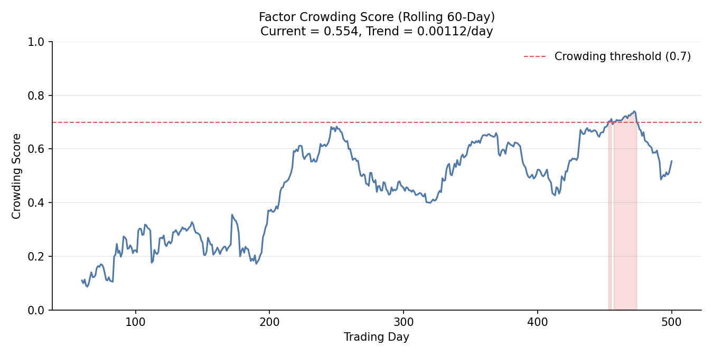

# Tail Risk Factor Analysis

## Overview

Standard factor models assume that factor exposures are constant across the return distribution. They are not. During crises, market betas spike, diversification benefits vanish, and factors that seemed orthogonal become dangerously correlated. A fund with a "normal" market beta of 1.0 may behave like a 1.8-beta fund in the worst 5% of days.

The `quantlite.factors.tail_risk` module provides four tools that go beyond variance-based factor analysis:

1. **CVaR Decomposition** attributes tail losses to individual factors
2. **Regime Factor Exposure** estimates separate betas for bull, bear, and crisis periods
3. **Factor Crowding Score** detects when too many investors pile into the same factors
4. **Tail Factor Beta** estimates factor betas using only extreme observations

## API Reference

### `factor_cvar_decomposition`

```python
factor_cvar_decomposition(
    returns: array-like,
    factor_returns: list of array-like,
    factor_names: list of str,
    alpha: float = 0.05,
) -> dict
```

Decomposes Conditional Value at Risk into individual factor contributions, revealing which factors drive tail losses.

**Parameters:**

| Parameter | Type | Description |
|-----------|------|-------------|
| `returns` | array-like | Asset return series |
| `factor_returns` | list of array-like | Factor return series |
| `factor_names` | list of str | Names for each factor |
| `alpha` | float | Tail probability (default 0.05) |

**Returns:**

| Key | Description |
|-----|-------------|
| `total_cvar` | Total CVaR at the given alpha level |
| `factor_contributions` | Dict mapping factor name to CVaR contribution |
| `residual_contribution` | CVaR from idiosyncratic risk |
| `pct_contributions` | Dict of percentage contributions to total CVaR |

**Example:**

```python
from quantlite.factors import factor_cvar_decomposition

result = factor_cvar_decomposition(
    fund_returns,
    [market, value, momentum],
    ["Market", "Value", "Momentum"],
    alpha=0.05,
)
print(f"Total CVaR (5%): {result['total_cvar']:.4%}")
for name, contrib in result["factor_contributions"].items():
    pct = result["pct_contributions"][name]
    print(f"  {name}: {contrib:.4%} ({pct:.0%} of total)")
```



### `regime_factor_exposure`

```python
regime_factor_exposure(
    returns: array-like,
    factor_returns: list of array-like,
    factor_names: list of str,
    regimes: array-like,
) -> dict
```

Estimates factor betas separately for each market regime, revealing how exposures shift during stress.

**Parameters:**

| Parameter | Type | Description |
|-----------|------|-------------|
| `returns` | array-like | Asset return series |
| `factor_returns` | list of array-like | Factor return series |
| `factor_names` | list of str | Names for each factor |
| `regimes` | array-like | Regime labels for each observation |

**Returns:** Dict keyed by regime label, each containing:

| Key | Description |
|-----|-------------|
| `alpha` | Regime-specific alpha (None if insufficient data) |
| `betas` | Dict of regime-specific factor betas |
| `r_squared` | Regime-specific R-squared |
| `n_obs` | Number of observations in the regime |

**Example:**

```python
from quantlite.factors import regime_factor_exposure

result = regime_factor_exposure(
    fund_returns, [market, value], ["Market", "Value"], regime_labels
)
for regime, stats in result.items():
    if stats["alpha"] is not None:
        print(f"{regime}: market beta = {stats['betas']['Market']:.2f}, "
              f"R2 = {stats['r_squared']:.3f} (n={stats['n_obs']})")
```



### `factor_crowding_score`

```python
factor_crowding_score(
    factor_returns: list of array-like,
    rolling_window: int = 60,
) -> dict
```

Detects factor crowding by tracking rolling pairwise correlations. Rising correlations suggest that many investors are taking the same factor bets, increasing the risk of a sudden unwind.

**Parameters:**

| Parameter | Type | Description |
|-----------|------|-------------|
| `factor_returns` | list of array-like | Factor return series (at least 2) |
| `rolling_window` | int | Rolling window size (default 60) |

**Returns:**

| Key | Description |
|-----|-------------|
| `crowding_scores` | Array of rolling mean pairwise correlations |
| `current_score` | Latest crowding score |
| `trend` | Linear slope of crowding score over time |
| `is_crowded` | True if current score exceeds 0.7 |

**Example:**

```python
from quantlite.factors import factor_crowding_score

result = factor_crowding_score([value_returns, momentum_returns], rolling_window=60)
print(f"Current crowding: {result['current_score']:.3f}")
print(f"Trend: {result['trend']:+.5f}/day")
if result["is_crowded"]:
    print("WARNING: Factor crowding detected")
```



### `tail_factor_beta`

```python
tail_factor_beta(
    returns: array-like,
    factor_returns: list of array-like,
    factor_names: list of str,
    alpha: float = 0.05,
) -> dict
```

Estimates factor betas using only the worst alpha percentile of returns, revealing how factor exposures amplify during extreme drawdowns.

**Parameters:**

| Parameter | Type | Description |
|-----------|------|-------------|
| `returns` | array-like | Asset return series |
| `factor_returns` | list of array-like | Factor return series |
| `factor_names` | list of str | Names for each factor |
| `alpha` | float | Tail probability (default 0.05) |

**Returns:**

| Key | Description |
|-----|-------------|
| `tail_betas` | Dict of betas estimated from tail observations only |
| `full_betas` | Dict of full-sample betas for comparison |
| `beta_ratio` | Dict of tail/full beta ratios (amplification factor) |
| `n_tail_obs` | Number of tail observations used |
| `var_threshold` | Return threshold for tail classification |

**Example:**

```python
from quantlite.factors import tail_factor_beta

result = tail_factor_beta(
    fund_returns, [market, value], ["Market", "Value"], alpha=0.05
)
for name in ["Market", "Value"]:
    ratio = result["beta_ratio"][name]
    print(f"{name}: full={result['full_betas'][name]:.2f}, "
          f"tail={result['tail_betas'][name]:.2f}, "
          f"amplification={ratio:.2f}x")
```

## Interpretation Guide

### CVaR Contributions

| Contribution Pattern | Interpretation |
|---------------------|----------------|
| One factor dominates | Concentrated tail risk; consider hedging that factor |
| Evenly spread | Diversified tail risk across factors |
| Large residual | Idiosyncratic tail risk; factor model incomplete |
| Negative contribution | Factor provides tail protection (rare) |

### Regime Beta Shifts

| Beta Ratio (crisis/calm) | Interpretation |
|--------------------------|----------------|
| > 1.5 | Severe beta amplification in stress; tail risk understated |
| 1.0 to 1.5 | Moderate amplification; typical for equity funds |
| ~1.0 | Stable exposure across regimes (rare, desirable) |
| < 1.0 | Defensive positioning activates in stress (good) |

### Crowding Score

| Score | Interpretation |
|-------|----------------|
| < 0.3 | Low crowding; factors are distinct |
| 0.3 to 0.5 | Moderate; normal market conditions |
| 0.5 to 0.7 | Elevated; factors converging |
| > 0.7 | High crowding; unwind risk is material |

### Tail Beta Amplification

| Amplification (tail/full) | Interpretation |
|--------------------------|----------------|
| > 2.0 | Extreme tail risk; factor exposure doubles in crises |
| 1.5 to 2.0 | Significant amplification; stress testing essential |
| 1.0 to 1.5 | Mild amplification; typical |
| < 1.0 | Exposure decreases in tails (defensive or hedged) |
