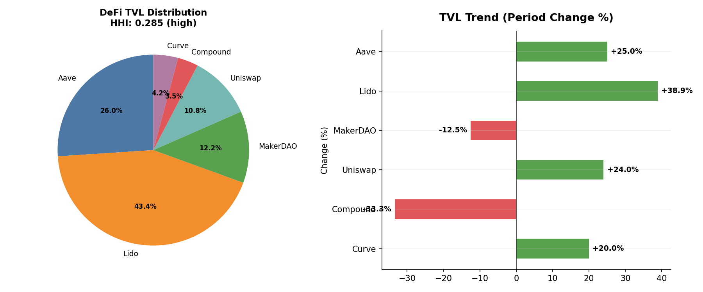
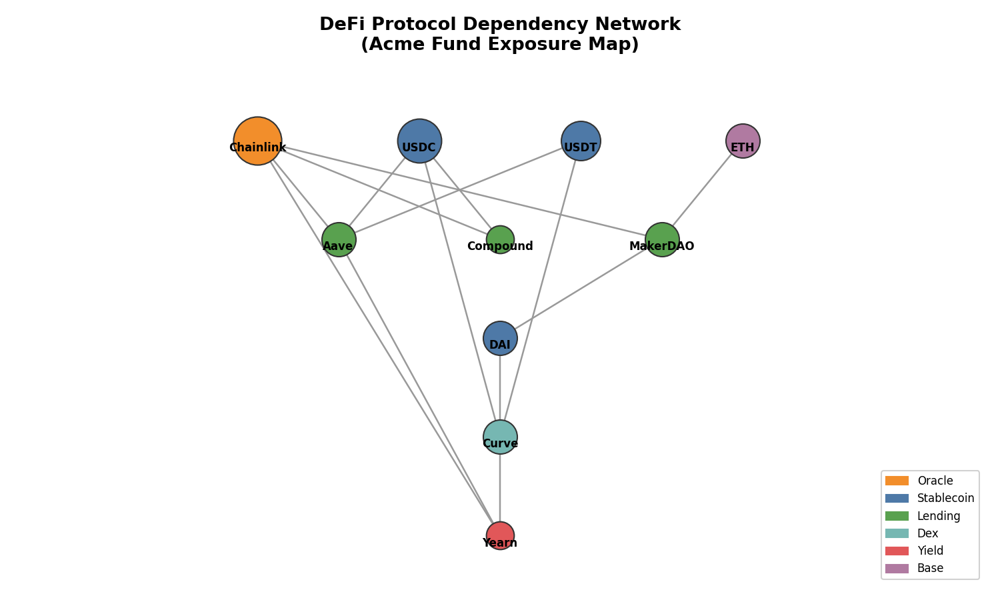
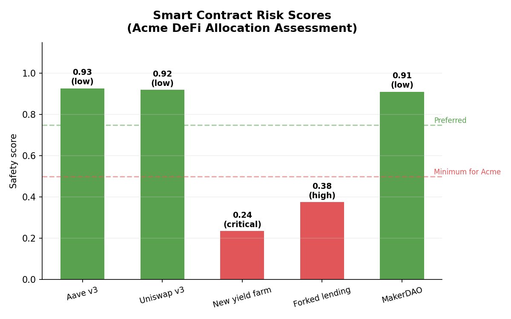

# On-Chain Risk Analysis

## Overview

DeFi composability is a feature until it becomes a contagion vector.

Protocols build on top of each other like layers of a financial system, but without the circuit breakers. When Chainlink's oracle fails, every lending protocol that depends on it is exposed. When a major stablecoin depegs, every liquidity pool holding it suffers. For a crypto exchange with DeFi exposure, understanding these dependency chains is essential for risk management.

The `quantlite.crypto.onchain` module provides four tools for assessing on-chain and DeFi risk:

1. **Wallet Exposure** returns a summary of token holdings and concentration for a given address
2. **TVL Tracker** analyses total value locked across protocols for concentration and trend risks
3. **DeFi Dependency Graph** maps protocol dependencies to identify systemic risk nodes
4. **Smart Contract Risk Score** provides a composite safety score for individual protocols

## API Reference

### `wallet_exposure`

```python
wallet_exposure(
    address: str,
    chain: str = "ethereum",
) -> dict
```

Return a wallet exposure summary for a given address. This is a skeleton implementation that returns synthetic data; in production, integrate with an on-chain data provider.

**Parameters:**

| Parameter | Type | Description |
|-----------|------|-------------|
| `address` | str | Wallet address to analyse |
| `chain` | str | Blockchain network (default "ethereum") |

**Returns:** Dictionary with keys:

| Key | Description |
|-----|-------------|
| `address` | The queried address |
| `chain` | The blockchain network |
| `tokens` | List of token holdings with name, balance, and value_usd |
| `total_value_usd` | Total portfolio value |
| `concentration` | HHI of token values |
| `risk_flags` | List of identified risks |
| `note` | Disclaimer about mock data |

**Example:**

```python
from quantlite.crypto.onchain import wallet_exposure

result = wallet_exposure("0xAcme_TREASURY_WALLET", chain="ethereum")
print(f"Total value: ${result['total_value_usd']:,.0f}")
print(f"Concentration (HHI): {result['concentration']:.3f}")
for flag in result["risk_flags"]:
    print(f"  Flag: {flag}")
```

### `tvl_tracker`

```python
tvl_tracker(
    protocol_tvls: dict,
) -> dict
```

Analyse TVL concentration, trends, and risk flags across DeFi protocols.

**Parameters:**

| Parameter | Type | Description |
|-----------|------|-------------|
| `protocol_tvls` | dict | Mapping of protocol name to TVL. Values can be floats (snapshot) or lists/arrays (time series, most recent last). |

**Returns:** Dictionary with keys:

| Key | Description |
|-----|-------------|
| `total_tvl` | Aggregate TVL across all protocols |
| `hhi` | Herfindahl-Hirschman Index of TVL concentration |
| `shares` | Dict of protocol to TVL share |
| `dominant_protocol` | Protocol with the largest share |
| `trends` | Dict of protocol to trend info (if time series provided) |
| `risk_flags` | List of identified risks |
| `risk_rating` | Qualitative rating |

Each trend dict (when time series input is provided) contains:

| Key | Description |
|-----|-------------|
| `total_change_pct` | Percentage change over the full period |
| `recent_change_pct` | Percentage change in the most recent period |
| `volatility` | TVL change volatility (%) |
| `direction` | "growing", "shrinking", or "stable" |

**Interpretation:**

| HHI | Risk Rating | Meaning |
|-----|-------------|---------|
| < 0.15 | Low | Well-diversified DeFi ecosystem |
| 0.15 to 0.25 | Medium | Moderate concentration; monitor dominant protocols |
| 0.25 to 0.40 | High | Significant concentration risk |
| > 0.40 | Critical | Systemic dependency on few protocols |

**Example:**

```python
from quantlite.crypto.onchain import tvl_tracker

# DeFi protocols Acme has exposure to
protocol_tvls = {
    "Aave": [12e9, 13e9, 14e9, 15e9],
    "Lido": [18e9, 20e9, 22e9, 25e9],
    "MakerDAO": [8e9, 7.5e9, 7e9, 7e9],
    "Uniswap": [5e9, 5.5e9, 6e9, 6.2e9],
}

result = tvl_tracker(protocol_tvls)
print(f"Total DeFi TVL: ${result['total_tvl'] / 1e9:.1f}B")
print(f"HHI: {result['hhi']:.3f} ({result['risk_rating']})")
for flag in result["risk_flags"]:
    print(f"  Flag: {flag}")
```



### `defi_dependency_graph`

```python
defi_dependency_graph(
    protocols: list,
) -> dict
```

Build a directed dependency network of DeFi protocols. Identifies systemic risk nodes, foundation protocols, and dependency depth layers.

**Parameters:**

| Parameter | Type | Description |
|-----------|------|-------------|
| `protocols` | list of dict | Each dict must have `name` (str) and `dependencies` (list of str). Optional: `tvl`, `category`. |

**Returns:** Dictionary with keys:

| Key | Description |
|-----|-------------|
| `nodes` | List of all protocol names |
| `edges` | List of (dependent, dependency) tuples |
| `adjacency` | Dict mapping each protocol to its dependencies |
| `reverse_adjacency` | Dict mapping each protocol to its dependants |
| `root_protocols` | Protocols with no dependencies (foundation layer) |
| `leaf_protocols` | Protocols nothing else depends on |
| `critical_protocols` | Protocols ranked by number of dependants |
| `risk_layers` | Protocols grouped by dependency depth |

**Interpretation:**

- **Root protocols** (layer 0) are foundation infrastructure. If Chainlink fails, everything above it is affected.
- **Critical protocols** have the most dependants. These are systemic risk nodes.
- **Leaf protocols** are end-user applications. Their failure affects fewer downstream systems.
- **Deeper layers** have more indirect dependencies and thus more attack surface.

**Example:**

```python
from quantlite.crypto.onchain import defi_dependency_graph

protocols = [
    {"name": "Yearn", "dependencies": ["Aave", "Curve", "Chainlink"]},
    {"name": "Aave", "dependencies": ["Chainlink", "USDC"]},
    {"name": "Curve", "dependencies": ["USDC", "USDT"]},
    {"name": "Chainlink", "dependencies": []},
    {"name": "USDC", "dependencies": []},
    {"name": "USDT", "dependencies": []},
]

result = defi_dependency_graph(protocols)
print(f"Foundation protocols: {result['root_protocols']}")
print(f"Critical (most depended upon): {result['critical_protocols'][:3]}")
print(f"Risk layers: {result['risk_layers']}")
```



### `smart_contract_risk_score`

```python
smart_contract_risk_score(
    age_days: int,
    audited: bool,
    tvl: float,
    tvl_stability: float = 0.9,
) -> dict
```

Compute a composite safety score for a smart contract or DeFi protocol, combining age (Lindy effect), audit status, TVL battle-testing, and stability.

**Parameters:**

| Parameter | Type | Description |
|-----------|------|-------------|
| `age_days` | int | Age of the smart contract in days since deployment |
| `audited` | bool | Whether the contract has been professionally audited |
| `tvl` | float | Current total value locked |
| `tvl_stability` | float | TVL stability metric in [0, 1], where 1.0 is perfectly stable (default 0.9) |

**Factor weights:**

| Factor | Weight | Rationale |
|--------|--------|-----------|
| Audit | 0.30 | Professional review is the single strongest signal |
| Age | 0.25 | Lindy effect: older contracts have survived longer |
| Stability | 0.25 | Stable TVL suggests sustained confidence |
| TVL | 0.20 | Higher TVL means more real-world battle testing |

**Returns:** Dictionary with keys:

| Key | Description |
|-----|-------------|
| `score` | Float in [0, 1], higher is safer |
| `risk_rating` | Qualitative: low, medium, high, or critical |
| `factors` | Dict of individual factor scores and weights |
| `recommendations` | List of risk considerations |

**Interpretation:**

| Score | Risk Rating | Guidance |
|-------|-------------|----------|
| 0.75+ | Low | Suitable for significant Acme treasury allocation |
| 0.50 to 0.75 | Medium | Acceptable with position limits and monitoring |
| 0.30 to 0.50 | High | Small allocation only; active risk management required |
| < 0.30 | Critical | Do not allocate Acme treasury funds |

**Example:**

```python
from quantlite.crypto.onchain import smart_contract_risk_score

# Assess Aave v3 for Acme treasury allocation
result = smart_contract_risk_score(
    age_days=900,
    audited=True,
    tvl=15_000_000_000,
    tvl_stability=0.95,
)
print(f"Score: {result['score']:.2f} ({result['risk_rating']})")
for factor, details in result["factors"].items():
    print(f"  {factor}: {details['score']:.2f} (weight: {details['weight']})")
```


