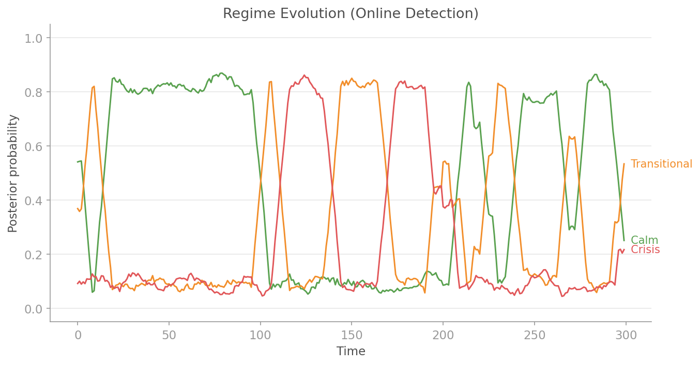
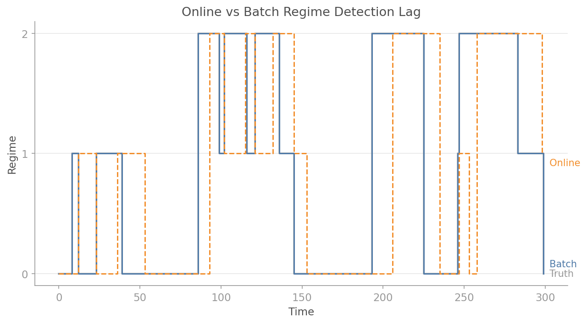

# Online Regime Detection

QuantLite's `OnlineRegimeDetector` brings regime detection to live, streaming data. Rather than fitting a batch HMM to a static dataset, the online detector maintains a sliding window of recent observations and performs incremental re-inference with each new data point.

## Overview

Market regimes (low-volatility trending, high-volatility mean-reverting, crisis) are not static. They shift in real time. The online detector lets you:

1. **Pre-train** on historical data to establish regime parameters
2. **Update incrementally** with each new observation
3. **Track regime changes** as they happen, with confidence scores
4. **Periodically refit** the underlying model to adapt to structural shifts

The detector wraps the batch HMM from `quantlite.regimes.hmm` and makes it suitable for production streaming pipelines.

## Quick Start

```python
import numpy as np
import quantlite as ql

# Historical returns for pre-training
np.random.seed(42)
historical = np.concatenate([
    np.random.normal(0.001, 0.01, 500),   # Calm regime
    np.random.normal(-0.002, 0.03, 200),  # Crisis regime
    np.random.normal(0.001, 0.01, 300),   # Back to calm
])

# Create and pre-train the detector
detector = ql.OnlineRegimeDetector(n_regimes=2, window_size=252)
detector.fit(historical)

print(f"Current regime: {detector.current_regime}")
print(f"Fitted: {detector.is_fitted}")

# Simulate live updates
live_returns = np.random.normal(-0.003, 0.04, 50)  # Volatile period
for ret in live_returns:
    result = detector.update(ret)
    if result.regime_changed:
        print(f"Regime change at obs {result.observation_count}: "
              f"now regime {result.regime} "
              f"(confidence: {result.confidence:.2%})")
```

## API Reference

### `RegimeUpdate`

Result of an online regime detection update.

| Attribute           | Type          | Description                                    |
|---------------------|---------------|------------------------------------------------|
| `regime`            | `int`         | Current most likely regime index               |
| `confidence`        | `float`       | Posterior probability of the current regime     |
| `probabilities`     | `np.ndarray`  | Full posterior distribution over all regimes    |
| `regime_changed`    | `bool`        | Whether the regime changed from the previous observation |
| `observation_count` | `int`         | Total observations processed                   |

### `OnlineRegimeDetector`

Streaming regime detector using windowed HMM inference.

**Constructor parameters:**

| Parameter          | Type         | Default | Description                                    |
|--------------------|--------------|---------|------------------------------------------------|
| `n_regimes`        | `int`        | `2`     | Number of hidden regimes                       |
| `window_size`      | `int`        | `252`   | Sliding window size for inference              |
| `min_observations` | `int`        | `50`    | Min observations before auto-fitting           |
| `refit_interval`   | `int`        | `100`   | Re-fit every N observations (0 to disable)     |
| `rng_seed`         | `int \| None`| `None`  | Random seed for reproducibility                |

**Properties:**

- `n_regimes` — number of hidden regimes
- `observation_count` — total observations processed
- `is_fitted` — whether the detector has a fitted model
- `current_regime` — current regime index, or `None` if not yet fitted
- `history` — list of all `RegimeUpdate` results

**Methods:**

- `fit(returns)` — pre-train on historical return data
- `update(observation) -> RegimeUpdate` — process a new observation
- `batch_update(observations) -> list[RegimeUpdate]` — process multiple observations
- `reset()` — reset to initial state

## Comparison to Batch HMM

| Feature                   | Batch HMM                          | Online Detector                       |
|---------------------------|-------------------------------------|---------------------------------------|
| Input                     | Full historical series              | One observation at a time             |
| Latency                   | Seconds to minutes                  | Milliseconds per update               |
| Adaptivity                | Static after fitting                | Periodic refitting                    |
| Memory                    | Full dataset                        | Sliding window only                   |
| Use case                  | Research, backtesting               | Live trading, monitoring              |
| Accuracy                  | Higher (full hindsight)             | Slightly lower (limited window)       |

The online detector trades a small amount of accuracy for the ability to operate in real time. In practice, with a window of 252 observations and periodic refitting, the regime labels closely match the batch HMM.

## Examples

### Pre-Training and Live Monitoring

A realistic workflow: train on 3 years of daily equity returns, then monitor live data.

```python
import numpy as np
import quantlite as ql

# Simulate 3 years of daily returns with regime structure
np.random.seed(42)
calm = np.random.normal(0.0005, 0.008, 500)
volatile = np.random.normal(-0.001, 0.025, 150)
recovery = np.random.normal(0.001, 0.012, 350)
historical = np.concatenate([calm, volatile, recovery])

# Pre-train
detector = ql.OnlineRegimeDetector(
    n_regimes=3,
    window_size=252,
    refit_interval=50,  # Adapt quickly
    rng_seed=42,
)
detector.fit(historical)

# Now process "live" data — a sudden volatility spike
crisis_returns = np.random.normal(-0.005, 0.04, 30)
normal_returns = np.random.normal(0.0005, 0.008, 30)
live_data = np.concatenate([crisis_returns, normal_returns])

for i, ret in enumerate(live_data):
    result = detector.update(ret)
    if result.regime_changed:
        probs_str = ", ".join(f"{p:.1%}" for p in result.probabilities)
        print(f"Day {i}: regime → {result.regime} "
              f"[{probs_str}] (confidence: {result.confidence:.1%})")
```

### Auto-Fitting Without Historical Data

If you have no historical data, the detector accumulates observations and auto-fits once it has enough:

```python
import numpy as np
import quantlite as ql

detector = ql.OnlineRegimeDetector(
    n_regimes=2,
    min_observations=100,
)

# Before fitting, updates return uniform probabilities
np.random.seed(42)
for i in range(120):
    ret = np.random.normal(0, 0.02)
    result = detector.update(ret)

    if i == 49:
        print(f"At obs 50: fitted={detector.is_fitted}, "
              f"confidence={result.confidence:.2%}")
    if i == 99:
        print(f"At obs 100: fitted={detector.is_fitted}")
    if i == 100:
        print(f"At obs 101: fitted={detector.is_fitted}, "
              f"regime={result.regime}, "
              f"confidence={result.confidence:.2%}")
```

### Combining with Price Streaming

The most powerful pattern: connect the online detector to a live price stream.

```python
import asyncio
import math
from collections import deque

import quantlite as ql

async def live_regime_detection():
    # Pre-train on historical data (in practice, load from a database)
    import numpy as np
    historical = np.random.normal(0, 0.02, 1000)

    detector = ql.OnlineRegimeDetector(n_regimes=3, rng_seed=42)
    detector.fit(historical)

    # Set up alerts for regime changes
    alerts = ql.AlertManager()
    alerts.add_rule(
        "BTC-USD",
        condition="regime_change",
        callback=lambda a: print(f"🚨 {a.message}"),
    )

    # Stream and detect
    prices: deque[float] = deque(maxlen=2)
    stream = ql.stream(["BTC-USD"], exchange="binance", throttle_ms=1000)

    async with stream:
        async for tick in stream:
            prices.append(tick.price)
            if len(prices) < 2:
                continue

            log_return = math.log(prices[-1] / prices[-2])
            result = detector.update(log_return)

            # Check alerts
            prev = (result.regime + 1) % 3 if result.regime_changed else result.regime
            alerts.check("BTC-USD", regime=result.regime, previous_regime=prev)

            print(f"BTC ${tick.price:,.0f} | "
                  f"Regime {result.regime} ({result.confidence:.0%})")

asyncio.run(live_regime_detection())
```

### Tracking Regime History

The detector stores every update, making it easy to analyse regime dynamics after the fact:

```python
import numpy as np
import quantlite as ql

detector = ql.OnlineRegimeDetector(n_regimes=2, rng_seed=42)
np.random.seed(42)
data = np.concatenate([
    np.random.normal(0.001, 0.01, 200),
    np.random.normal(-0.002, 0.035, 100),
    np.random.normal(0.001, 0.01, 200),
])

results = detector.batch_update(data)

# Analyse regime dynamics
regimes = [r.regime for r in results]
changes = [r for r in results if r.regime_changed]
print(f"Total observations: {len(results)}")
print(f"Regime changes: {len(changes)}")
print(f"Time in each regime: {np.bincount(regimes)}")

# Average confidence
avg_conf = np.mean([r.confidence for r in results if detector.is_fitted])
print(f"Average confidence: {avg_conf:.2%}")
```

## Sliding Window Mechanics

The detector maintains a `deque` of size `window_size` (default 252). On each `update()`:

1. The new observation is appended to the window (oldest observation is dropped if the window is full)
2. The full window is passed to the HMM for Viterbi/forward-backward inference
3. The posterior probabilities for the **last** observation determine the current regime
4. If `refit_interval` updates have passed since the last fit, the HMM parameters are re-estimated from the current window

This means:

- **Memory is bounded** — only `window_size` observations are stored
- **Inference is local** — only the recent window affects regime estimates
- **The model adapts** — periodic refitting captures structural changes

## Tuning the Detector

| Parameter          | Effect of increasing                    | Recommended range     |
|--------------------|------------------------------------------|-----------------------|
| `n_regimes`        | More granular regime classification      | 2-4 for most markets  |
| `window_size`      | Smoother, more stable estimates          | 126-504               |
| `min_observations` | Requires more data before first estimate | 30-100                |
| `refit_interval`   | Less frequent adaptation                 | 50-252                |

For intraday data, consider a smaller window (e.g., 100-500 ticks). For daily data, the default of 252 (one trading year) works well.

## Visualisation

### Regime Evolution

Posterior probabilities for each regime evolving as new observations arrive. Confidence bands make it clear when the classifier is uncertain.



### Regime Transitions

Returns plotted with background colour bands indicating the active regime. Vertical markers highlight transition points where the detector identifies a regime change.


### Detection Lag

Comparison of online vs batch regime detection against ground truth. The online detector lags behind batch by several observations at each transition, a trade-off for bounded memory and real-time operation.


