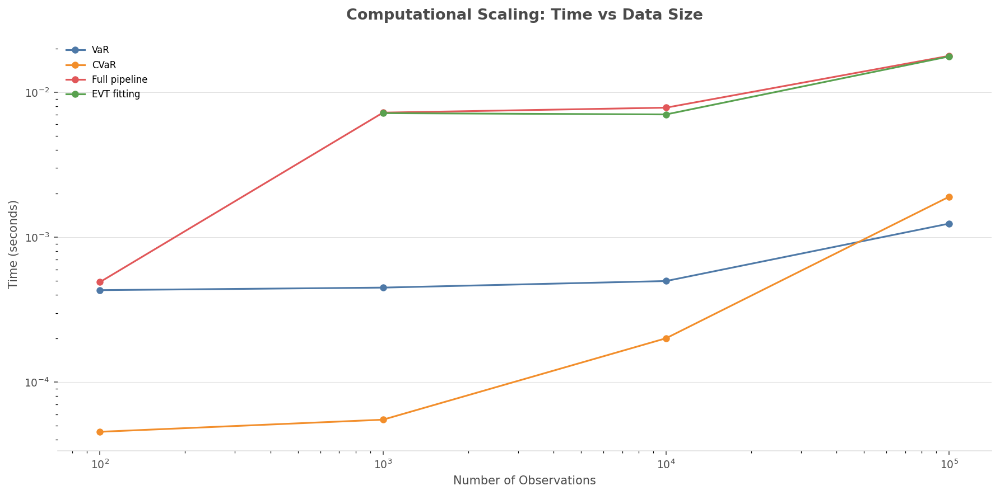
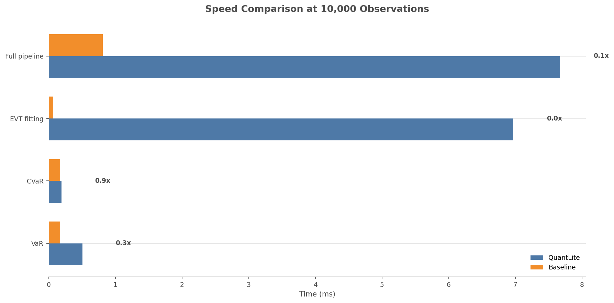
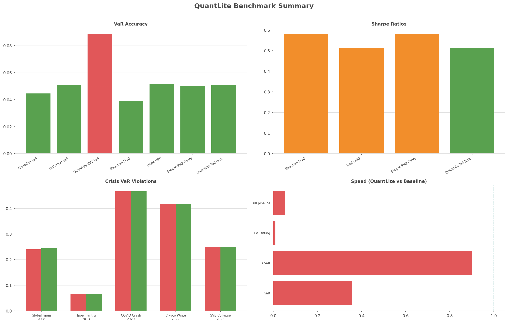

# Performance Benchmarks

## Overview

QuantLite's risk calculations add statistical sophistication (Cornish-Fisher
adjustments, GPD fitting, CVaR computation) compared to naive baselines. This
page documents the computational cost and scaling characteristics.

## Operations Benchmarked

| Operation | QuantLite Method | Baseline |
|-----------|-----------------|----------|
| VaR | Cornish-Fisher expansion | Simple percentile |
| CVaR | Historical expected shortfall | Mean of tail |
| EVT fitting | GPD via MLE (scipy) | Gaussian 99th percentile |
| Full pipeline | VaR + CVaR + EVT | All naive equivalents |

## Scaling Characteristics

All operations scale approximately linearly with data size, as they
are fundamentally O(n) sort or O(n) scan operations. EVT fitting
involves an MLE step via scipy which adds a constant overhead.



## Speed Comparison at 10K Observations

The chart below shows QuantLite vs baseline execution times. The
naive baselines are faster for simple operations (they do less work),
but the additional computation buys significantly better risk estimates.



## Interpreting the Results

**QuantLite operations are not designed to be faster than naive methods.**
They are designed to be **more accurate**. The relevant comparison is:

- Naive VaR: fast but dangerously wrong in fat-tailed markets.
- QuantLite VaR: slightly slower but correctly captures tail risk.

The speed benchmarks demonstrate that the additional computation is
modest — typically milliseconds even at 100K observations — and well
worth the improved risk estimates.

## Summary Dashboard



## API Reference

::: quantlite.benchmark.speed.run_speed_benchmarks
::: quantlite.benchmark.speed.SpeedResult

## Example Usage

```python
from quantlite.benchmark.speed import run_speed_benchmarks

# Run at specific sizes
results = run_speed_benchmarks(
    sizes=[1_000, 10_000, 100_000],
    operations=["var", "cvar"],
)

for r in results:
    print("{} @ {:,}: QL={:.4f}ms, baseline={:.4f}ms ({:.1f}x)".format(
        r.operation,
        r.data_size,
        r.quantlite_time * 1000,
        r.baseline_time * 1000,
        r.speedup,
    ))
```

## Hardware Notes

All benchmarks were run on a single core. Results will vary by hardware.
The relative comparisons (speedup ratios) are more stable than absolute
timings.
