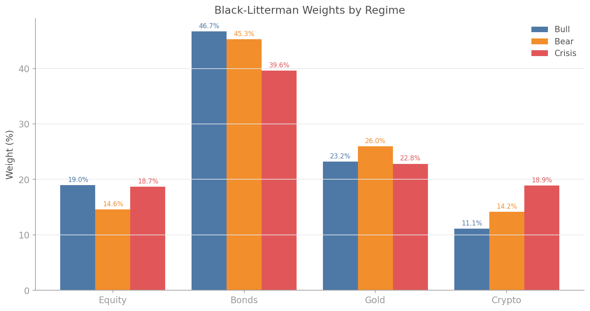
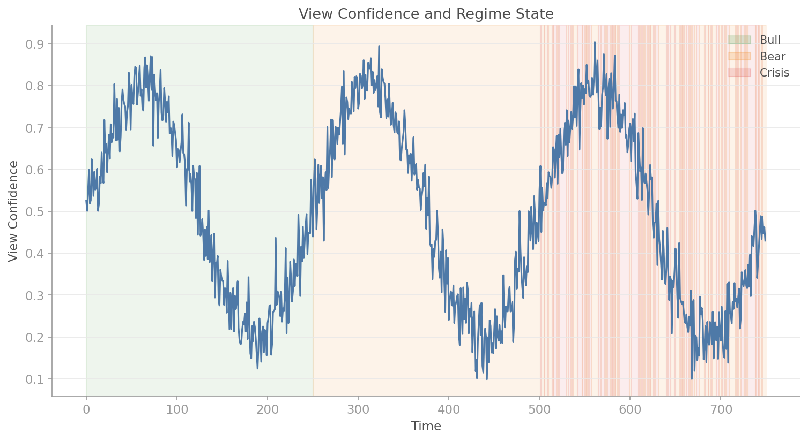
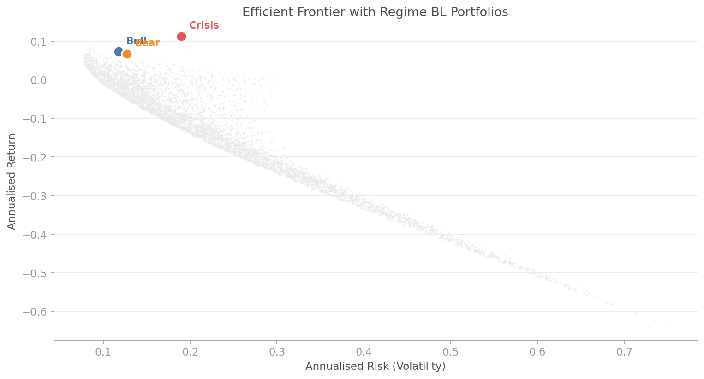

# Regime-Conditional Black-Litterman

## Overview

The Black-Litterman model elegantly combines market equilibrium with investor views to produce a posterior estimate of expected returns. However, the standard model treats views as static: your bullish view on equities carries the same weight whether the market is in a calm bull regime or a violent crisis.

Regime-conditional Black-Litterman fixes this. It adjusts both the views themselves and their confidence levels based on the detected market regime. In a bull regime, bullish views are amplified and held with higher confidence. In a crisis, defensive views dominate and offensive views are dampened. The result is a set of optimal weights per regime and a probability-weighted blend across regimes.

The `quantlite.portfolio.regime_bl` module provides:

- **Standard Black-Litterman** — baseline BL posterior computation
- **Regime-conditional BL** — views and confidence that adapt to regimes
- **Weight blending** — probability-weighted blend across regimes



## API Reference

### `black_litterman_posterior(returns_df, market_caps, views, view_confidences, tau=0.05, risk_aversion=2.5, freq=252)`

Compute the standard Black-Litterman posterior returns and covariance.

```python
from quantlite.portfolio.regime_bl import black_litterman_posterior

mu, cov = black_litterman_posterior(
    returns_df, market_caps, views={"Equity": 0.10}, view_confidences={"Equity": 0.7}
)
```

**Parameters:**

| Name | Type | Description |
|------|------|-------------|
| `returns_df` | `pd.DataFrame` | Asset returns |
| `market_caps` | `dict` | Market capitalisation per asset |
| `views` | `dict` | Absolute views on expected returns (annualised) |
| `view_confidences` | `dict` | Confidence per view (0 to 1) |
| `tau` | `float` | Uncertainty scaling parameter |
| `risk_aversion` | `float` | Market risk aversion (λ) |
| `freq` | `int` | Trading periods per year |

**Returns:** Tuple of `(posterior_returns, posterior_cov)`.

---

### `regime_conditional_bl(returns_df, regime_labels, market_caps, base_views, base_confidences, ...)`

Compute regime-conditional BL allocations. Adjusts views and confidence per regime.

```python
from quantlite.portfolio.regime_bl import regime_conditional_bl

result = regime_conditional_bl(
    returns_df, regime_labels, market_caps,
    base_views={"Equity": 0.10, "Bonds": 0.03},
    base_confidences={"Equity": 0.7, "Bonds": 0.5},
    regime_view_adjustments={0: {"Equity": 1.5}, 1: {"Equity": 0.5}},
    regime_confidence_scaling={0: 1.2, 1: 0.6},
)

print("Blended weights:", result.blended_weights)
print("Regime probabilities:", result.regime_probabilities)
```

**Returns:** `RegimeBLResult` with `regime_weights`, `blended_weights`, `regime_returns`, `regime_covariances`, `regime_probabilities`.

---

### `blend_regime_weights(regime_weights, regime_probabilities)`

Blend portfolio weights across regimes by probability.

```python
from quantlite.portfolio.regime_bl import blend_regime_weights

blended = blend_regime_weights(
    {0: {"Equity": 0.6, "Bonds": 0.4}, 1: {"Equity": 0.3, "Bonds": 0.7}},
    {0: 0.6, 1: 0.4},
)
```

---

## Examples

### Full Regime-Conditional Pipeline

```python
import numpy as np
import pandas as pd
from quantlite.portfolio.regime_bl import regime_conditional_bl

# Synthetic data
rng = np.random.RandomState(42)
n = 750
returns_df = pd.DataFrame({
    "Equity": rng.normal(0.0003, 0.015, n),
    "Bonds": rng.normal(0.0002, 0.006, n),
    "Gold": rng.normal(0.0001, 0.010, n),
})

# Regime labels (from HMM or other detector)
regime_labels = np.zeros(n, dtype=int)
regime_labels[250:500] = 1  # Bear
regime_labels[500:] = 2     # Crisis

caps = {"Equity": 5000, "Bonds": 3000, "Gold": 2000}
views = {"Equity": 0.12, "Bonds": 0.04, "Gold": 0.06}
confidences = {"Equity": 0.8, "Bonds": 0.6, "Gold": 0.5}

result = regime_conditional_bl(
    returns_df, regime_labels, caps, views, confidences,
    regime_view_adjustments={
        0: {"Equity": 1.5},   # Amplify equity view in bull
        1: {"Equity": 0.5},   # Dampen in bear
        2: {"Equity": 0.2},   # Strongly dampen in crisis
    },
    regime_confidence_scaling={0: 1.3, 1: 0.7, 2: 0.4},
)

for regime, weights in result.regime_weights.items():
    print(f"Regime {regime}: {weights}")
print(f"Blended: {result.blended_weights}")
```





## References

- Black, F. and Litterman, R. (1992). "Global Portfolio Optimization." *Financial Analysts Journal.*
- He, G. and Litterman, R. (1999). "The Intuition Behind Black-Litterman Model Portfolios." *Goldman Sachs Asset Management.*
- Ang, A. and Bekaert, G. (2002). "Regime Switches in Interest Rates." *Journal of Business and Economic Statistics.*
