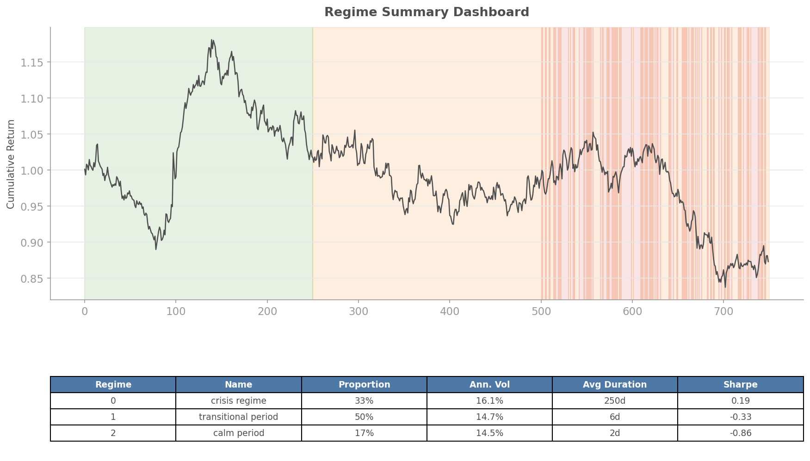
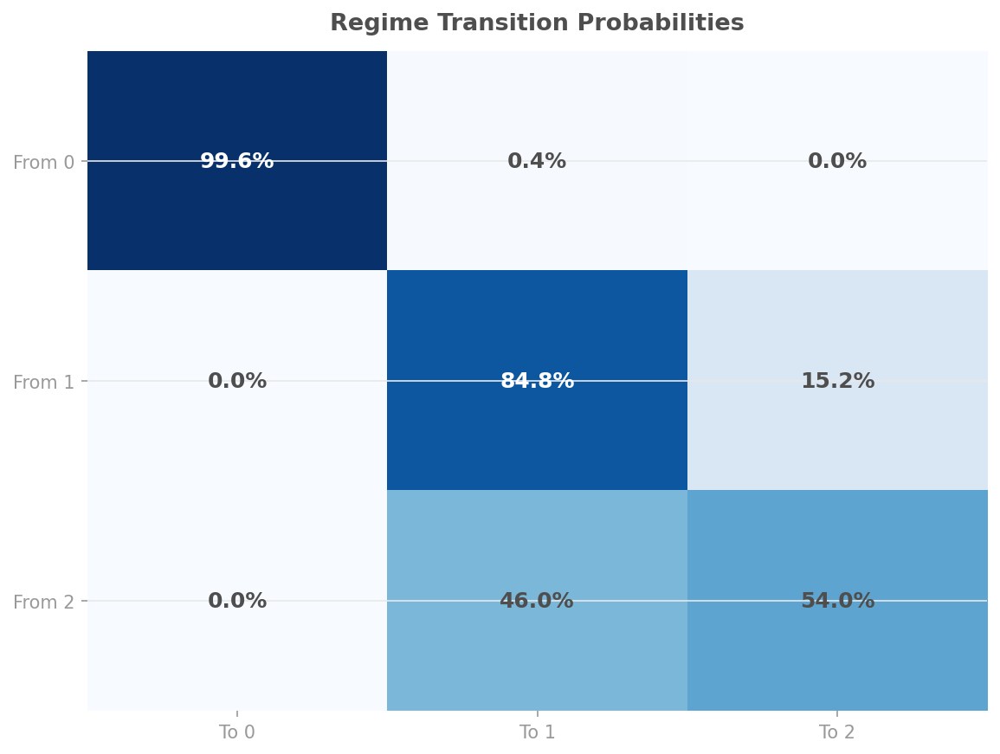

# Regime Narratives

## Overview

Regime detection models output arrays of integers. Humans need stories. The `quantlite.explain.narratives` module bridges that gap by auto-generating human-readable text that explains what the regime model found, what each regime looks like, and what the transitions mean.

This matters because regime models are only useful if their output is interpretable. A fund manager who cannot explain "we shifted to defensive positioning because the model detected a crisis regime" in plain English will not trust the model enough to act on it.

The module supports three detail levels:

- **Brief** (2–3 sentences): headline summary suitable for dashboards or alerts
- **Standard** (paragraph): includes per-regime statistics
- **Detailed** (full report): adds transition probabilities, date-specific shifts, and duration analysis



## API Reference

### `generate_narrative(returns, regime_labels, detail_level, dates, freq)`

The main entry point. Generates a complete narrative with supporting statistics.

```python
from quantlite.explain.narratives import generate_narrative

narrative = generate_narrative(
    returns, regime_labels,
    detail_level="standard",
)

print(narrative.summary)
print(f"Current regime: {narrative.current_regime}")
```

**Parameters:**

| Name | Type | Description |
|------|------|-------------|
| `returns` | array-like | Portfolio or asset returns |
| `regime_labels` | `np.ndarray` | Integer regime labels |
| `detail_level` | `str` | `"brief"`, `"standard"`, or `"detailed"` |
| `dates` | `pd.DatetimeIndex` | Optional datetime index for date-aware narratives |
| `freq` | `int` | Annualisation frequency (default 252) |

**Returns:** `RegimeNarrative` dataclass.

---

### `transition_narrative(regime_labels, dates, regime_names)`

Generates text focused specifically on regime transitions.

```python
from quantlite.explain.narratives import transition_narrative

text = transition_narrative(
    regime_labels,
    dates=returns.index,
    regime_names={0: "Calm", 1: "Transitional", 2: "Crisis"},
)
print(text)
```

**Returns:** `str` — Human-readable transition descriptions.

---

### `RegimeNarrative` Dataclass

| Field | Type | Description |
|-------|------|-------------|
| `summary` | `str` | Generated narrative text |
| `regime_stats` | `list[RegimeStats]` | Per-regime statistics |
| `transition_matrix` | `pd.DataFrame` | Transition probability matrix |
| `current_regime` | `int` | Most recent regime label |
| `detail_level` | `str` | Detail level used |

### `RegimeStats` Dataclass

| Field | Type | Description |
|-------|------|-------------|
| `label` | `int` | Regime identifier |
| `name` | `str` | Auto-generated descriptive name |
| `count` | `int` | Number of observations |
| `proportion` | `float` | Fraction of total |
| `mean_return` | `float` | Mean daily return |
| `volatility` | `float` | Annualised volatility |
| `mean_duration` | `float` | Average consecutive duration |
| `sharpe` | `float` | Annualised Sharpe ratio |

## Examples

### Brief Narrative

```python
narrative = generate_narrative(returns, labels, detail_level="brief")
print(narrative.summary)
# "The model identified 3 regimes: a low-volatility bull market (65% of
#  observations), a transitional period (20%), and a crisis regime (15%).
#  The current regime is low-volatility bull market."
```

### Detailed Report with Dates

```python
import pandas as pd

dates = pd.bdate_range("2020-01-01", periods=len(returns))
narrative = generate_narrative(
    returns, labels,
    detail_level="detailed",
    dates=dates,
)
print(narrative.summary)
# Includes per-regime stats, transition probabilities,
# and date-stamped regime shifts
```

### Transition Probabilities



```python
# Access the transition matrix directly
print(narrative.transition_matrix)
#     0     1     2
# 0  0.95  0.04  0.01
# 1  0.10  0.85  0.05
# 2  0.03  0.12  0.85
```
