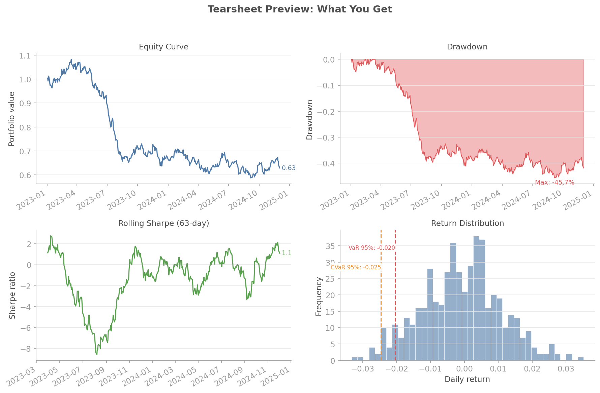

# Tearsheet Reports

QuantLite's tearsheet engine generates professional portfolio reports from backtest results, with interactive charts and clean, print-friendly layouts following Stephen Few's visual design principles.

## Overview



## Quick Start

```python
from quantlite import run_backtest
from quantlite.report import tearsheet

result = run_backtest(prices, allocator, config)
tearsheet(result, save="portfolio_report.html")
```

## API Reference

### `tearsheet(backtest_result, save, sections, title, commentary)`

Generate a complete tearsheet report.

**Args:**

| Parameter | Type | Default | Description |
|-----------|------|---------|-------------|
| `backtest_result` | `BacktestResult` | required | Backtest result with `portfolio_value` and optional `regime_labels` |
| `save` | `str` | `"tearsheet.html"` | Output path. Use `.html` for HTML, `.pdf` for PDF |
| `sections` | `list[str] \| None` | `None` (all) | Sections to include |
| `title` | `str` | `"Portfolio Tearsheet"` | Report title |
| `commentary` | `str \| None` | `None` | Optional commentary paragraph |

**Returns:** HTML content as a string.

**Available sections:** `summary`, `risk`, `drawdown`, `monthly`, `rolling`, `regimes`, `factors`, `stress`

## Sections

### Executive Summary (`summary`)

Key metrics table: total return, annualised return, annualised volatility, Sharpe ratio, Sortino ratio, Calmar ratio, maximum drawdown, VaR (95%), and CVaR (95%).

```python
tearsheet(result, sections=["summary"], save="summary.html")
```

### Risk Metrics (`risk`)

VaR/CVaR comparison table at 95% and 99% confidence levels, plus a return distribution histogram with VaR and CVaR overlays.

```python
tearsheet(result, sections=["risk"], save="risk.html")
```

### Drawdown Analysis (`drawdown`)

Underwater chart showing drawdown over time, plus a table of the top 5 drawdowns ranked by depth with duration and recovery information.

```python
tearsheet(result, sections=["drawdown"], save="drawdown.html")
```

### Monthly Returns (`monthly`)

Heatmap of monthly returns by year and month. Requires a `DatetimeIndex` on the portfolio value series.

```python
tearsheet(result, sections=["monthly"], save="monthly.html")
```

### Rolling Statistics (`rolling`)

Rolling Sharpe ratio and rolling annualised volatility charts. Default window is 63 periods (approximately one quarter).

```python
tearsheet(result, sections=["rolling"], save="rolling.html")
```

### Regime Analysis (`regimes`)

Per-regime metrics table showing annualised return, volatility, and Sharpe ratio for each regime. Requires `regime_labels` on the backtest result.

```python
tearsheet(result, sections=["regimes"], save="regimes.html")
```

### Factor Exposure (`factors`)

Placeholder section. Full factor analysis will be available in v0.8.

### Stress Tests (`stress`)

Placeholder section. Stress testing scenarios will be available in v0.6.

## Customisation

### Custom Title and Commentary

```python
tearsheet(
    result,
    title="Momentum Strategy Q4 2025",
    commentary="Outperformed during the high-volatility regime.",
    save="report.html",
)
```

### Select Specific Sections

```python
tearsheet(
    result,
    sections=["summary", "risk", "drawdown", "monthly"],
    save="brief.html",
)
```

## HTML vs PDF

| Feature | HTML | PDF |
|---------|------|-----|
| Interactive charts | Yes (with Plotly) | No |
| File size | Larger (embedded charts) | Smaller |
| Print-friendly | Yes (via CSS) | Native |
| Dependencies | matplotlib (Plotly optional) | matplotlib (weasyprint optional) |

### PDF Generation

PDF output uses weasyprint when available for full-fidelity rendering. Without weasyprint, a minimal fallback PDF is generated.

```bash
# Full PDF support
pip install quantlite[pdf]

# Interactive HTML charts
pip install quantlite[report]
```

## Integration with Backtesting

```python
import numpy as np
from quantlite import run_backtest, BacktestConfig
from quantlite.report import tearsheet
from quantlite.data_generation import correlated_gbm

# Generate synthetic data
prices = correlated_gbm(
    n_assets=3,
    n_steps=504,
    mu=[0.08, 0.12, 0.06],
    sigma=[0.15, 0.25, 0.10],
    corr_matrix=np.eye(3),
)

# Run backtest
config = BacktestConfig(initial_capital=100_000)

def equal_weight(ctx):
    n = len(ctx.assets)
    return {a: 1.0 / n for a in ctx.assets}

result = run_backtest(prices, equal_weight, config)

# Generate tearsheet
tearsheet(result, save="portfolio_report.html", title="Equal Weight Strategy")
```
