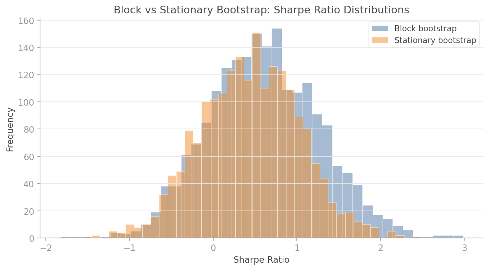
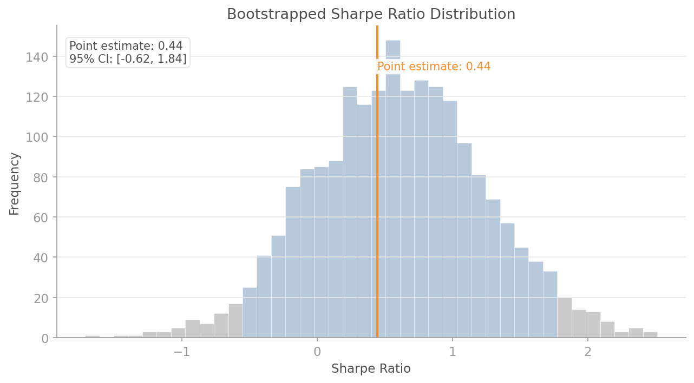
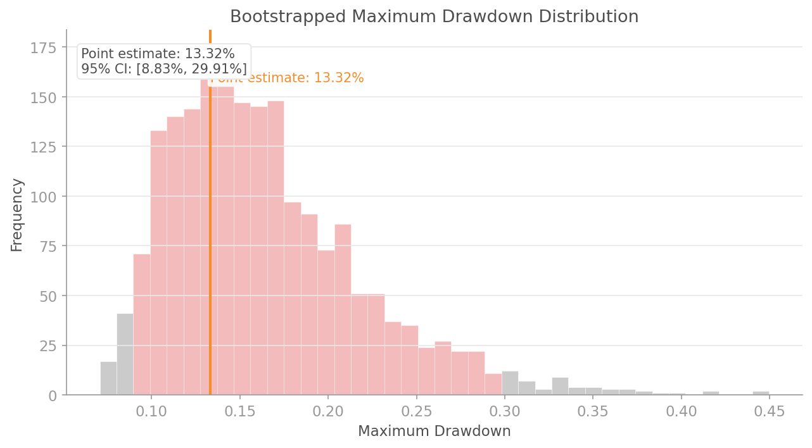

# Resampled Backtesting

## Overview

A single backtest produces a single number. That number is a point estimate with no error bars, no confidence interval, and no indication of how fragile it is to the specific sequence of returns in your dataset.

Point estimates are dangerous. A Sharpe ratio of 1.5 could easily be 0.8 or 2.1 on a different (equally plausible) path of returns. Without confidence intervals, you are making allocation decisions on a single draw from a distribution you have not characterised.

The `quantlite.resample` module provides bootstrap methods that generate thousands of synthetic return paths, preserving the autocorrelation structure of the original data, to build honest confidence intervals around any performance metric.

## Bootstrap Methods

### Block Bootstrap

```python
block_bootstrap(
    returns: array-like,
    block_size: int,
    n_samples: int = 1000,
    seed: int | None = None,
) -> numpy.ndarray  # shape (n_samples, len(returns))
```

Resamples non-overlapping blocks of consecutive returns, preserving serial dependence within each block. Best when you have a reasonable estimate of the autocorrelation lag.

### Stationary Bootstrap

```python
stationary_bootstrap(
    returns: array-like,
    avg_block_size: int,
    n_samples: int = 1000,
    seed: int | None = None,
) -> numpy.ndarray  # shape (n_samples, len(returns))
```

Uses geometrically distributed block lengths, making the resampled series strictly stationary. Better than block bootstrap when the autocorrelation structure is unknown, as varying block lengths reduce sensitivity to the block size choice.

### Block vs Stationary: When to Use Which

| Criterion | Block | Stationary |
|-----------|-------|------------|
| Known autocorrelation lag | Preferred | Either |
| Unknown dependence structure | Avoid | Preferred |
| Strict stationarity required | No | Yes |
| Sensitivity to block size | High | Low |



## Generic Confidence Interval

```python
bootstrap_confidence_interval(
    returns: array-like,
    metric_fn: callable,
    n_samples: int = 1000,
    confidence: float = 0.95,
    method: str = "block",
    block_size: int | None = None,
    seed: int | None = None,
) -> dict
```

Computes a confidence interval for **any** metric via bootstrap. Pass a custom function that takes a returns array and returns a float.

**Returns:** Dictionary with keys:
- `point_estimate`: metric computed on original returns
- `ci_lower`: lower bound of confidence interval
- `ci_upper`: upper bound of confidence interval
- `distribution`: array of bootstrap metric values

**Example with custom metric:**

```python
import numpy as np
from quantlite.resample import bootstrap_confidence_interval

rng = np.random.default_rng(42)
returns = rng.normal(0.0003, 0.01, 500)

def calmar_ratio(ret):
    """Annualised return / max drawdown."""
    cumret = np.cumprod(1 + ret)
    peak = np.maximum.accumulate(cumret)
    dd = ((peak - cumret) / peak).max()
    ann_ret = (cumret[-1]) ** (252 / len(ret)) - 1
    return ann_ret / dd if dd > 0 else 0.0

result = bootstrap_confidence_interval(returns, calmar_ratio, n_samples=2000, seed=42)
print(f"Calmar ratio: {result['point_estimate']:.2f}")
print(f"95% CI: [{result['ci_lower']:.2f}, {result['ci_upper']:.2f}]")
```

## Convenience Wrappers

### `bootstrap_sharpe_distribution`

```python
bootstrap_sharpe_distribution(
    returns: array-like,
    n_samples: int = 1000,
    block_size: int | None = None,
    seed: int | None = None,
) -> dict
```

Convenience wrapper that bootstraps the annualised Sharpe ratio. Returns the same structure as `bootstrap_confidence_interval`.

**Example:**

```python
from quantlite.resample import bootstrap_sharpe_distribution

result = bootstrap_sharpe_distribution(returns, n_samples=2000, seed=42)
print(f"Sharpe: {result['point_estimate']:.2f}")
print(f"95% CI: [{result['ci_lower']:.2f}, {result['ci_upper']:.2f}]")
```



### `bootstrap_drawdown_distribution`

```python
bootstrap_drawdown_distribution(
    returns: array-like,
    n_samples: int = 1000,
    block_size: int | None = None,
    seed: int | None = None,
) -> dict
```

Convenience wrapper that bootstraps the maximum drawdown. Returns the same structure as `bootstrap_confidence_interval`.

**Example:**

```python
from quantlite.resample import bootstrap_drawdown_distribution

result = bootstrap_drawdown_distribution(returns, n_samples=2000, seed=42)
print(f"Max drawdown: {result['point_estimate']:.2%}")
print(f"95% CI: [{result['ci_lower']:.2%}, {result['ci_upper']:.2%}]")
```


