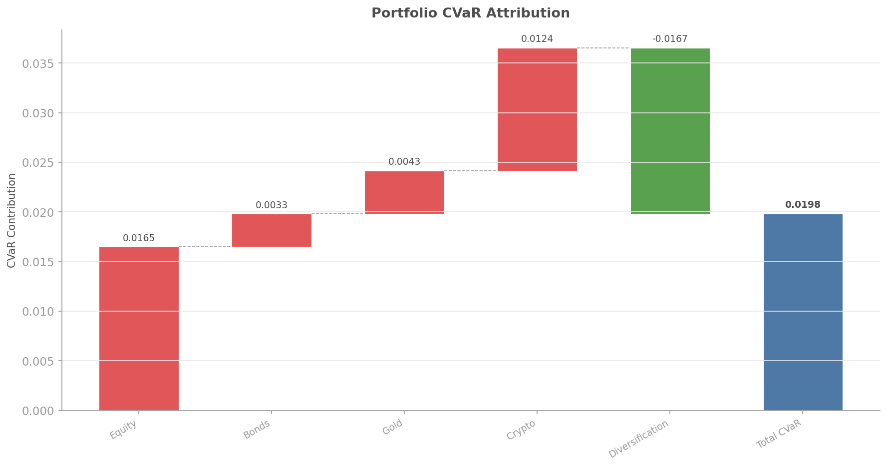
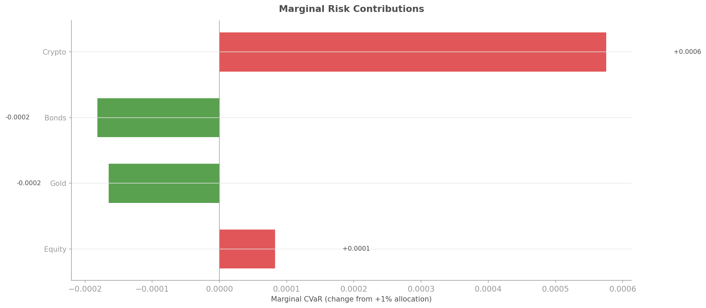
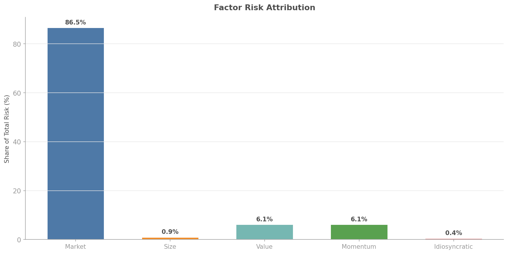

# Risk Attribution

## Overview

Risk attribution answers the fundamental question: **where does my portfolio risk come from?**

A portfolio's total risk is not simply the sum of individual asset risks. Correlations, position sizing, and fat-tailed dependencies all interact in non-obvious ways. Without proper attribution, you might think you are diversified when a single factor dominates your tail risk, or you might trim an asset that was actually reducing portfolio CVaR through diversification.

The `quantlite.explain.attribution` module decomposes portfolio VaR and CVaR into:

- **Component risk**: each asset's contribution to total portfolio risk (sums exactly to total)
- **Marginal risk**: what happens if you add or remove 1% of a given asset
- **Factor attribution**: how much risk comes from market, size, value, and momentum exposures vs idiosyncratic residual
- **Regime-conditional attribution**: how the risk breakdown changes across detected regimes



## API Reference

### `compute_risk_attribution(returns_df, weights, alpha, factor_returns, regime_labels)`

The main entry point. Computes all attribution decompositions in a single call.

```python
from quantlite.explain.attribution import compute_risk_attribution

attr = compute_risk_attribution(
    returns_df,
    weights={"Equity": 0.4, "Bonds": 0.3, "Gold": 0.2, "Crypto": 0.1},
    alpha=0.05,
)

print(f"Total CVaR: {attr.total_cvar:.4f}")
for asset, contrib in attr.component_cvar.items():
    print(f"  {asset}: {contrib:.4f} ({contrib/attr.total_cvar:.0%})")
```

**Parameters:**

| Name | Type | Description |
|------|------|-------------|
| `returns_df` | `pd.DataFrame` | Asset returns (assets as columns) |
| `weights` | `dict[str, float]` | Portfolio weights |
| `alpha` | `float` | VaR/CVaR confidence level (default 0.05 = 95%) |
| `factor_returns` | `pd.DataFrame` | Optional factor return series |
| `regime_labels` | `np.ndarray` | Optional regime labels for conditional analysis |

**Returns:** `RiskAttribution` dataclass with all decompositions.

---

### `marginal_risk_contribution(returns_df, weights, alpha, delta)`

Measures the change in portfolio CVaR when each asset's weight increases by `delta`.

```python
from quantlite.explain.attribution import marginal_risk_contribution

marg = marginal_risk_contribution(returns_df, weights, delta=0.01)
for asset, m in sorted(marg.items(), key=lambda x: -abs(x[1])):
    print(f"  {asset}: {m:+.4f}")
```

**Parameters:**

| Name | Type | Description |
|------|------|-------------|
| `returns_df` | `pd.DataFrame` | Asset returns |
| `weights` | `dict[str, float]` | Current portfolio weights |
| `alpha` | `float` | Confidence level (default 0.05) |
| `delta` | `float` | Weight perturbation size (default 0.01) |

**Returns:** `dict[str, float]` — Marginal CVaR per asset.



---

### `factor_attribution(returns_df, weights, factor_returns, alpha)`

Decomposes portfolio risk into systematic factor contributions and idiosyncratic residual. If no factor returns are provided, synthetic market, size, value, and momentum factors are constructed from the cross-section.

```python
from quantlite.explain.attribution import factor_attribution

contrib, idio = factor_attribution(returns_df, weights)
for factor, risk in contrib.items():
    print(f"  {factor}: {risk:.6f}")
print(f"  Idiosyncratic: {idio:.6f}")
```



---

### `regime_conditional_attribution(returns_df, weights, regime_labels, alpha)`

Computes component CVaR separately for each detected regime, revealing how risk allocation shifts across market conditions.

```python
from quantlite.explain.attribution import regime_conditional_attribution

regime_attr = regime_conditional_attribution(returns_df, weights, regime_labels)
for regime, contrib in regime_attr.items():
    print(f"Regime {regime}:")
    for asset, c in contrib.items():
        print(f"  {asset}: {c:.4f}")
```

## Examples

### Full Attribution Pipeline

```python
import numpy as np
import pandas as pd
from quantlite.explain.attribution import compute_risk_attribution

# Generate sample data
rng = np.random.RandomState(42)
returns = pd.DataFrame({
    "Equity": rng.normal(0.0003, 0.015, 750),
    "Bonds": rng.normal(0.0002, 0.006, 750),
    "Gold": rng.normal(0.0001, 0.010, 750),
    "Crypto": rng.normal(0.0005, 0.030, 750),
})

weights = {"Equity": 0.4, "Bonds": 0.3, "Gold": 0.2, "Crypto": 0.1}
regimes = np.array([0]*250 + [1]*250 + [2]*250)

attr = compute_risk_attribution(
    returns, weights, regime_labels=regimes
)

# Component CVaR sums to total
print(f"Total CVaR: {attr.total_cvar:.4f}")
print(f"Sum of components: {sum(attr.component_cvar.values()):.4f}")

# Marginal contributions show where adding weight increases/decreases risk
for asset, m in attr.marginal_cvar.items():
    direction = "increases" if m > 0 else "decreases"
    print(f"Adding 1% to {asset} {direction} CVaR by {abs(m):.4f}")
```

### `RiskAttribution` Dataclass

The result contains:

| Field | Type | Description |
|-------|------|-------------|
| `total_var` | `float` | Portfolio VaR |
| `total_cvar` | `float` | Portfolio CVaR |
| `component_var` | `dict` | Per-asset VaR contributions |
| `component_cvar` | `dict` | Per-asset CVaR contributions |
| `marginal_var` | `dict` | Marginal VaR per asset |
| `marginal_cvar` | `dict` | Marginal CVaR per asset |
| `factor_contributions` | `dict` | Factor risk breakdown |
| `idiosyncratic_risk` | `float` | Unexplained residual risk |
| `regime_attributions` | `dict` | Per-regime breakdown |
| `asset_names` | `list` | Asset names in order |
