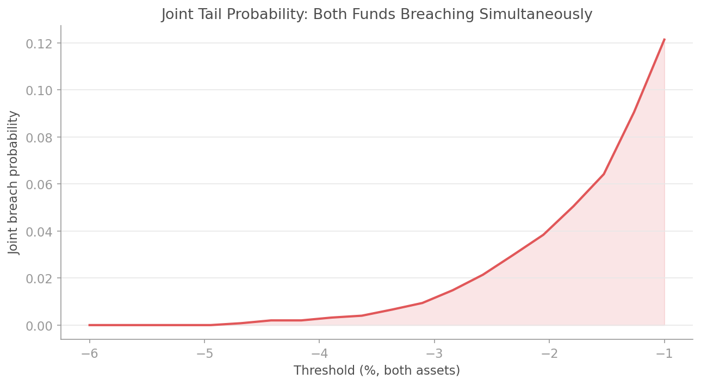

# Copula Monte Carlo Simulation

## Overview

Correlation is not dependence. Two assets can have the same Pearson correlation yet behave entirely differently in the tails. Gaussian copulas underestimate joint crash risk; Student-t copulas with low degrees of freedom capture the tendency for extreme events to cluster across assets.

The `quantlite.simulation.copula_mc` module provides multivariate Monte Carlo simulation that separates marginal behaviour from dependence structure. Each asset keeps its own fat-tailed marginal distribution while the copula controls how they move together, especially in the tails.

Four functions cover the full workflow:

1. **`gaussian_copula_mc`** generates correlated scenarios using a Gaussian copula with empirical marginals
2. **`t_copula_mc`** adds tail dependence via a Student-t copula, making joint crashes more likely
3. **`stress_correlation_mc`** simulates under stressed (crisis-level) correlations
4. **`joint_tail_probability`** estimates the probability of multiple assets crashing simultaneously

## API Reference

### `gaussian_copula_mc`

```python
gaussian_copula_mc(
    marginals: list[np.ndarray],
    correlation_matrix: np.ndarray,
    n_scenarios: int = 10000,
    seed: int = 42,
) -> np.ndarray
```

Multivariate simulation using a Gaussian copula with empirical marginals. Generates correlated uniform samples via the Gaussian copula, then maps them back to each asset's empirical distribution. This preserves correlation structure while retaining the fat tails of each individual return series.

**Parameters:**

| Parameter | Type | Description |
|-----------|------|-------------|
| `marginals` | list[np.ndarray] | List of 1-D arrays, one per asset, containing historical returns. Each defines the marginal distribution for that asset |
| `correlation_matrix` | np.ndarray | Square correlation matrix of shape `(n_assets, n_assets)` |
| `n_scenarios` | int | Number of joint scenarios to generate (default 10,000) |
| `seed` | int | Random seed |

**Returns:** Array of shape `(n_scenarios, n_assets)` with simulated returns.

**Interpretation:**

| Observation | Meaning |
|-------------|---------|
| Joint tails match historical frequency | Gaussian copula is adequate for this pair |
| Joint tails rarer than historical | Gaussian copula underestimates tail dependence; consider t-copula |
| Marginals preserved, correlation preserved | The copula is working as intended |

**Example:**

```python
import numpy as np
from quantlite.simulation import gaussian_copula_mc

rng = np.random.default_rng(42)
n = 1000

# Fund A and Fund B with different fat-tail profiles
fund_a = np.concatenate([rng.normal(0.0005, 0.012, 900), rng.standard_t(3, 100) * 0.03])
fund_b = np.concatenate([rng.normal(0.0003, 0.015, 900), rng.standard_t(4, 100) * 0.025])

corr = np.array([[1.0, 0.6], [0.6, 1.0]])
simulated = gaussian_copula_mc([fund_a, fund_b], corr, n_scenarios=10000)

print(f"Shape: {simulated.shape}")
print(f"Simulated correlation: {np.corrcoef(simulated.T)[0, 1]:.3f}")
print(f"Fund A 1st pctl: {np.percentile(simulated[:, 0], 1):.4f}")
print(f"Fund B 1st pctl: {np.percentile(simulated[:, 1], 1):.4f}")
```


---

### `t_copula_mc`

```python
t_copula_mc(
    marginals: list[np.ndarray],
    correlation_matrix: np.ndarray,
    df: int = 4,
    n_scenarios: int = 10000,
    seed: int = 42,
) -> np.ndarray
```

Multivariate simulation using a Student-t copula. The t-copula generates tail dependence: extreme events across assets are more likely to co-occur than under a Gaussian copula. Lower degrees of freedom produce stronger tail dependence.

**Parameters:**

| Parameter | Type | Description |
|-----------|------|-------------|
| `marginals` | list[np.ndarray] | List of 1-D arrays, one per asset |
| `correlation_matrix` | np.ndarray | Correlation matrix |
| `df` | int | Degrees of freedom for the t-copula (default 4). Lower values produce heavier tail dependence |
| `n_scenarios` | int | Number of scenarios (default 10,000) |
| `seed` | int | Random seed |

**Returns:** Array of shape `(n_scenarios, n_assets)`.

**Interpretation:**

| Degrees of freedom | Tail dependence |
|--------------------|-----------------|
| df = 3 | Very heavy tail dependence; joint crashes frequent |
| df = 4-5 | Moderate tail dependence (typical for equity pairs) |
| df = 10-15 | Mild tail dependence |
| df > 30 | Approaches Gaussian copula behaviour |

**Example:**

```python
import numpy as np
from quantlite.simulation import gaussian_copula_mc, t_copula_mc

rng = np.random.default_rng(42)
fund_a = np.concatenate([rng.normal(0.0005, 0.012, 900), rng.standard_t(3, 100) * 0.03])
fund_b = np.concatenate([rng.normal(0.0003, 0.015, 900), rng.standard_t(4, 100) * 0.025])
corr = np.array([[1.0, 0.6], [0.6, 1.0]])

gauss = gaussian_copula_mc([fund_a, fund_b], corr, n_scenarios=10000, seed=42)
student = t_copula_mc([fund_a, fund_b], corr, df=4, n_scenarios=10000, seed=42)

# Count joint tail events (both below 5th percentile)
threshold_a = np.percentile(fund_a, 5)
threshold_b = np.percentile(fund_b, 5)
gauss_joint = np.mean((gauss[:, 0] < threshold_a) & (gauss[:, 1] < threshold_b))
student_joint = np.mean((student[:, 0] < threshold_a) & (student[:, 1] < threshold_b))
print(f"Joint tail (Gaussian copula): {gauss_joint:.4f}")
print(f"Joint tail (t-copula df=4):   {student_joint:.4f}")
# The t-copula produces more joint tail events.
```

---

### `stress_correlation_mc`

```python
stress_correlation_mc(
    marginals: list[np.ndarray],
    correlation_matrix: np.ndarray,
    stress_factor: float = 1.5,
    n_scenarios: int = 10000,
    seed: int = 42,
) -> np.ndarray
```

Simulate under stressed correlations. In crises, correlations tend to spike towards 1.0, destroying diversification benefits precisely when they matter most. This function scales off-diagonal correlations by `stress_factor` (capping at 1.0), then simulates using a Gaussian copula.

**Parameters:**

| Parameter | Type | Description |
|-----------|------|-------------|
| `marginals` | list[np.ndarray] | List of 1-D arrays, one per asset |
| `correlation_matrix` | np.ndarray | Base (calm-market) correlation matrix |
| `stress_factor` | float | Multiplier for off-diagonal correlations (default 1.5). Values > 1 increase correlation |
| `n_scenarios` | int | Number of scenarios (default 10,000) |
| `seed` | int | Random seed |

**Returns:** Array of shape `(n_scenarios, n_assets)`.

**Interpretation:**

| Stress factor | Scenario |
|---------------|----------|
| 1.0 | No stress; baseline correlations |
| 1.3-1.5 | Moderate stress; typical for sector-wide selloffs |
| 1.8-2.0 | Severe stress; 2008-style correlation spike |
| 2.5+ | Extreme; approaching perfect correlation |

**Example:**

```python
import numpy as np
from quantlite.simulation import gaussian_copula_mc, stress_correlation_mc

rng = np.random.default_rng(42)
fund_a = rng.normal(0.0005, 0.012, 1000)
fund_b = rng.normal(0.0003, 0.015, 1000)
fund_c = rng.normal(0.0002, 0.018, 1000)

corr = np.array([
    [1.0, 0.3, 0.2],
    [0.3, 1.0, 0.4],
    [0.2, 0.4, 1.0],
])

calm = gaussian_copula_mc([fund_a, fund_b, fund_c], corr, n_scenarios=10000)
stressed = stress_correlation_mc([fund_a, fund_b, fund_c], corr, stress_factor=1.8)

print(f"Calm portfolio std:     {calm.sum(axis=1).std():.4f}")
print(f"Stressed portfolio std: {stressed.sum(axis=1).std():.4f}")
# Stressed correlations produce wider portfolio dispersion.
```


---

### `joint_tail_probability`

```python
joint_tail_probability(
    simulated_returns: np.ndarray,
    thresholds: list[float],
) -> dict
```

Compute joint tail probabilities from simulation output. Estimates the probability of multiple assets simultaneously breaching their respective thresholds in the same scenario.

**Parameters:**

| Parameter | Type | Description |
|-----------|------|-------------|
| `simulated_returns` | np.ndarray | Array of shape `(n_scenarios, n_assets)` from a copula simulation |
| `thresholds` | list[float] | Return thresholds, one per asset (negative for losses, e.g. `[-0.05, -0.03]`) |

**Returns:** Dictionary with keys:

| Key | Type | Description |
|-----|------|-------------|
| `"joint_probability"` | float | Probability that all assets breach simultaneously |
| `"marginal_probabilities"` | list[float] | Individual breach probabilities per asset |
| `"conditional_probabilities"` | list[float] | Probability of joint breach given each asset breaches |
| `"n_joint_breaches"` | int | Count of joint breach scenarios |
| `"n_scenarios"` | int | Total number of scenarios |

**Interpretation:**

| Joint vs product of marginals | Meaning |
|-------------------------------|---------|
| Joint >> product of marginals | Strong tail dependence; crashes cluster |
| Joint ~ product of marginals | Near-independence in the tails |
| Joint << product of marginals | Negative tail dependence (very rare) |

**Example:**

```python
import numpy as np
from quantlite.simulation import t_copula_mc, joint_tail_probability

rng = np.random.default_rng(42)
fund_a = np.concatenate([rng.normal(0.0005, 0.012, 900), rng.standard_t(3, 100) * 0.03])
fund_b = np.concatenate([rng.normal(0.0003, 0.015, 900), rng.standard_t(4, 100) * 0.025])
corr = np.array([[1.0, 0.6], [0.6, 1.0]])

simulated = t_copula_mc([fund_a, fund_b], corr, df=4, n_scenarios=50000)

result = joint_tail_probability(simulated, thresholds=[-0.03, -0.03])
print(f"Joint crash probability: {result['joint_probability']:.4f}")
print(f"Marginal probabilities:  {result['marginal_probabilities']}")
print(f"Conditional given A:     {result['conditional_probabilities'][0]:.4f}")
# If independent: joint ~ marginal_A * marginal_B
independent = result['marginal_probabilities'][0] * result['marginal_probabilities'][1]
print(f"If independent:          {independent:.4f}")
print(f"Tail dependence ratio:   {result['joint_probability'] / independent:.1f}x")
```


