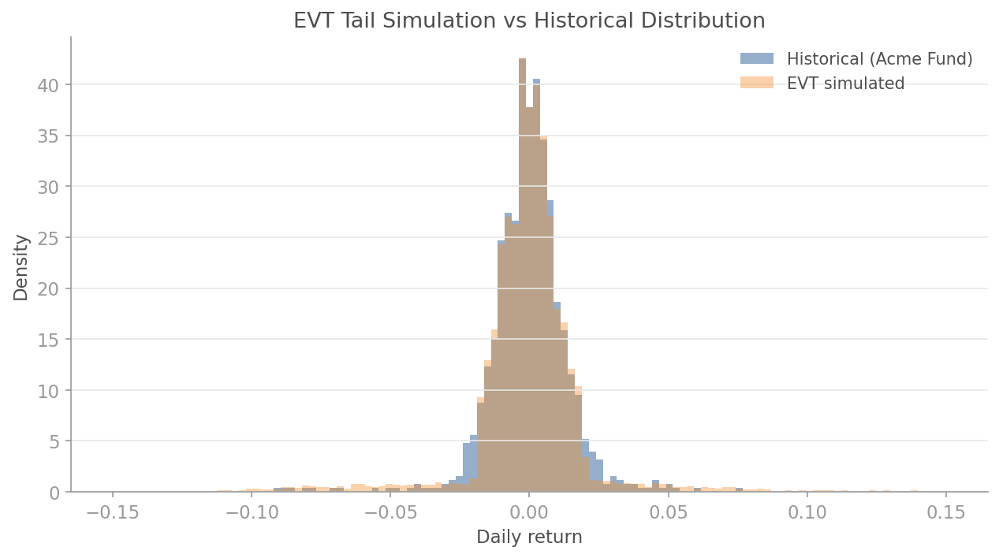
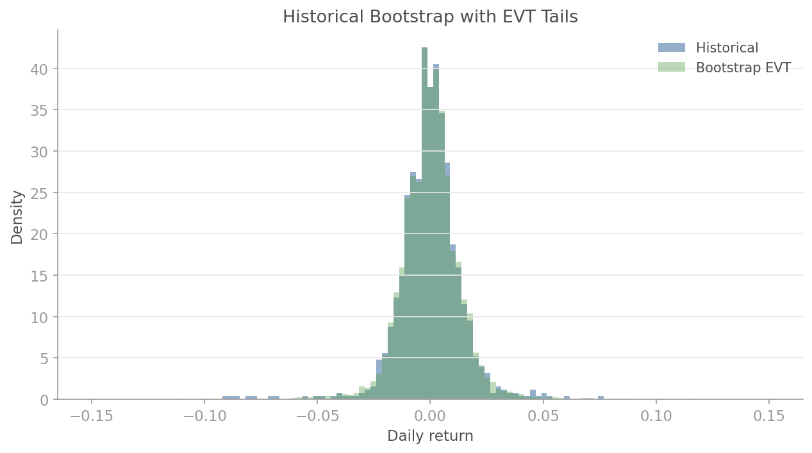
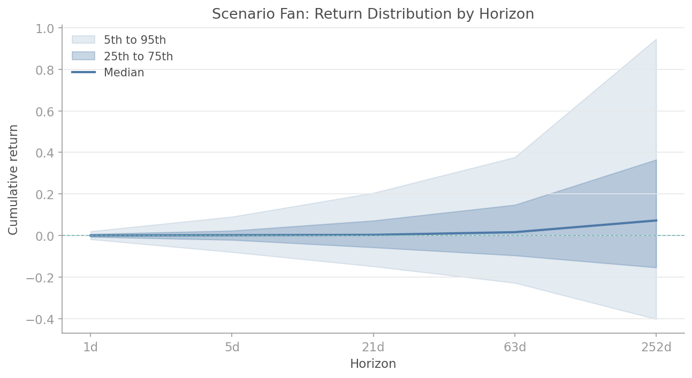

# EVT Tail Simulation

## Overview

Normal distributions underestimate tail risk by orders of magnitude. A return that Gaussian models call a "10-sigma event" (probability ~10^-23) actually occurs every few years in financial markets. The gap between modelled and realised tail risk is not a rounding error -- it is the difference between solvency and ruin.

The `quantlite.simulation.evt_simulation` module bridges this gap by combining Extreme Value Theory with Monte Carlo simulation. It fits Generalised Pareto Distributions (GPD) to the observed tails, preserves the empirical body, and generates thousands of scenarios that respect the true shape of financial returns.

Four functions cover the full workflow:

1. **`evt_tail_simulation`** fits GPD to both tails and samples realistic fat-tailed scenarios
2. **`parametric_tail_simulation`** generates scenarios from explicit GPD parameters (useful when you have a view on tail shape)
3. **`historical_bootstrap_evt`** combines empirical bootstrapping for the body with GPD extrapolation for the tails
4. **`scenario_fan`** projects return distributions at multiple horizons, producing fan charts for risk communication

## API Reference

### `evt_tail_simulation`

```python
evt_tail_simulation(
    returns: array-like,
    n_scenarios: int = 10000,
    alpha: float = 0.05,
    seed: int = 42,
) -> np.ndarray
```

Generate scenarios using fitted GPD for tails and the empirical distribution for the body. The left and right tails (below the `alpha` and above the `1 - alpha` quantiles) are modelled with separate GPD fits. The body is sampled from the historical distribution.

**Parameters:**

| Parameter | Type | Description |
|-----------|------|-------------|
| `returns` | array-like | Historical return series |
| `n_scenarios` | int | Number of scenarios to generate (default 10,000) |
| `alpha` | float | Tail fraction on each side (default 0.05, i.e. 5%) |
| `seed` | int | Random seed for reproducibility |

**Returns:** Array of shape `(n_scenarios,)` with simulated returns.

**Interpretation:**

| Observation | Meaning |
|-------------|---------|
| Simulated tails heavier than historical | GPD has extrapolated beyond observed data, revealing hidden tail risk |
| Simulated and historical match closely | Tails are well-captured by existing data; GPD confirms rather than extends |
| Body matches, tails diverge | The EVT hybrid is working as intended: faithful centre, honest tails |

**Example:**

```python
import numpy as np
from quantlite.simulation import evt_tail_simulation

# Acme Fund daily returns (fat-tailed)
rng = np.random.default_rng(42)
body = rng.normal(0.0003, 0.01, 900)
tails = rng.standard_t(3, 100) * 0.03
returns = np.concatenate([body, tails])

simulated = evt_tail_simulation(returns, n_scenarios=20000, seed=42)
print(f"Historical 1st percentile: {np.percentile(returns, 1):.4f}")
print(f"Simulated 1st percentile:  {np.percentile(simulated, 1):.4f}")
# The simulated tail extends further, reflecting GPD extrapolation.
```



---

### `parametric_tail_simulation`

```python
parametric_tail_simulation(
    shape: float,
    scale: float,
    threshold: float,
    n_body: int,
    body_mean: float,
    body_std: float,
    n_scenarios: int = 10000,
    seed: int = 42,
) -> np.ndarray
```

Simulate from explicit GPD parameters plus a normal body. Use this when you have a specific view on tail shape (e.g. from a previous GPD fit, or a regulatory requirement) rather than fitting from data.

The body is drawn from `N(body_mean, body_std)`, truncated at `[-threshold, threshold]`. Returns beyond the threshold are drawn from a GPD.

**Parameters:**

| Parameter | Type | Description |
|-----------|------|-------------|
| `shape` | float | GPD shape parameter (xi). Positive values produce heavier tails |
| `scale` | float | GPD scale parameter (sigma). Controls the spread of tail exceedances |
| `threshold` | float | Tail threshold (positive, applied symmetrically) |
| `n_body` | int | Approximate number of historical observations in the body (used to calibrate tail probability) |
| `body_mean` | float | Mean of the normal body distribution |
| `body_std` | float | Standard deviation of the normal body |
| `n_scenarios` | int | Number of scenarios to generate (default 10,000) |
| `seed` | int | Random seed |

**Returns:** Array of `n_scenarios` simulated returns.

**Interpretation:**

| Shape (xi) | Tail behaviour |
|------------|----------------|
| xi = 0 | Exponential tails (thin-tailed, similar to normal) |
| 0 < xi < 0.3 | Moderately heavy tails (typical for equities) |
| xi > 0.3 | Very heavy tails (crypto, emerging markets) |
| xi < 0 | Bounded tails (rare in finance) |

**Example:**

```python
from quantlite.simulation import parametric_tail_simulation

# Generate scenarios with known tail parameters
# xi=0.2 is typical for equity indices
simulated = parametric_tail_simulation(
    shape=0.2,
    scale=0.005,
    threshold=0.02,
    n_body=1000,
    body_mean=0.0003,
    body_std=0.01,
    n_scenarios=10000,
)
print(f"Mean: {simulated.mean():.5f}")
print(f"Std:  {simulated.std():.4f}")
print(f"1st percentile: {np.percentile(simulated, 1):.4f}")
```

---

### `historical_bootstrap_evt`

```python
historical_bootstrap_evt(
    returns: array-like,
    n_scenarios: int = 10000,
    tail_fraction: float = 0.05,
    seed: int = 42,
) -> np.ndarray
```

Hybrid bootstrap: empirical body, GPD-sampled tails. Bootstraps from the body of the distribution and uses GPD sampling for tail scenarios. This preserves the empirical centre while allowing tail extrapolation beyond observed data.

The key advantage over pure bootstrapping is that the GPD tails can generate scenarios more extreme than anything in the historical record, which is essential for stress testing.

**Parameters:**

| Parameter | Type | Description |
|-----------|------|-------------|
| `returns` | array-like | Historical return series |
| `n_scenarios` | int | Number of scenarios to generate (default 10,000) |
| `tail_fraction` | float | Fraction of each tail (default 0.05) |
| `seed` | int | Random seed |

**Returns:** Array of `n_scenarios` simulated returns.

**Interpretation:**

| Comparison | Meaning |
|------------|---------|
| Bootstrap heavier than pure historical | GPD is extrapolating tail risk beyond the observed sample |
| Bootstrap close to pure bootstrap | Tail fraction may be too large, or tails are well-sampled historically |
| Bootstrap much heavier than EVT fit | Check for data quality issues or GPD overfitting |

**Example:**

```python
import numpy as np
from quantlite.simulation import historical_bootstrap_evt

rng = np.random.default_rng(42)
returns = np.concatenate([
    rng.normal(0.0003, 0.01, 900),
    rng.standard_t(3, 100) * 0.03,
])

bootstrap = historical_bootstrap_evt(returns, n_scenarios=20000, seed=42)
print(f"Historical range: [{returns.min():.4f}, {returns.max():.4f}]")
print(f"Bootstrap range:  [{bootstrap.min():.4f}, {bootstrap.max():.4f}]")
# Bootstrap range extends beyond historical, showing GPD extrapolation.
```



---

### `scenario_fan`

```python
scenario_fan(
    returns: array-like,
    horizons: list[int],
    n_scenarios: int = 5000,
    seed: int = 42,
) -> dict
```

Project return distributions at multiple horizons. For each horizon, simulates cumulative returns by drawing daily returns from an EVT-based model and compounding over the horizon. Produces the data for fan charts that communicate uncertainty across time.

**Parameters:**

| Parameter | Type | Description |
|-----------|------|-------------|
| `returns` | array-like | Daily return series |
| `horizons` | list[int] | List of horizons in days (e.g. `[1, 5, 21, 63, 252]`) |
| `n_scenarios` | int | Number of scenarios per horizon (default 5,000) |
| `seed` | int | Random seed |

**Returns:** Dictionary with keys:

| Key | Type | Description |
|-----|------|-------------|
| `"horizons"` | list[int] | The input horizons |
| `"percentiles"` | list[int] | Percentile levels: `[5, 25, 50, 75, 95]` |
| `"fans"` | dict | Maps each horizon to a dict of `{percentile: cumulative_return}` |
| `"scenarios"` | dict | Maps each horizon to the full array of cumulative returns |

**Interpretation:**

| Fan width | Meaning |
|-----------|---------|
| Narrow fan | Low uncertainty; returns are tightly distributed |
| Wide fan, symmetric | High uncertainty but balanced upside/downside |
| Wide fan, skewed down | Fat left tail dominates; crash risk exceeds rally potential |
| Fan widens non-linearly | Compounding amplifies tail risk at longer horizons |

**Example:**

```python
import numpy as np
from quantlite.simulation import evt_tail_simulation, scenario_fan

rng = np.random.default_rng(42)
returns = np.concatenate([
    rng.normal(0.0003, 0.01, 900),
    rng.standard_t(3, 100) * 0.03,
])

fan = scenario_fan(returns, horizons=[1, 5, 21, 63, 252], n_scenarios=5000)
for h in fan["horizons"]:
    p5 = fan["fans"][h]["5"]
    p95 = fan["fans"][h]["95"]
    print(f"  {h:>3}d: [{p5:+.2%}, {p95:+.2%}]")
# Uncertainty widens dramatically at longer horizons.
```


