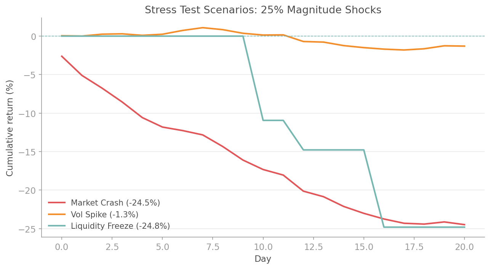

# Regime-Switching Simulation

## Overview

Markets do not have one personality. They switch between calm trending periods, volatile sideways chop, and full-blown crises. A single distribution fitted to the entire history blends these regimes together, underestimating the severity of crises and overestimating the risk during calm periods.

The `quantlite.simulation.regime_mc` module generates return paths where the underlying distribution shifts between regimes according to a Markov transition matrix. It also provides stress testing frameworks that go beyond historical replay, and reverse stress tests that answer the question: "What would have to happen for us to lose X%?"

Four functions cover the full workflow:

1. **`regime_switching_simulation`** generates multi-step paths with Markov regime transitions
2. **`stress_test_scenario`** applies predefined shock types (crashes, vol spikes, liquidity freezes) to a return series
3. **`reverse_stress_test`** finds the scenarios most likely to produce a specific loss target
4. **`simulation_summary`** computes comprehensive risk statistics from any simulation output

## API Reference

### `regime_switching_simulation`

```python
regime_switching_simulation(
    regime_params: list[dict[str, float]],
    transition_matrix: np.ndarray,
    n_steps: int = 252,
    n_scenarios: int = 5000,
    seed: int = 42,
) -> dict
```

Simulate return paths with regime-switching dynamics. Each regime has its own mean and volatility. At each step, the regime may change according to the Markov transition matrix.

**Parameters:**

| Parameter | Type | Description |
|-----------|------|-------------|
| `regime_params` | list[dict] | List of dicts, each with keys `"mu"` (daily mean return) and `"sigma"` (daily volatility). One dict per regime |
| `transition_matrix` | np.ndarray | Square matrix of shape `(n_regimes, n_regimes)`. Entry `[i][j]` is the probability of transitioning from regime `i` to regime `j`. Rows must sum to 1.0 |
| `n_steps` | int | Number of time steps per path (default 252 = one trading year) |
| `n_scenarios` | int | Number of simulation paths (default 5,000) |
| `seed` | int | Random seed |

**Returns:** Dictionary with keys:

| Key | Type | Description |
|-----|------|-------------|
| `"returns"` | np.ndarray | Shape `(n_scenarios, n_steps)` -- daily returns |
| `"regimes"` | np.ndarray | Shape `(n_scenarios, n_steps)` -- regime index at each step |
| `"cumulative_returns"` | np.ndarray | Shape `(n_scenarios, n_steps)` -- compounded returns |
| `"regime_params"` | list[dict] | Echo of input regime parameters |

**Interpretation:**

| Pattern | Meaning |
|---------|---------|
| Most paths stay in regime 0 | Calm regime is sticky; crises are rare but severe |
| Frequent regime switching | Unstable market; high uncertainty about the current state |
| Terminal returns bimodal | Two regimes dominate the outcome distribution |
| Wide fan in crisis regime | Vol-of-vol effect: crisis paths diverge rapidly |

**Example:**

```python
import numpy as np
from quantlite.simulation import regime_switching_simulation

# Three regimes: calm, volatile, crisis
regimes = [
    {"mu": 0.0004, "sigma": 0.008},   # Calm
    {"mu": 0.0001, "sigma": 0.020},   # Volatile
    {"mu": -0.002, "sigma": 0.035},   # Crisis
]

# Transition matrix: crises are rare but sticky
transition = np.array([
    [0.95, 0.04, 0.01],   # Calm: mostly stays calm
    [0.10, 0.80, 0.10],   # Volatile: can go either way
    [0.05, 0.15, 0.80],   # Crisis: sticky once entered
])

result = regime_switching_simulation(
    regimes, transition, n_steps=252, n_scenarios=5000, seed=42,
)

terminal = result["cumulative_returns"][:, -1]
print(f"Median annual return: {np.median(terminal):.2%}")
print(f"5th percentile:       {np.percentile(terminal, 5):.2%}")
print(f"95th percentile:      {np.percentile(terminal, 95):.2%}")
```


---

### `stress_test_scenario`

```python
stress_test_scenario(
    returns: array-like,
    shock_type: str,
    magnitude: float,
    horizon: int = 21,
) -> dict
```

Apply predefined stress scenarios to a return series. Calibrates the shock using historical statistics, then generates a deterministic stressed path.

**Supported shock types:**

| Shock type | Description |
|------------|-------------|
| `"market_crash"` | Sudden drop of `magnitude` spread over the horizon, front-loaded |
| `"vol_spike"` | Volatility multiplied by `magnitude`; returns become erratic |
| `"correlation_breakdown"` | Diversification benefit disappears; returns become more negative with higher variance |
| `"liquidity_freeze"` | Returns compressed towards zero with occasional large drops |

**Parameters:**

| Parameter | Type | Description |
|-----------|------|-------------|
| `returns` | array-like | Historical return series (used to calibrate baseline statistics) |
| `shock_type` | str | One of `"market_crash"`, `"vol_spike"`, `"correlation_breakdown"`, `"liquidity_freeze"` |
| `magnitude` | float | Severity of the shock. For crash: total loss fraction. For vol_spike: volatility multiplier |
| `horizon` | int | Number of periods over which the shock unfolds (default 21) |

**Returns:** Dictionary with keys:

| Key | Type | Description |
|-----|------|-------------|
| `"stressed_returns"` | np.ndarray | Array of stressed daily returns |
| `"cumulative_impact"` | float | Total cumulative return over the scenario |
| `"max_drawdown"` | float | Worst peak-to-trough within the scenario |
| `"shock_type"` | str | Echo of input |
| `"magnitude"` | float | Echo of input |
| `"horizon"` | int | Echo of input |

**Example:**

```python
import numpy as np
from quantlite.simulation import stress_test_scenario

rng = np.random.default_rng(42)
returns = rng.normal(0.0003, 0.012, 1000)

# Market crash: 30% loss over one month
crash = stress_test_scenario(returns, "market_crash", magnitude=0.30, horizon=21)
print(f"Cumulative impact: {crash['cumulative_impact']:.2%}")
print(f"Max drawdown:      {crash['max_drawdown']:.2%}")

# Volatility spike: 3x normal vol
vol = stress_test_scenario(returns, "vol_spike", magnitude=3.0, horizon=21)
print(f"Vol spike impact:  {vol['cumulative_impact']:.2%}")

# Liquidity freeze
liq = stress_test_scenario(returns, "liquidity_freeze", magnitude=0.15, horizon=21)
print(f"Liquidity freeze:  {liq['cumulative_impact']:.2%}")
```



---

### `reverse_stress_test`

```python
reverse_stress_test(
    returns: array-like,
    target_loss: float,
    n_scenarios: int = 50000,
    seed: int = 42,
) -> dict
```

Find scenarios that produce a specific loss level. Simulates many paths via bootstrapping and identifies the ones closest to the target loss, revealing what combination of daily moves would cause (for example) a 20% drawdown over 21 days.

**Parameters:**

| Parameter | Type | Description |
|-----------|------|-------------|
| `returns` | array-like | Historical return series |
| `target_loss` | float | Target cumulative loss (negative, e.g. `-0.20` for 20% drawdown) |
| `n_scenarios` | int | Number of scenarios to simulate (default 50,000) |
| `seed` | int | Random seed |

**Returns:** Dictionary with keys:

| Key | Type | Description |
|-----|------|-------------|
| `"target_loss"` | float | Echo of input |
| `"closest_scenarios"` | np.ndarray | Shape `(n_closest, 21)` -- the scenario paths nearest to the target |
| `"closest_cumulative"` | np.ndarray | Cumulative returns of the closest scenarios |
| `"mean_path"` | np.ndarray | Average of the closest scenario paths |
| `"n_scenarios_searched"` | int | Total scenarios simulated |
| `"worst_day_mean"` | float | Average worst single-day return across matching scenarios |

**Interpretation:**

| Result | Meaning |
|--------|---------|
| Mean path shows gradual decline | Loss accumulates through sustained selling, not a single shock |
| Mean path shows front-loaded crash | A single large event drives most of the loss |
| Worst day mean close to target / 21 | Loss is spread evenly; no single catastrophic day |
| Worst day mean is a large fraction of target | One very bad day dominates the scenario |

**Example:**

```python
import numpy as np
from quantlite.simulation import reverse_stress_test

rng = np.random.default_rng(42)
returns = np.concatenate([
    rng.normal(0.0003, 0.012, 900),
    rng.standard_t(3, 100) * 0.03,
])

# What does a 20% drawdown look like?
result = reverse_stress_test(returns, target_loss=-0.20, n_scenarios=50000)
print(f"Scenarios searched:  {result['n_scenarios_searched']}")
print(f"Closest cumulative:  {np.mean(result['closest_cumulative']):.2%}")
print(f"Avg worst single day: {result['worst_day_mean']:.2%}")
print(f"Mean path shape:     {result['mean_path'].shape}")
```


---

### `simulation_summary`

```python
simulation_summary(
    simulated_returns: np.ndarray,
) -> dict
```

Compute comprehensive risk statistics from simulation output. Works with both single-period (1-D) and multi-step (2-D) simulation arrays.

**Parameters:**

| Parameter | Type | Description |
|-----------|------|-------------|
| `simulated_returns` | np.ndarray | Simulated returns. 1-D for single-period scenarios, or 2-D `(n_scenarios, n_steps)` for path-based simulations |

**Returns:** Dictionary with keys:

| Key | Type | Description |
|-----|------|-------------|
| `"var"` | dict | VaR at 90%, 95%, 99% confidence (positive = loss) |
| `"cvar"` | dict | CVaR (Expected Shortfall) at 90%, 95%, 99% |
| `"max_drawdown"` | dict | Statistics: mean, median, worst, best |
| `"probability_of_ruin"` | dict | Probability of losing more than 10%, 20%, 50% |
| `"mean_return"` | float | Mean of terminal returns |
| `"median_return"` | float | Median of terminal returns |
| `"std_return"` | float | Standard deviation |
| `"skewness"` | float | Skewness of the return distribution |
| `"kurtosis"` | float | Excess kurtosis |

**Interpretation:**

| Metric | What to look for |
|--------|-----------------|
| CVaR >> VaR | Heavy left tail; losses beyond VaR are severe |
| CVaR ~ VaR | Thin tail; VaR is a reasonable risk summary |
| High kurtosis (> 3) | Fat tails present; Gaussian assumptions will fail |
| Negative skewness | Left tail is heavier; crash risk exceeds rally potential |
| P(ruin 20%) significant | Material probability of severe loss; position sizing matters |

**Example:**

```python
import numpy as np
from quantlite.simulation import regime_switching_simulation, simulation_summary

regimes = [
    {"mu": 0.0004, "sigma": 0.008},
    {"mu": -0.001, "sigma": 0.025},
]
transition = np.array([[0.95, 0.05], [0.10, 0.90]])

sim = regime_switching_simulation(regimes, transition, n_steps=252, n_scenarios=5000)
stats = simulation_summary(sim["returns"])

print(f"VaR 95%:  {stats['var']['95%']:.2%}")
print(f"CVaR 95%: {stats['cvar']['95%']:.2%}")
print(f"Mean max drawdown: {stats['max_drawdown']['mean']:.2%}")
print(f"P(loss > 20%): {stats['probability_of_ruin']['20%']:.2%}")
print(f"Skewness: {stats['skewness']:.2f}")
print(f"Kurtosis: {stats['kurtosis']:.2f}")
```
