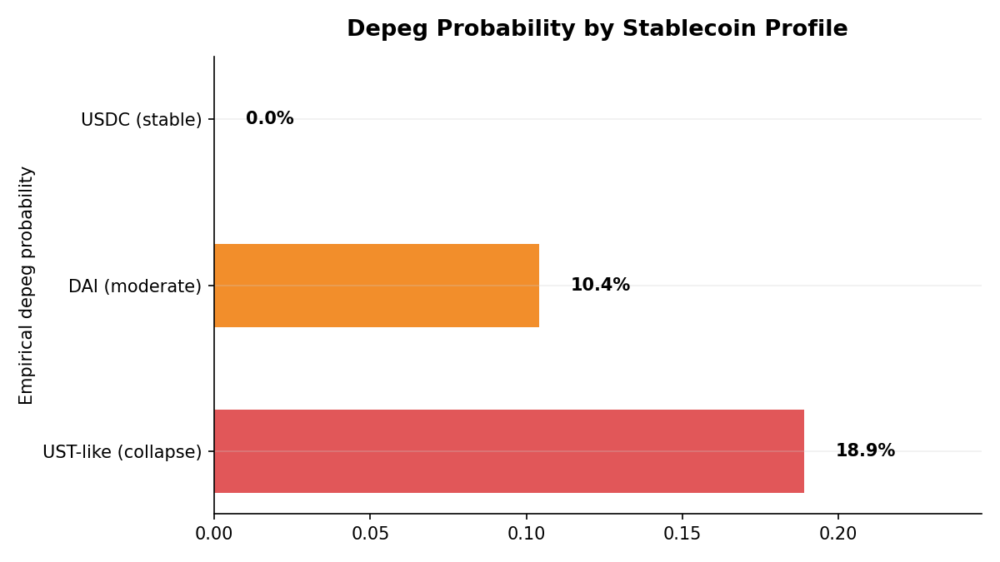
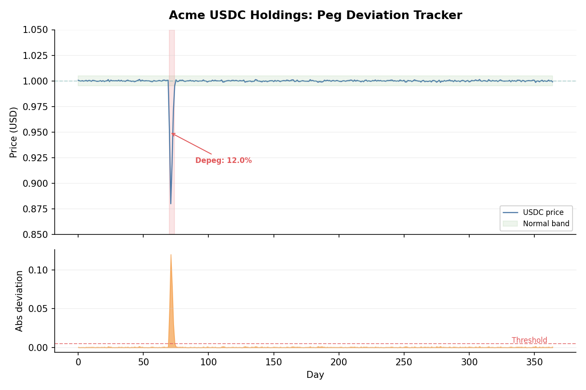
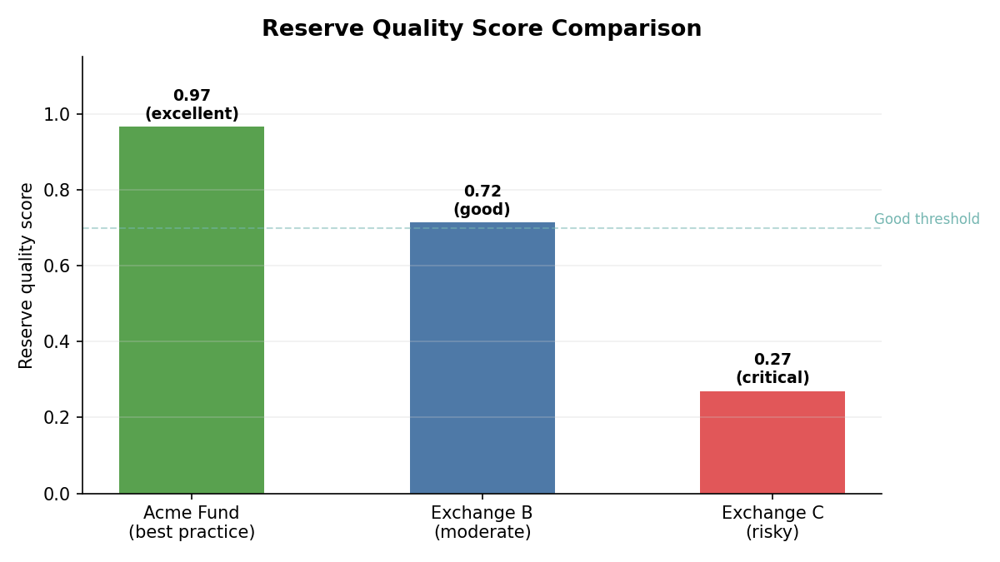

# Stablecoin Risk Analysis

## Overview

Stablecoins are the plumbing of crypto markets, but "stable" is a marketing term, not a guarantee.

The 2022 UST collapse destroyed $40 billion in days. The 2023 USDC depeg triggered by Silicon Valley Bank exposed reserve concentration risk. Even USDT, the most traded stablecoin, has experienced brief depegs during market panics. For a crypto exchange CFO, stablecoin risk is not theoretical; it sits on your balance sheet every single day.

The `quantlite.crypto.stablecoin` module provides four analytical tools and a historical reference dataset:

1. **Depeg Probability** estimates the likelihood of peg breach from historical price data
2. **Peg Deviation Tracker** computes rolling deviation statistics and identifies excursion periods
3. **Depeg Recovery Time** measures how long it takes to return to peg after a breach
4. **Reserve Risk Score** evaluates reserve quality based on asset composition
5. **Historical Depegs** provides reference data on notable depeg events

## API Reference

### `depeg_probability`

```python
depeg_probability(
    price_series: array-like,
    threshold: float = 0.005,
) -> dict
```

Estimate the probability of a peg breach using historical deviations. Computes both empirical (observed frequency) and parametric (fitted distribution) probability estimates.

**Parameters:**

| Parameter | Type | Description |
|-----------|------|-------------|
| `price_series` | array-like | Historical price observations for the stablecoin |
| `threshold` | float | Deviation threshold defining a depeg event (default 0.005, i.e. 0.5%) |

**Returns:** Dictionary with keys:

| Key | Description |
|-----|-------------|
| `empirical_prob` | Fraction of observations exceeding the threshold |
| `parametric_prob` | Probability from fitted normal distribution |
| `n_breaches` | Count of threshold breaches |
| `n_observations` | Total number of observations |
| `mean_deviation` | Mean absolute deviation from peg |
| `max_deviation` | Maximum absolute deviation from peg |
| `risk_rating` | Qualitative rating: low, medium, high, or critical |

**Interpretation:**

| Empirical Probability | Risk Rating | Meaning |
|----------------------|-------------|---------|
| < 1% | Low | Tight peg maintenance; suitable for treasury holdings |
| 1% to 5% | Medium | Occasional deviations; monitor reserve disclosures |
| 5% to 10% | High | Frequent deviations; reduce exposure or hedge |
| > 10% | Critical | Unreliable peg; consider alternatives |

**Example:**

```python
import numpy as np
from quantlite.crypto.stablecoin import depeg_probability

rng = np.random.default_rng(42)
usdc_prices = 1.0 + rng.normal(0, 0.0008, 365)

result = depeg_probability(usdc_prices, threshold=0.005)
print(f"Depeg probability: {result['empirical_prob']:.2%}")
print(f"Risk rating: {result['risk_rating']}")
```



### `peg_deviation_tracker`

```python
peg_deviation_tracker(
    price_series: array-like,
    peg: float = 1.0,
) -> dict
```

Compute rolling deviation statistics from the peg, identifying excursion periods where the price deviates significantly.

**Parameters:**

| Parameter | Type | Description |
|-----------|------|-------------|
| `price_series` | array-like | Historical price observations |
| `peg` | float | Target peg value (default 1.0) |

**Returns:** Dictionary with keys:

| Key | Description |
|-----|-------------|
| `deviations` | Array of signed deviations from peg |
| `abs_deviations` | Array of absolute deviations |
| `mean_deviation` | Mean absolute deviation |
| `max_deviation` | Maximum absolute deviation |
| `std_deviation` | Standard deviation of signed deviations |
| `excursions` | List of dicts describing each excursion period |
| `longest_excursion` | Duration of the longest excursion (in periods) |
| `pct_time_off_peg` | Percentage of time the deviation exceeds 0.001 |

Each excursion dict contains:

| Key | Description |
|-----|-------------|
| `start` | Index of excursion start |
| `end` | Index of excursion end |
| `duration` | Number of periods |
| `max_deviation` | Peak deviation during excursion |
| `mean_deviation` | Average deviation during excursion |
| `direction` | "above" or "below" the peg |

**Example:**

```python
from quantlite.crypto.stablecoin import peg_deviation_tracker

result = peg_deviation_tracker(usdc_prices)
print(f"Mean deviation: {result['mean_deviation']:.4f}")
print(f"Longest excursion: {result['longest_excursion']} periods")
print(f"Time off peg: {result['pct_time_off_peg']:.1f}%")
```



### `depeg_recovery_time`

```python
depeg_recovery_time(
    price_series: array-like,
    threshold: float = 0.005,
    peg: float = 1.0,
) -> dict
```

Identify depeg events and measure recovery duration.

**Parameters:**

| Parameter | Type | Description |
|-----------|------|-------------|
| `price_series` | array-like | Historical price observations |
| `threshold` | float | Deviation threshold for depeg detection (default 0.005) |
| `peg` | float | Target peg value (default 1.0) |

**Returns:** Dictionary with keys:

| Key | Description |
|-----|-------------|
| `events` | List of event dicts with start, end, duration, max_deviation, recovered |
| `mean_recovery_time` | Average recovery time across recovered events |
| `max_recovery_time` | Longest recovery time |
| `unrecovered` | Number of events that never recovered within the data |
| `total_events` | Total depeg events detected |

**Interpretation:**

| Recovery Time | Implication |
|---------------|-------------|
| < 1 day | Market microstructure noise; not a real depeg |
| 1 to 3 days | Stress event with functioning arbitrage |
| 3 to 7 days | Serious event; reserve concerns likely |
| > 7 days or unrecovered | Structural failure; exit position |

**Example:**

```python
from quantlite.crypto.stablecoin import depeg_recovery_time

result = depeg_recovery_time(prices, threshold=0.005)
print(f"Total events: {result['total_events']}")
print(f"Mean recovery: {result['mean_recovery_time']:.1f} periods")
print(f"Unrecovered: {result['unrecovered']}")
```

### `reserve_risk_score`

```python
reserve_risk_score(
    reserve_composition: dict,
) -> dict
```

Score reserve quality based on asset type composition. Higher scores indicate safer, more liquid reserves.

**Parameters:**

| Parameter | Type | Description |
|-----------|------|-------------|
| `reserve_composition` | dict | Mapping of asset type to percentage allocation |

Recognised asset types and their quality weights:

| Asset Type | Quality Weight | Notes |
|------------|---------------|-------|
| `cash` | 1.00 | Bank deposits, immediately liquid |
| `treasuries` | 0.95 | US Treasury bills and notes |
| `money_market` | 0.85 | Money market fund shares |
| `bonds` | 0.75 | Investment-grade bonds |
| `commercial_paper` | 0.60 | Corporate short-term debt |
| `secured_loans` | 0.50 | Collateralised lending |
| `crypto` | 0.25 | Cryptocurrency holdings |
| `other` | 0.15 | Unclassified or opaque assets |

**Returns:** Dictionary with keys:

| Key | Description |
|-----|-------------|
| `score` | Float in [0, 1], higher is safer |
| `rating` | Qualitative: excellent, good, fair, poor, or critical |
| `breakdown` | Per-asset contribution details |
| `total_allocation` | Sum of input allocations |
| `warnings` | List of specific risk warnings |

**Interpretation:**

| Score | Rating | Guidance |
|-------|--------|----------|
| 0.85+ | Excellent | Institutional grade; suitable for large treasury holdings |
| 0.70 to 0.85 | Good | Acceptable for most purposes |
| 0.50 to 0.70 | Fair | Monitor closely; demand better disclosure |
| 0.30 to 0.50 | Poor | Reduce exposure; diversify across issuers |
| < 0.30 | Critical | Avoid; reserves insufficient or opaque |

**Example:**

```python
from quantlite.crypto.stablecoin import reserve_risk_score

# Acme Fund treasury reserves
fund_reserves = {"cash": 55, "treasuries": 35, "money_market": 10}
result = reserve_risk_score(fund_reserves)
print(f"Reserve score: {result['score']:.2f} ({result['rating']})")
for warning in result["warnings"]:
    print(f"  Warning: {warning}")
```



### `HISTORICAL_DEPEGS`

A dictionary of notable historical depeg events for reference and calibration.

| Stablecoin | Date | Trough Price | Magnitude | Recovery (days) |
|------------|------|-------------|-----------|-----------------|
| UST | 2022-05-09 | $0.044 | 95.6% | Never |
| USDC | 2023-03-10 | $0.878 | 12.2% | 3 |
| DAI | 2020-03-12 | $1.11 | 11.0% (above peg) | 5 |
| USDT | 2022-05-12 | $0.9485 | 5.15% | 2 |

```python
from quantlite.crypto.stablecoin import HISTORICAL_DEPEGS

for key, event in HISTORICAL_DEPEGS.items():
    recovered = f"{event['recovery_days']} days" if event["recovery_days"] else "Never"
    print(f"{event['name']}: {event['magnitude']:.1%} depeg, recovered: {recovered}")
```
