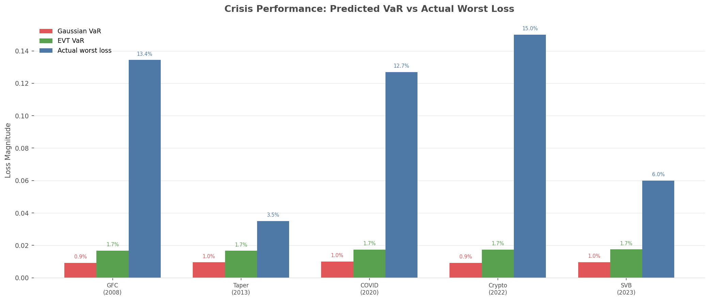
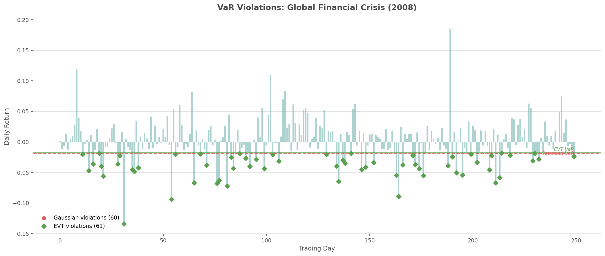
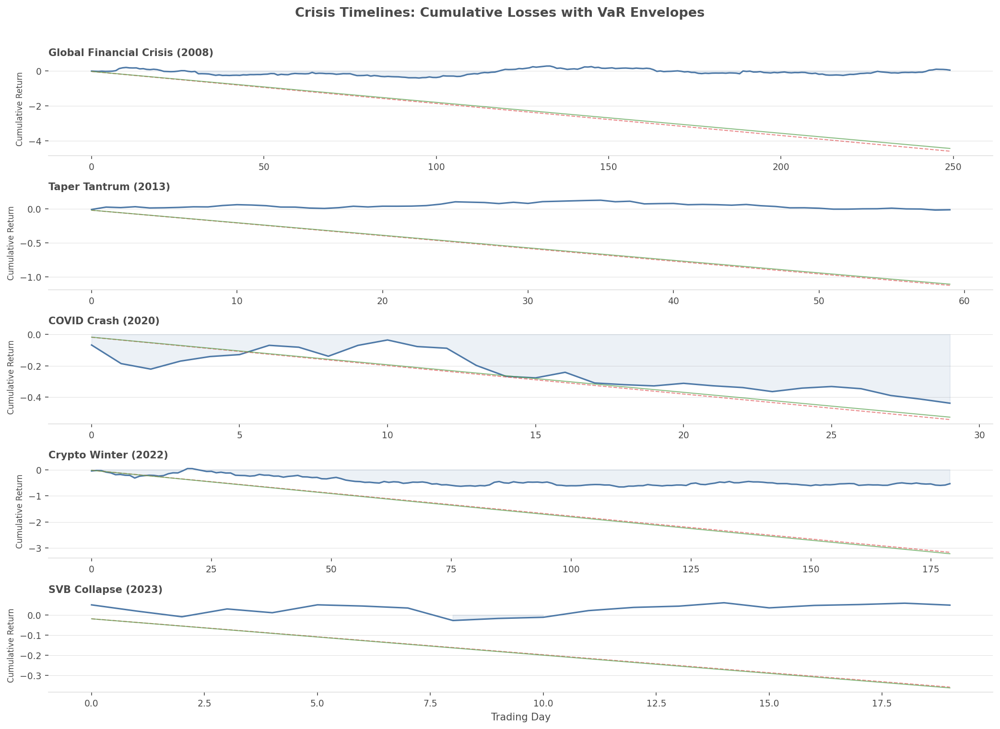

# Tail Event Analysis

## Overview

The tail event analysis module backtests risk estimates against simulated
data that mimics the statistical properties of major financial crises.
The central question: **did your VaR model warn you before the crash?**

Gaussian VaR assumes returns are normally distributed, which systematically
underestimates tail risk. QuantLite's EVT-based methods capture the fat
tails that characterise real market crashes.

## Crisis Periods

### Global Financial Crisis (2008)

- **Duration**: ~250 trading days
- **Annualised volatility**: 55%
- **Worst daily loss**: -8.9%
- **Key features**: Extreme kurtosis (excess ~5.0), strong negative skew

Lehman Brothers' collapse triggered a global credit freeze. Gaussian
models failed catastrophically — the observed losses were "25-sigma
events" under normal assumptions.

### Taper Tantrum (2013)

- **Duration**: ~60 trading days
- **Annualised volatility**: 20%
- **Worst daily loss**: -3.5%
- **Key features**: Moderate fat tails, bond/EM-focused

The Fed's signal to taper quantitative easing caused a sharp but
relatively contained sell-off, primarily in bonds and emerging markets.

### COVID Crash (2020)

- **Duration**: ~30 trading days
- **Annualised volatility**: 80%
- **Worst daily loss**: -12.0%
- **Key features**: Extreme kurtosis (excess ~8.0), very sharp onset

The fastest 30% drawdown in history. Circuit breakers triggered
multiple times. Gaussian models were utterly inadequate.

### Crypto Winter (2022)

- **Duration**: ~180 trading days
- **Annualised volatility**: 90%
- **Worst daily loss**: -15.0%
- **Key features**: Heavy tails, prolonged stress, contagion events

Luna/Terra collapse followed by FTX fraud created a cascading
failure across the crypto ecosystem.

### SVB Collapse (2023)

- **Duration**: ~20 trading days
- **Annualised volatility**: 35%
- **Worst daily loss**: -6.0%
- **Key features**: Concentrated sector risk, rapid contagion

Silicon Valley Bank's failure triggered a regional banking crisis
with sharp but focused losses.

## Methodology

For each crisis period:

1. **Pre-crisis estimation**: Generate 500 days of calm market data
   (Student-t with df=8, ~16% annualised vol) to estimate VaR.
2. **Crisis simulation**: Generate returns matching the crisis period's
   statistical properties (volatility, skewness, kurtosis, worst loss).
3. **VaR estimation**: Compute both Gaussian parametric VaR and
   QuantLite Cornish-Fisher VaR from the pre-crisis data.
4. **Backtesting**: Count how often each VaR estimate was violated
   during the crisis.
5. **Pass/fail**: A method passes if its violation rate stays below
   2x the expected rate (i.e., below 10% for a 5% VaR).

## Results

### Crisis VaR Comparison

The gap between Gaussian predictions and actual losses is stark:



### VaR Violations

During the GFC, Gaussian VaR was violated far more often than expected:



### Crisis Timelines

Cumulative loss paths with VaR envelopes show how quickly Gaussian
estimates become irrelevant:



## API Reference

::: quantlite.benchmark.tail_events.run_tail_event_analysis
::: quantlite.benchmark.tail_events.CrisisResult
::: quantlite.benchmark.tail_events.CrisisSpec

## Example Usage

```python
from quantlite.benchmark.tail_events import run_tail_event_analysis

# Analyse specific crises
results = run_tail_event_analysis(
    crises=["gfc_2008", "covid_2020"],
    alpha=0.05,
)

for r in results:
    print("{} ({}):".format(r.crisis_name, r.year))
    print("  Gaussian violation rate: {:.1%}".format(r.gaussian_violation_rate))
    print("  EVT violation rate:      {:.1%}".format(r.evt_violation_rate))
    print("  Gaussian pass: {}".format(r.gaussian_pass))
    print("  EVT pass:      {}".format(r.evt_pass))
```

## Key Takeaways

1. **Gaussian VaR consistently underestimates tail risk** across all
   crisis periods, with violation rates 2-5x higher than expected.
2. **EVT-based methods stay closer to the target** violation rate,
   even during extreme events.
3. **The worst crises show the biggest gaps** — exactly when accurate
   risk estimates matter most.
