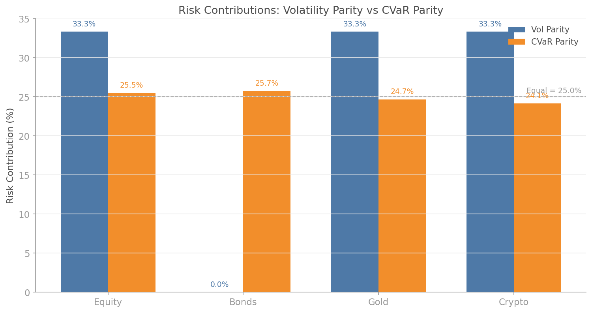
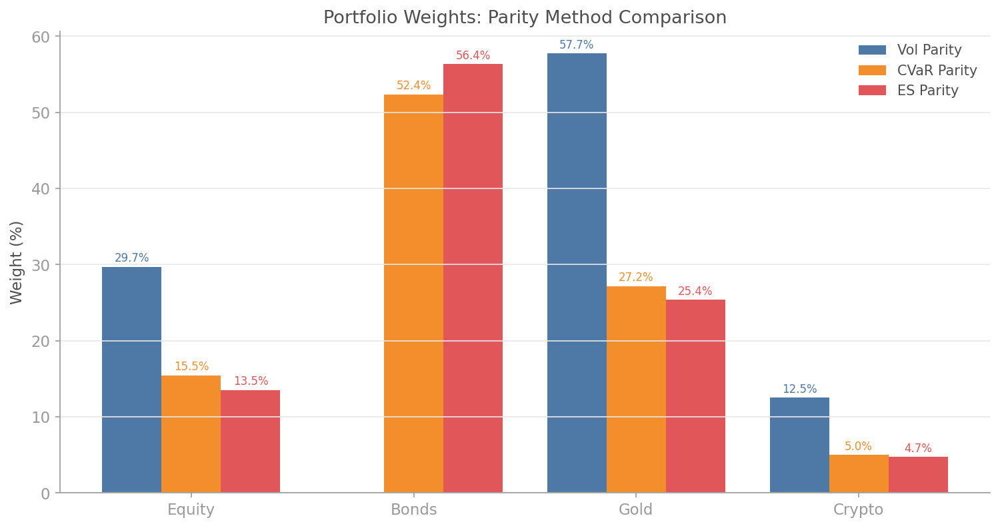
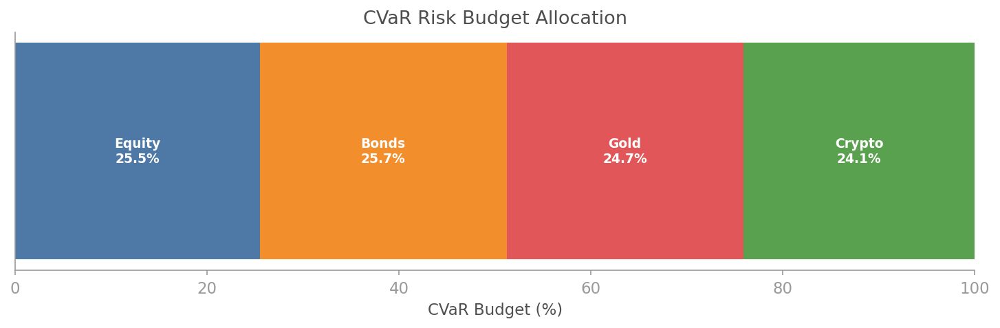

# Tail-Risk Parity

## Overview

Traditional risk parity equalises volatility contributions: each asset contributes the same amount to total portfolio standard deviation. This sounds reasonable, but it assumes volatility adequately captures risk. It does not. Two assets can have identical volatility yet wildly different tail behaviour. An asset with fat-tailed returns (think equities, crypto) contributes far more to catastrophic losses than its volatility suggests.

Tail-risk parity fixes this by equalising Conditional Value at Risk (CVaR) contributions instead of volatility contributions. CVaR, also called Expected Shortfall, measures the average loss in the worst α% of scenarios. By equalising CVaR contributions, the portfolio ensures that no single asset dominates the tail-risk budget, even if its "normal" volatility looks benign.

The `quantlite.portfolio.tail_risk_parity` module provides:

- **CVaR parity** — equalise CVaR contributions across assets
- **Expected Shortfall parity** — same concept with a deeper tail (default α=2.5%)
- **Volatility parity** — traditional risk parity (for comparison)
- **Comparison function** — side-by-side analysis of all three methods
- **Regime-conditional tail parity** — different parity targets per detected regime



## API Reference

### `cvar_parity_weights(returns_df, alpha=0.05, risk_budget=None, max_iter=1000)`

Compute CVaR parity weights. Each asset contributes equally to the portfolio's Conditional Value at Risk, unless a custom risk budget is specified.

```python
from quantlite.portfolio.tail_risk_parity import cvar_parity_weights

result = cvar_parity_weights(returns_df, alpha=0.05)
print(result.weights)
print(result.risk_contributions)
```

**Parameters:**

| Name | Type | Description |
|------|------|-------------|
| `returns_df` | `pd.DataFrame` | Asset returns (assets as columns) |
| `alpha` | `float` | Significance level for CVaR (default 0.05) |
| `risk_budget` | `dict` or `None` | Per-asset risk budget (must sum to 1) |
| `max_iter` | `int` | Maximum optimisation iterations |

**Returns:** `TailRiskParityResult` with `weights`, `risk_contributions`, `total_risk`, `method`, `risk_measure`.

---

### `es_parity_weights(returns_df, alpha=0.025, risk_budget=None, max_iter=1000)`

Expected Shortfall parity. Uses a deeper tail (default α=2.5%) for more extreme tail equalisation.

```python
from quantlite.portfolio.tail_risk_parity import es_parity_weights

result = es_parity_weights(returns_df, alpha=0.025)
```

---

### `vol_parity_weights(returns_df, risk_budget=None, max_iter=1000)`

Standard volatility parity (for comparison). Equalises volatility contributions.

```python
from quantlite.portfolio.tail_risk_parity import vol_parity_weights

result = vol_parity_weights(returns_df)
```

---

### `compare_parity_methods(returns_df, alpha=0.05)`

Compare vol parity, CVaR parity, and ES parity side by side.

```python
from quantlite.portfolio.tail_risk_parity import compare_parity_methods

results = compare_parity_methods(returns_df)
for method, result in results.items():
    print(f"{method}: {result.weights}")
```

**Returns:** Dictionary mapping method name to `TailRiskParityResult`.

---

### `regime_conditional_tail_parity(returns_df, regime_labels, alpha=0.05, risk_budgets=None)`

Compute CVaR parity weights conditional on detected regimes.

```python
from quantlite.portfolio.tail_risk_parity import regime_conditional_tail_parity

results = regime_conditional_tail_parity(returns_df, regime_labels)
for regime, result in results.items():
    print(f"Regime {regime}: {result.weights}")
```

**Parameters:**

| Name | Type | Description |
|------|------|-------------|
| `returns_df` | `pd.DataFrame` | Asset returns |
| `regime_labels` | `np.ndarray` | Integer regime labels |
| `alpha` | `float` | CVaR significance level |
| `risk_budgets` | `dict` or `None` | Per-regime risk budgets |

---

## Examples

### Basic CVaR Parity

```python
import pandas as pd
import numpy as np
from quantlite.portfolio.tail_risk_parity import cvar_parity_weights, vol_parity_weights

# Generate synthetic returns with different tail properties
rng = np.random.RandomState(42)
returns_df = pd.DataFrame({
    "Equity": rng.standard_t(df=5, size=500) * 0.015 + 0.0003,
    "Bonds": rng.normal(0.0002, 0.006, 500),
    "Gold": rng.normal(0.0001, 0.010, 500),
    "Crypto": rng.standard_t(df=3, size=500) * 0.03 + 0.0005,
})

# Compare methods
vol_result = vol_parity_weights(returns_df)
cvar_result = cvar_parity_weights(returns_df)

print("Vol Parity Weights:", vol_result.weights)
print("CVaR Parity Weights:", cvar_result.weights)
# Note: CVaR parity gives less weight to Crypto (fat tails)
# even though vol parity treats it similarly to Equity
```

### Custom Risk Budget

```python
# Allocate 40% of tail risk to equities, 20% each to others
budget = {"Equity": 0.40, "Bonds": 0.20, "Gold": 0.20, "Crypto": 0.20}
result = cvar_parity_weights(returns_df, risk_budget=budget)
```





## References

- Boudt, K., Carl, P., and Peterson, B. (2013). "Asset Allocation with Conditional Value-at-Risk Budgets." *Journal of Risk.*
- Maillard, S., Roncalli, T., and Teïletche, J. (2010). "The Properties of Equally Weighted Risk Contribution Portfolios." *Journal of Portfolio Management.*
