# Visualisation

QuantLite's visualisation system follows Stephen Few's design principles: maximum data-ink ratio, no chartjunk, muted palette, direct labels over legends, horizontal gridlines only, and small multiples over busy charts.

## Theme (`quantlite.viz.theme`)

### The Few Palette

```python
from quantlite.viz.theme import FEW_PALETTE

# Palette colours:
# primary:    #4E79A7 (muted blue)
# secondary:  #F28E2B (muted orange)
# negative:   #E15759 (muted red)
# positive:   #59A14F (muted green)
# neutral:    #76B7B2 (muted teal)
# grey_dark:  #4E4E4E
# grey_mid:   #999999
# grey_light: #E8E8E8
# bg:         #FFFFFF
```

### Applying the Theme

```python
from quantlite.viz.theme import apply_few_theme, few_figure

# Apply globally to all matplotlib charts
apply_few_theme()

# Create a figure with the theme pre-applied
fig, ax = few_figure(nrows=1, ncols=2, figsize=(10, 4))
```

### Direct Labels

Few advocates for direct labels instead of legends. QuantLite provides a helper:

```python
from quantlite.viz.theme import direct_label
import matplotlib.pyplot as plt

fig, ax = few_figure()
ax.plot([1, 2, 3], [1, 4, 9])
direct_label(ax, 3, 9, "Quadratic growth", colour="#4E79A7")
plt.show()
```

### Sparklines and Bullet Graphs

Minimal, high-density chart elements:

```python
from quantlite.viz.theme import sparkline, bullet_graph, few_figure

fig, (ax1, ax2) = few_figure(nrows=2, figsize=(6, 3))

# Sparkline: minimal line chart, no axes
sparkline(ax1, [1.0, 1.02, 0.98, 1.05, 1.03, 1.08, 1.06])

# Bullet graph: actual vs target with qualitative ranges
bullet_graph(ax2, value=0.78, target=0.85, ranges=[0.5, 0.75, 1.0], label="Sharpe")
```

## Risk Charts (`quantlite.viz.risk`)

### Tail Distribution

Return histogram with normal overlay, GPD tail fit, and VaR/CVaR reference lines:

```python
from quantlite.viz.risk import plot_tail_distribution
from quantlite.risk.evt import fit_gpd
from quantlite.distributions.fat_tails import student_t_process

returns = student_t_process(nu=4, mu=0.0003, sigma=0.012, n_steps=2520, rng_seed=42)
gpd = fit_gpd(returns)

fig, ax = plot_tail_distribution(returns, gpd_fit=gpd)
```

The grey dashed line shows the Gaussian fit; the blue line shows the GPD tail fit. The gap between them illustrates why Gaussian VaR underestimates tail risk.

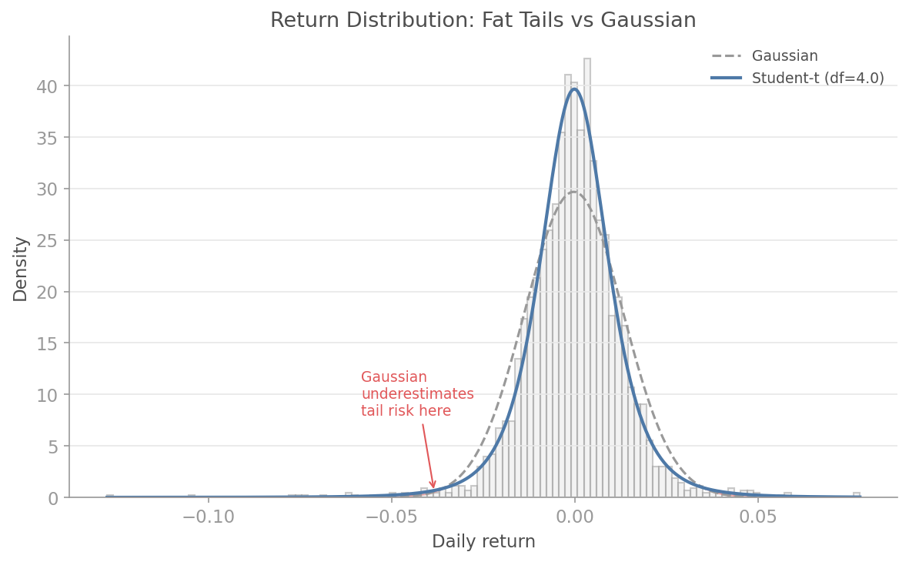

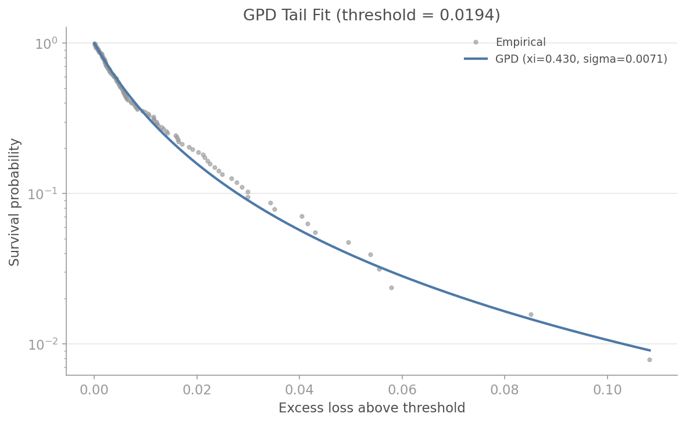

### VaR/CVaR Comparison

Historical, parametric, and Cornish-Fisher VaR side by side:

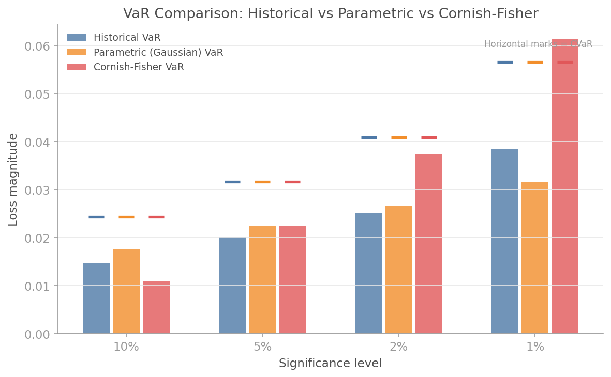

### QQ Plots

Quantile-quantile plots reveal departure from normality in the tails:

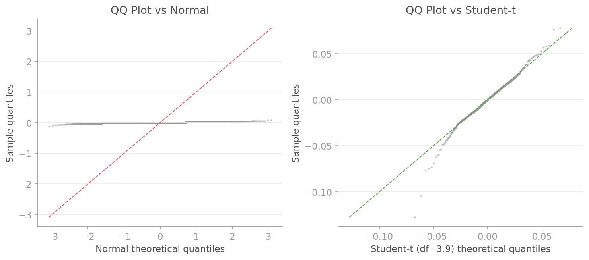

### Return Level Plot

Return levels against return periods on a log scale, with confidence bands:

```python
from quantlite.viz.risk import plot_return_levels

fig, ax = plot_return_levels(gpd, max_period=10000)
```

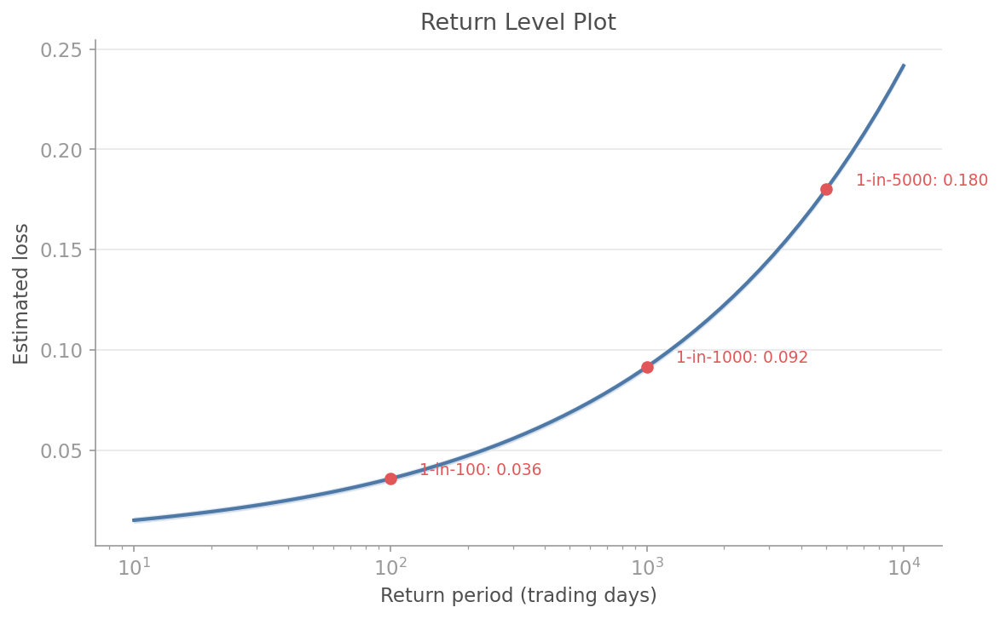

### Hill Plot

The Hill estimator tracks how the tail index varies with the number of order statistics used:

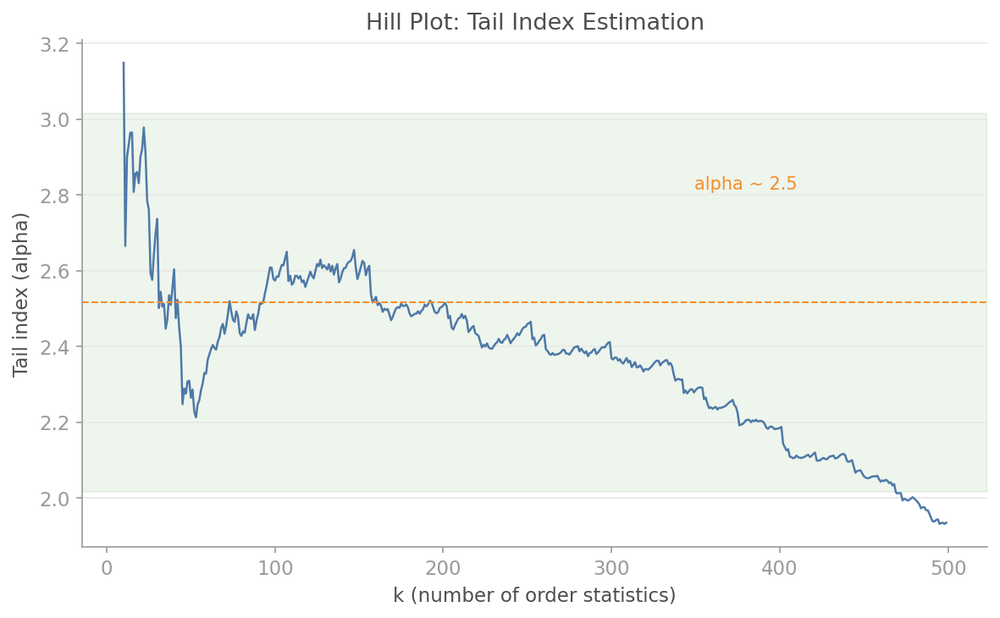

### Risk Bullet Graphs

Sortino, Calmar, and Omega ratios as bullet graphs (Stephen Few's preferred format for showing a value against qualitative ranges):

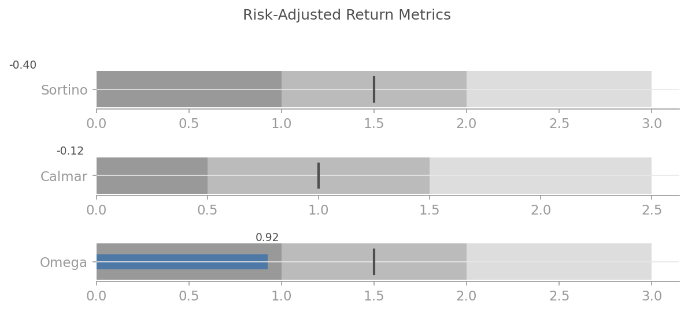

### Drawdown Chart

Underwater chart with maximum drawdown annotation:

```python
from quantlite.viz.risk import plot_drawdown

fig, ax = plot_drawdown(returns)
```

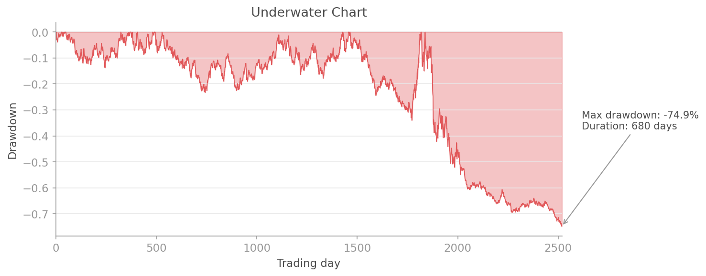

### Risk Dashboard

Single-page dashboard with distribution, drawdown, key metrics, and rolling volatility:

```python
from quantlite.viz.risk import plot_risk_dashboard

fig, axes = plot_risk_dashboard(returns)
```

## Dependency Charts (`quantlite.viz.dependency`)

### Copula Contour Plot

Bivariate copula contour with marginal histograms and tail dependence annotation:

```python
from quantlite.viz.dependency import plot_copula_contour
from quantlite.dependency.copulas import StudentTCopula
import numpy as np

rng = np.random.default_rng(42)
data = rng.multivariate_normal([0, 0], [[1, 0.6], [0.6, 1]], size=1000) * 0.015

cop = StudentTCopula()
cop.fit(data)
fig, ax = plot_copula_contour(cop, data)
```

The fitted copula contours appear in blue, with the Gaussian copula in grey for comparison. Tail dependence coefficients are annotated directly on the chart.

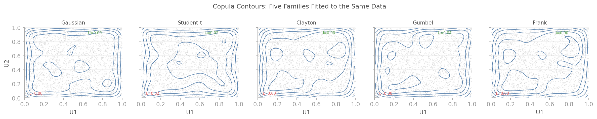

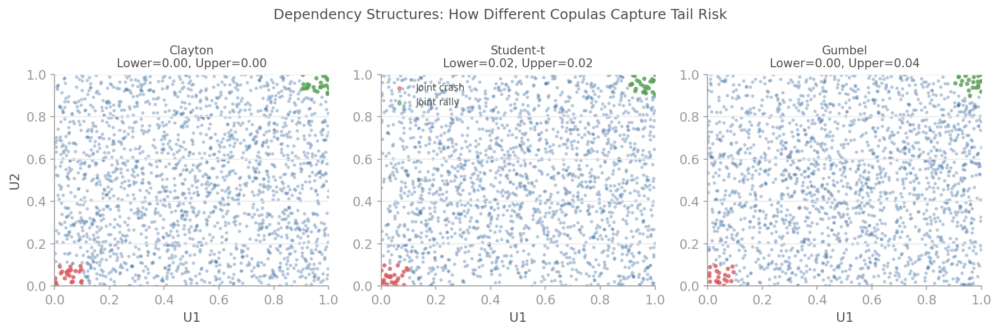

### Tail Dependence Comparison

How different copula families capture tail behaviour:

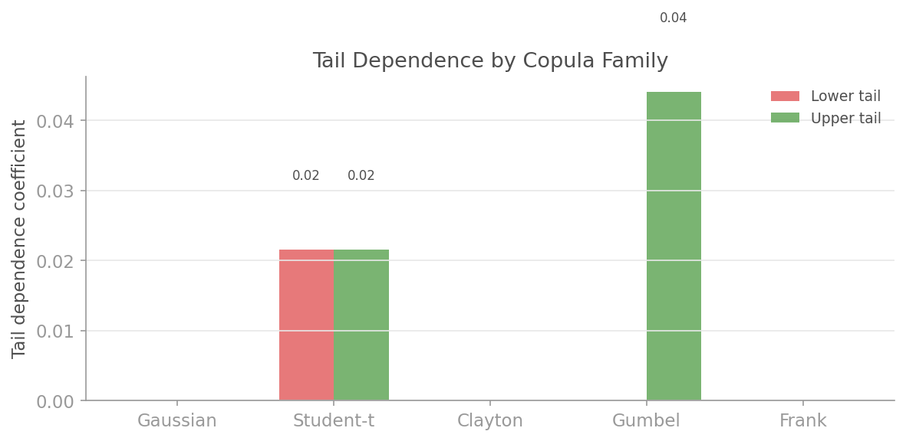

### Correlation Matrix

Heatmap with cell annotations and a muted diverging colourmap:

```python
from quantlite.viz.dependency import plot_correlation_matrix
import pandas as pd

corr = returns_df.corr()
fig, ax = plot_correlation_matrix(corr)
```

### Stress vs Calm Correlation

Side-by-side correlation matrices for calm and stress periods:

```python
from quantlite.viz.dependency import plot_stress_correlation
from quantlite.dependency.correlation import stress_correlation

calm_corr = returns_df.corr()
stress_corr_mat = stress_correlation(returns_df, threshold_percentile=10)
fig, axes = plot_stress_correlation(calm_corr, stress_corr_mat)
```

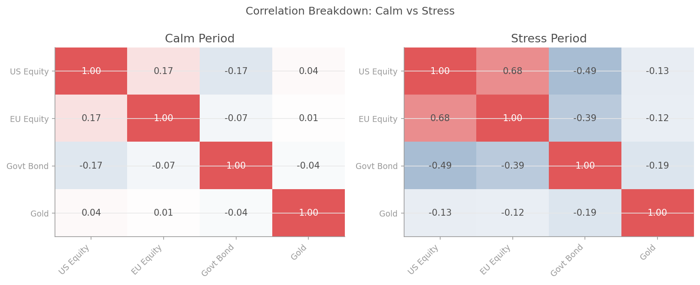

### Rolling Correlation

Time series of rolling correlation with overall correlation reference line:

```python
from quantlite.viz.dependency import plot_correlation_dynamics

fig, ax = plot_correlation_dynamics(
    returns_df["US_Equity"], returns_df["Govt_Bonds"], window=60,
)
```

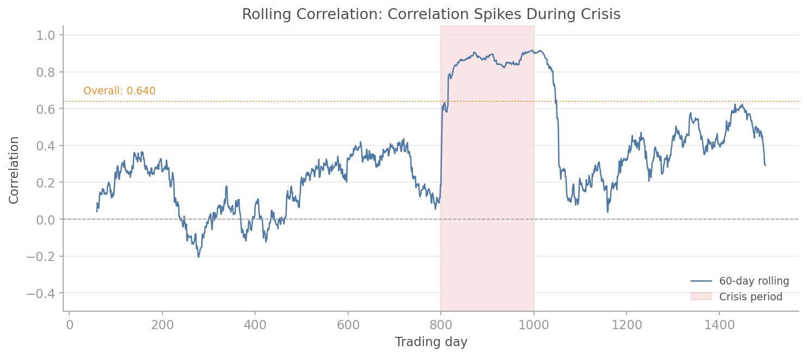

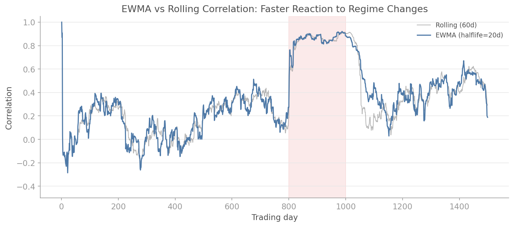

## Regime Charts (`quantlite.viz.regimes`)

### Regime Timeline

Cumulative returns with a colour-coded regime band below:

```python
from quantlite.viz.regimes import plot_regime_timeline
from quantlite.regimes.hmm import fit_regime_model

model = fit_regime_model(returns, n_regimes=2, rng_seed=42)
fig, ax = plot_regime_timeline(returns, model.regime_labels)
```

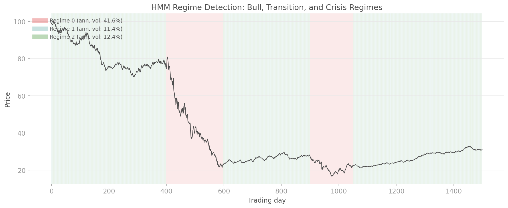

### Regime Distributions

Small multiples of return distributions, one per regime, sharing the same x-axis:

```python
from quantlite.viz.regimes import plot_regime_distributions

fig, axes = plot_regime_distributions(returns, model.regime_labels)
```

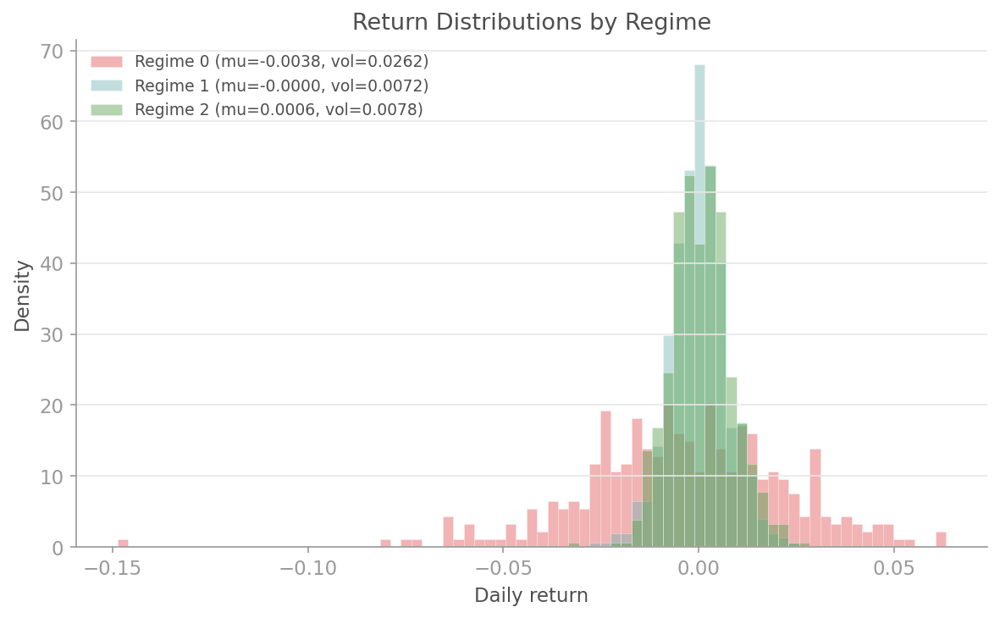

### Transition Matrix

Annotated heatmap of regime transition probabilities:

```python
from quantlite.viz.regimes import plot_transition_matrix

fig, ax = plot_transition_matrix(model)
```

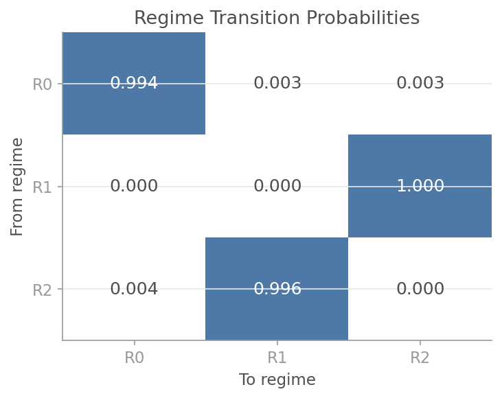

### Changepoint Detection

Bayesian changepoint detection with detected structural breaks:

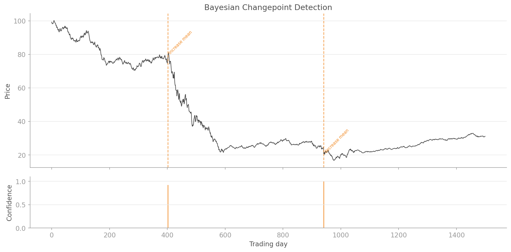

### Regime Summary

Composite chart: timeline, per-regime distributions, and a metrics table:

```python
from quantlite.viz.regimes import plot_regime_summary

fig, axes = plot_regime_summary(returns, model.regime_labels)
```

## Portfolio Charts (`quantlite.viz.portfolio`)

### Efficient Frontier

Random portfolio scatter with minimum variance and maximum Sharpe points:

```python
from quantlite.viz.portfolio import plot_efficient_frontier

fig, ax = plot_efficient_frontier(returns_df, n_portfolios=3000)
```

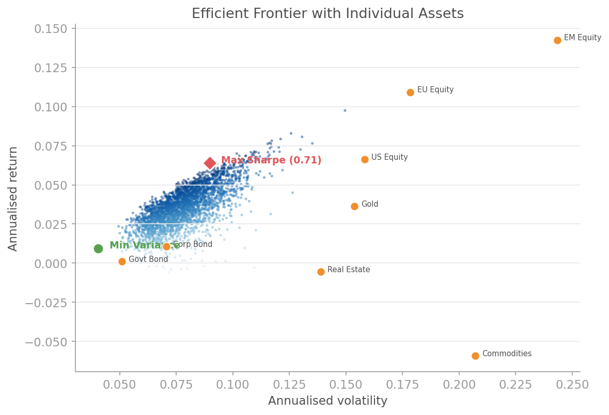

### HRP Dendrogram

Hierarchical Risk Parity clusters assets by correlation distance:

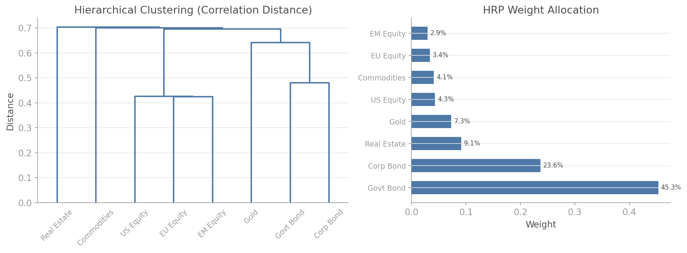

### Weight Comparison

Four optimisation methods produce notably different allocations:

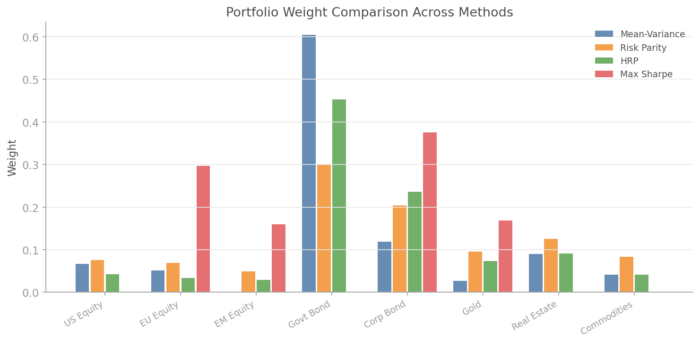

### Weight Evolution

Stacked area chart of portfolio weights over time:

```python
from quantlite.viz.portfolio import plot_weights_over_time
from quantlite.portfolio.rebalancing import rebalance_calendar

result = rebalance_calendar(returns_df, lambda df: {c: 1/5 for c in df.columns}, freq="monthly")
fig, ax = plot_weights_over_time(result)
```

### Monthly Returns Heatmap

Year-by-month returns table as a colour-coded heatmap:

```python
from quantlite.viz.portfolio import plot_monthly_returns
# Requires a BacktestResult from the backtesting engine
```

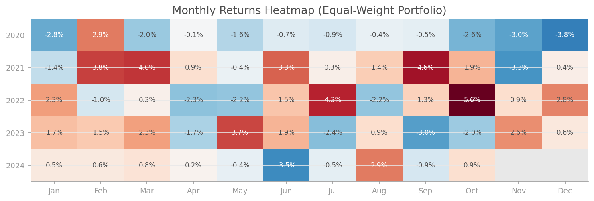

### Backtest Tearsheet

Strategy equity curve, drawdown, and rolling Sharpe:

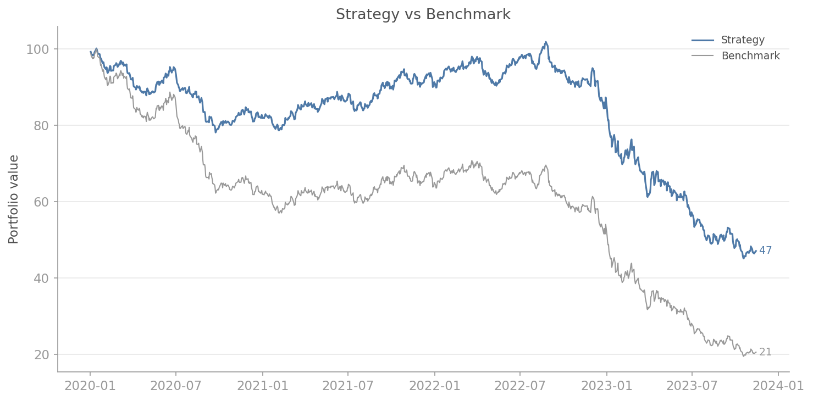

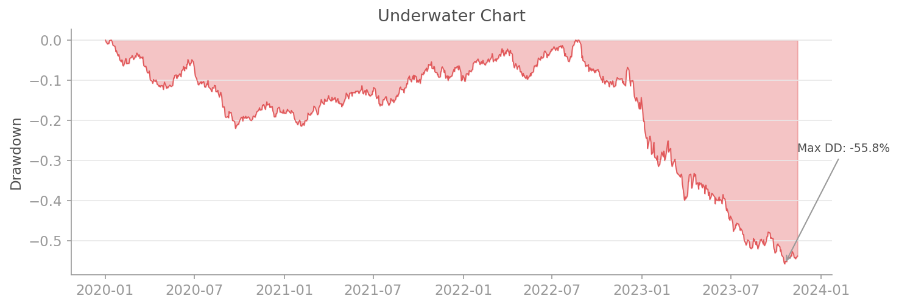

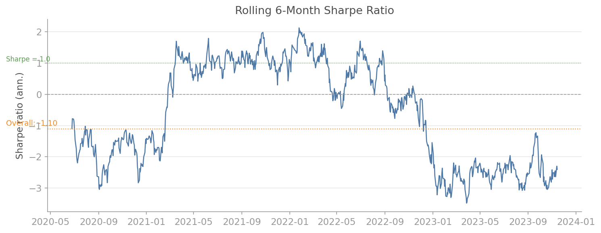

### Backtest Summary Dashboard

Equity curve, drawdown, and weight evolution in a single view:

```python
from quantlite.viz.portfolio import plot_backtest_summary
# Requires a BacktestResult
```

### Risk Contribution

Horizontal bar chart of each asset's marginal risk contribution:

```python
from quantlite.viz.portfolio import plot_risk_contribution

weights = {"US_Equity": 0.3, "Intl_Equity": 0.2, "Govt_Bonds": 0.25, "Corp_Bonds": 0.15, "Gold": 0.1}
fig, ax = plot_risk_contribution(weights, returns_df)
```

### Correlation Network

Network graph with edges for correlations above a threshold, node size proportional to portfolio weight:

```python
from quantlite.viz.portfolio import plot_correlation_network

corr = returns_df.corr()
fig, ax = plot_correlation_network(corr, threshold=0.3, weights=weights)
```
