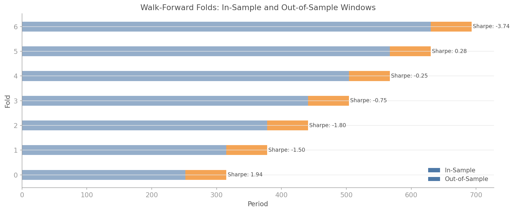

# Walk-Forward Optimisation

## Overview

Backtesting a strategy on the same data used to optimise it is a recipe for self-deception. Walk-forward optimisation fixes this by strictly separating in-sample optimisation from out-of-sample evaluation.

The process: split your data into sequential windows. Optimise on the in-sample window. Evaluate on the immediately following out-of-sample window. Slide forward and repeat. The result is an equity curve built entirely from out-of-sample returns, which is as close to a real-world test as you can get without live trading.

The `quantlite.portfolio.walkforward` module supports:

- **Expanding windows** — in-sample grows with each fold
- **Sliding windows** — fixed-size in-sample window that moves forward
- **Multiple scoring functions** — Sharpe, Sortino, Calmar, max drawdown
- **Custom optimisers** — any callable that maps a DataFrame to weights



## API Reference

### `walk_forward(returns_df, optimiser, is_window=252, oos_window=63, window_type="expanding", scoring="sharpe", min_is_observations=60)`

Run walk-forward optimisation.

```python
from quantlite.portfolio.walkforward import walk_forward
from quantlite.portfolio.optimisation import risk_parity_weights

def rp_optimiser(df):
    return risk_parity_weights(df).weights

result = walk_forward(returns_df, rp_optimiser, is_window=252, oos_window=63)
print(f"Mean OOS Sharpe: {result.aggregate_score:.2f} ± {result.aggregate_std:.2f}")
print(f"Folds: {len(result.folds)}")
```

**Parameters:**

| Name | Type | Description |
|------|------|-------------|
| `returns_df` | `pd.DataFrame` | Asset returns |
| `optimiser` | callable | Takes in-sample DataFrame, returns weight dict |
| `is_window` | `int` | In-sample window size (or minimum for expanding) |
| `oos_window` | `int` | Out-of-sample window size |
| `window_type` | `str` | `"expanding"` or `"sliding"` |
| `scoring` | `str` or callable | `"sharpe"`, `"sortino"`, `"calmar"`, `"max_dd"` |

**Returns:** `WalkForwardResult` with `folds`, `aggregate_score`, `aggregate_std`, `equity_curve`, `scoring_function`, `window_type`.

---

### Scoring Functions

```python
from quantlite.portfolio.walkforward import sharpe_score, sortino_score, calmar_score, max_drawdown_score

sharpe = sharpe_score(returns_array)
sortino = sortino_score(returns_array)
calmar = calmar_score(returns_array)
max_dd = max_drawdown_score(returns_array)
```

---

## Examples

### Expanding Window Walk-Forward

```python
import pandas as pd
import numpy as np
from quantlite.portfolio.walkforward import walk_forward

rng = np.random.RandomState(42)
returns_df = pd.DataFrame({
    "Equity": rng.normal(0.0003, 0.015, 1000),
    "Bonds": rng.normal(0.0002, 0.006, 1000),
    "Gold": rng.normal(0.0001, 0.010, 1000),
})

def equal_weight_opt(df):
    n = df.shape[1]
    return {col: 1.0 / n for col in df.columns}

result = walk_forward(
    returns_df, equal_weight_opt,
    is_window=252, oos_window=63,
    window_type="expanding", scoring="sharpe",
)

for fold in result.folds:
    print(f"Fold {fold.fold_index}: IS={fold.is_start}-{fold.is_end}, "
          f"OOS={fold.oos_start}-{fold.oos_end}, "
          f"IS Sharpe={fold.is_score:.2f}, OOS Sharpe={fold.oos_score:.2f}")
```

### Custom Scoring

```python
def custom_score(returns):
    """Return-to-max-drawdown ratio."""
    equity = np.cumprod(1.0 + returns)
    dd = (equity - np.maximum.accumulate(equity)) / np.maximum.accumulate(equity)
    max_dd = abs(np.min(dd))
    ann_ret = equity[-1] ** (252 / len(returns)) - 1
    return ann_ret / max(max_dd, 1e-6)

result = walk_forward(returns_df, equal_weight_opt, scoring=custom_score)
```


## References

- Pardo, R. (2008). *The Evaluation and Optimization of Trading Strategies.* Wiley.
- Bailey, D. H., Borwein, J. M., Lopez de Prado, M., and Zhu, Q. J. (2014). "The Probability of Backtest Overfitting." *Journal of Computational Finance.*
