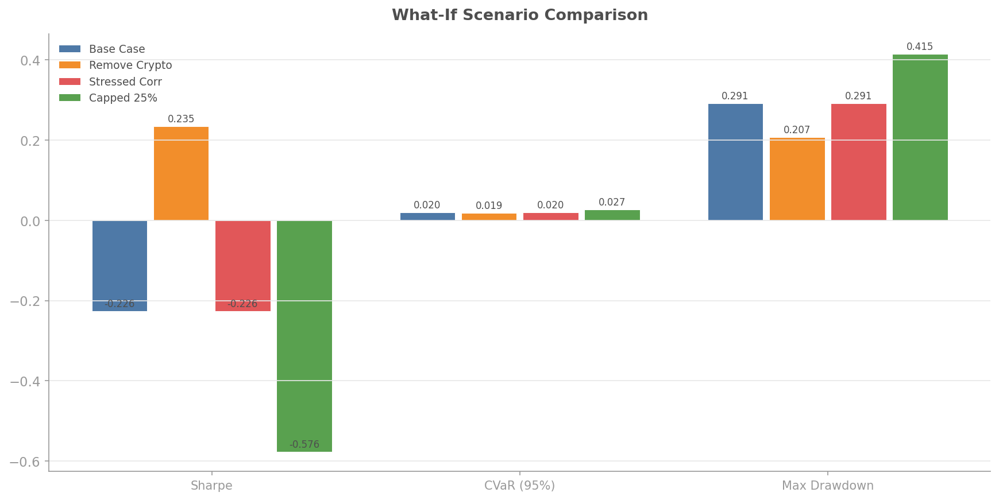
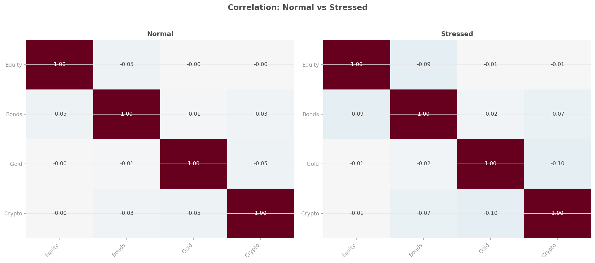
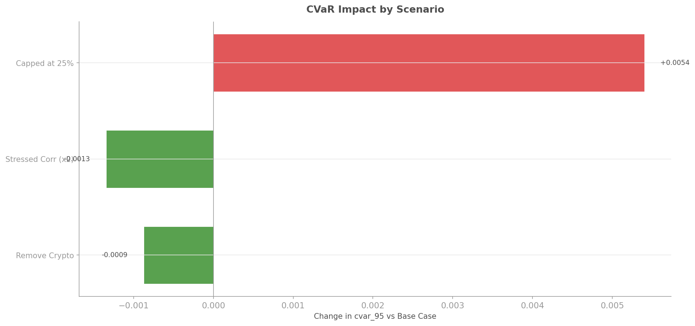

# What-If Analysis

## Overview

What-if analysis lets you explore hypothetical scenarios before committing capital. Instead of guessing what would happen if you removed an asset, stressed correlations, or capped positions, you can compute the answer.

The `quantlite.explain.whatif` module provides four types of what-if analysis:

1. **Asset removal**: "If I remove Crypto, what happens to my tail risk?"
2. **Correlation stress**: "If correlations spike to crisis levels, what happens?"
3. **Weight constraints**: "If I cap any position at 20%, what is the cost?"
4. **Multi-scenario comparison**: side-by-side metrics for any set of weight alternatives

Each analysis returns a `WhatIfResult` with base case metrics, scenario metrics, and a comparison table.



## API Reference

### `remove_asset(returns_df, weights, asset, freq)`

Removes an asset from the portfolio, redistributes weights proportionally, and recomputes all metrics.

```python
from quantlite.explain.whatif import remove_asset

result = remove_asset(returns_df, weights, "Crypto")
print(result.comparison_table)
```

**Parameters:**

| Name | Type | Description |
|------|------|-------------|
| `returns_df` | `pd.DataFrame` | Asset returns |
| `weights` | `dict[str, float]` | Base portfolio weights |
| `asset` | `str` | Asset to remove |
| `freq` | `int` | Annualisation frequency (default 252) |

**Returns:** `WhatIfResult`.

---

### `stress_correlations(returns_df, weights, stress_factor, freq)`

Multiplies off-diagonal correlations by `stress_factor` (capped at ±0.99), ensures positive semi-definiteness, and generates synthetic stressed returns.

```python
from quantlite.explain.whatif import stress_correlations

result = stress_correlations(returns_df, weights, stress_factor=2.0)
print(f"Base CVaR: {result.base.cvar_95:.4f}")
print(f"Stressed CVaR: {result.scenarios[0].cvar_95:.4f}")
```



---

### `cap_weights(returns_df, weights, max_weight, freq)`

Caps each position at `max_weight` and redistributes excess proportionally.

```python
from quantlite.explain.whatif import cap_weights

result = cap_weights(returns_df, weights, max_weight=0.20)
print(result.comparison_table)
```

---

### `compare_scenarios(returns_df, base_weights, scenarios, freq)`

Compares multiple arbitrary weight scenarios against a base case.

```python
from quantlite.explain.whatif import compare_scenarios

result = compare_scenarios(
    returns_df,
    base_weights={"Equity": 0.4, "Bonds": 0.3, "Gold": 0.2, "Crypto": 0.1},
    scenarios={
        "Equal Weight": {"Equity": 0.25, "Bonds": 0.25, "Gold": 0.25, "Crypto": 0.25},
        "Bonds Heavy": {"Equity": 0.1, "Bonds": 0.7, "Gold": 0.1, "Crypto": 0.1},
    },
)
print(result.comparison_table)
```

---

### `WhatIfResult` Dataclass

| Field | Type | Description |
|-------|------|-------------|
| `base` | `ScenarioMetrics` | Base case metrics |
| `scenarios` | `list[ScenarioMetrics]` | Scenario metrics |
| `comparison_table` | `pd.DataFrame` | Side-by-side comparison |

### `ScenarioMetrics` Dataclass

| Field | Type | Description |
|-------|------|-------------|
| `name` | `str` | Scenario name |
| `weights` | `dict[str, float]` | Portfolio weights |
| `annual_return` | `float` | Annualised return |
| `annual_vol` | `float` | Annualised volatility |
| `sharpe` | `float` | Sharpe ratio |
| `var_95` | `float` | Value at Risk (95%) |
| `cvar_95` | `float` | Conditional VaR (95%) |
| `max_drawdown` | `float` | Maximum drawdown |

## Examples

### Impact Analysis



```python
from quantlite.explain.whatif import remove_asset, stress_correlations, cap_weights

# Which scenario has the biggest impact on CVaR?
removal = remove_asset(returns_df, weights, "Crypto")
stressed = stress_correlations(returns_df, weights, stress_factor=2.0)
capped = cap_weights(returns_df, weights, max_weight=0.25)

for name, result in [
    ("Remove Crypto", removal),
    ("Stress Correlations", stressed),
    ("Cap at 25%", capped),
]:
    delta = result.scenarios[0].cvar_95 - result.base.cvar_95
    print(f"{name}: CVaR changes by {delta:+.4f}")
```
